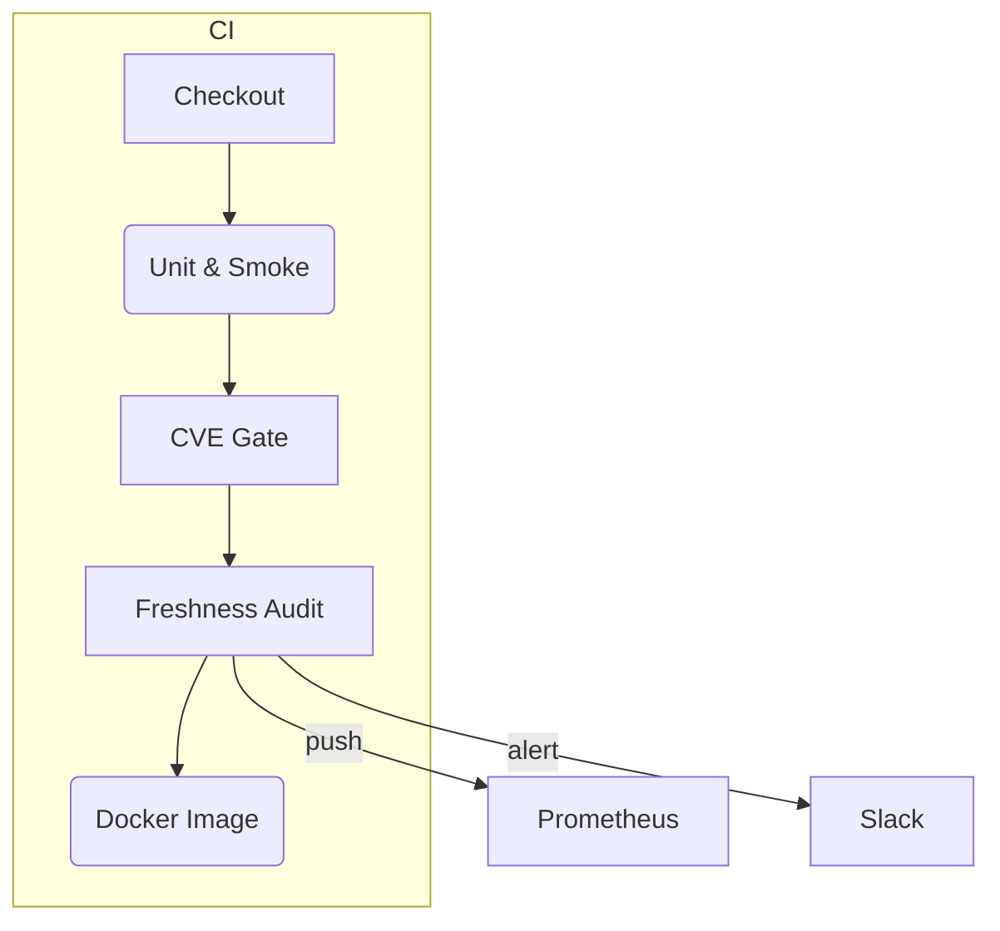

# ADR 2025-06 · Dependency Freshness Audit
*Status*: Proposed
*Date*: 25 May 2025
*Author*: @o3 (Architect)
*Relates to*: ADR 2025-05-spring-clean • DA-008 CVE-gate

---

## 1 · Context

DA-008 hard-fails the build on un-waived HIGH/CRITICAL CVEs ≤ 30 days old.
Yet *stale* packages without CVEs remain invisible.  A lightweight, recurring
freshness audit is required to surface and remediate such drift.

The repo is poly-glot (Python ▸ Pip, Node ▸ npm, Go ▸ go-modules) and already
ships:

* Prometheus & Grafana stack (`docker-compose.prom.yml`)
* `alfred/metrics/` helpers and Slack notifier (`scripts/slack_cve_alert.py`)
* Weekly Trivy scan workflow

---

## 2 · Decision

### 2.1 · Cadence
Quarterly audit **(first Monday of Jan/Apr/Jul/Oct)** executed as a
GitHub Action job `freshness-audit.yml`.

### 2.2 · Metrics & SLOs

| Metric | Target | Alert if |
|--------|--------|----------|
| **% deps > 12 months** | **≤ 5 %** | > 5 % |
| **Mean dep age** | ≤ 180 d | > 220 d |
| **95-percentile age** | ≤ 365 d | > 365 d (build-fail) |
| **Audit coverage** | 100 % declared stacks | < 100 % |

> Metrics exposed as `dependency_age_days` (per-dep gauge) and
> `dependency_age_percentile` (summary) in Prometheus.

### 2.3 · Scope & Tools

| Ecosystem | Scanner | Lockfile / Manifest |
|-----------|---------|---------------------|
| Python | `pip-outdated --format=json` | `requirements.txt`, `requirements-lockfile.txt` |
| Node | `npm outdated --json` | `package-lock.json` |
| Go | `go list -m -u -json all` | `go.sum` |
| Containers | **Trivy SBOM** | Base-image, layers |

Indirect deps are *pinned* in existing lockfiles; the job fails if missing.

### 2.4 · Roles

| Role | Duty |
|------|------|
| **Platform Security** | Own dashboards, triage violations |
| **Maintainers** | Patch stale deps within **1 sprint** or request waiver |
| **Architect** | Curate thresholds, approve waivers |

### 2.5 · Waivers

JSON schema `dep_age_waiver.json` (clone of `cve_waiver.json`) lives in
`alfred/metrics/schemas/`.  Expiry auto-reminded by Slack after 30 d.

---

## 3 · CI Wiring

Build fails if `dependency_age_percentile{p="95"} > 365`.

Expected run-time increase: ≈ 30 s (validated on dry-run).

---

## 4 · Consequences

**Pros**: early drift detection, minimal net-new code, aligns with Spring-Clean
and DA-008 alerting.

**Cons**: potential noise across multi-lang stacks; monitor first two runs and
tune thresholds.

---

## 5 · Alternatives Considered

* **Monthly audits** — higher toil, marginal benefit.
* **Licence-gate only** — orthogonal risk class; will proceed as DA-009.

---

## 6 · Implementation Checklist

- [ ] Add `freshness-audit.yml` GitHub Action (matrix by stack)
- [ ] Extend `alfred/metrics/` for new gauges/summaries
- [ ] Grafana dashboard tile "Dep Freshness"
- [ ] Slack notifier update (`scripts/slack_cve_alert.py`)
- [ ] Document waivers in `docs/security/waivers.md`

---

## 7 · References

* DA-008 CVE Gate (2025-05)
* OWASP Dependency-Track (v4.11) docs
* Spring-Clean Initiative ADR 2025-05
