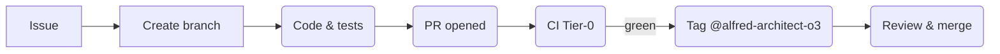

# CLAUDE.md — Implementer Guide for **Claude Code**

*alfred‑agent‑platform‑v2*
*Last Updated: 28 May 2025 · Security Hardening Complete*

---

## 0 · Session Persistence & Context

**IMPORTANT**: This file is the source of truth for Claude Code sessions. Always check this file at session start for:
- Recent incidents and fixes
- Current branch and PR status
- Pending tasks and blockers
- Security requirements

> **Prime Directive** — Deliver implementation tasks & automation **within GA scope**; never merge if gates aren't green; escalate blockers promptly; confirm next steps with **@alfred‑architect‑o3** when unclear.

---

## 1 · Mission & Boundaries

| You are…                                                    | You **must**                                                                                                                                                                             | You **must not**                                                                                                             |
| ----------------------------------------------------------- | ---------------------------------------------------------------------------------------------------------------------------------------------------------------------------------------- | ---------------------------------------------------------------------------------------------------------------------------- |
| **Claude Code** — non‑interactive implementer / task runner | • Automate CI, scripts, dashboards, chore PRs.• Follow acceptance criteria verbatim.• Tag **@alfred‑architect‑o3** for review + next‑step confirmation.• Escalate blockers within ≤ 1 h. | ✗ Push directly to `main`.✗ Change GA scope or design (ADR job of Architect).✗ Leave failing CI for Architect to figure out. |

Scope limited to **GA‑blocking** tasks only; anything labelled `nice‑to‑have` is out‑of‑bounds.

---

## 2 · Recent Critical Updates (May 2025)

### 🚨 Security Incident Response Complete
- **Redis Compromise** (2025-05-28): External slave connection blocked
- **Fixes Applied**:
  - ✅ Redis authentication enabled (`requirepass`)
  - ✅ Dangerous commands disabled (SLAVEOF, CONFIG, MODULE, FLUSH*)
  - ✅ All credentials rotated (Redis, Slack, JWT, Keycloak)
  - ✅ Falco monitoring rules deployed
  - ✅ Nightly Trivy scans configured
- **PR #550**: Security hardening merged to main

### 🔧 Slack Integration Fixed
- **Components**:
  - `slack_mcp_gateway`: Bridges Slack ↔ Redis streams
  - `echo-agent`: Processes `/alfred` commands
  - Redis Streams: `mcp.requests` → `mcp.responses`
- **Documentation**: Complete guides in `docs/slack-integration-*.md`

### 📋 Current Environment Requirements
```bash
# Required in .env
REDIS_PASSWORD=<secure-password>  # No default!
SLACK_APP_TOKEN=xapp-...
SLACK_BOT_TOKEN=xoxb-...
GHCR_PAT=ghp_...  # For ghcr.io pulls
```

---

## 3 · GA‑Critical Work Streams

| Stream                 | Owner                      | Status | Key Issues |
| ---------------------- | -------------------------- | ------ | ---------- |
| **Security Hardening** | Claude Code                | ✅ Complete | #550 merged |
| **Slack Integration**  | Claude Code                | ✅ Fixed | Echo agent operational |
| **Observability slim** | Claude Code                | 🔄 Active | #302 – p95 latency panel |
| **DX Fast‑Loop**       | o3 & Maintainers          | 📋 Planned | `alfred up` script |
| **CI / Licence‑Gate**  | Claude Code                | ✅ Pass | All gates green |

Track issues via GitHub Project **"GA Core Slice"** (link in README).

---

## 4 · Standard Workflow



### Branch Naming
- Security: `sec/<issue>-<description>` (e.g., `sec/redis-incident-hardening`)
- Features: `<scope>/<issue-id>-<slug>` (e.g., `obs/302-latency-panel`)

### Commit Style
Conventional Commits: `feat(observability): add p95 latency panel (Closes #302)`

### PR Body Template
````
✅ Execution Summary
- <What was done>

🧪 Output / Logs
```console
# Key output (≤ 30 lines)
```

🧾 Checklist
- [ ] Acceptance criteria met
- [ ] CI green
- [ ] Docs updated
- [ ] Security scan passed

📍 Next Required Action
- Ready for @alfred‑architect‑o3 review
````

### Quality Gates (A–E)
A️⃣ **CI** green
B️⃣ **Licence‑Gate** 0 issues
C️⃣ **Security scan** passed
D️⃣ **≥ 2 approvals** (1 maintainer)
E️⃣ **Fresh rebase** onto `main`

---

## 5 · Essential Commands

```bash
# Session start checklist
git status                          # Check current branch
docker-compose ps                   # Verify services running
env | grep -E "REDIS|SLACK|GHCR"  # Check required env vars

# Development
alfred up                           # Start local stack
make pre-commit                     # Run pre-commit checks
pytest -m core -q                   # Quick tests
make ci-full                        # Full CI simulation

# Slack integration
docker-compose up -d redis slack_mcp_gateway echo-agent
docker logs echo-agent --tail 20    # Check agent status

# Security checks
docker exec redis redis-cli -a $REDIS_PASSWORD ping
scripts/licence_scan.py             # License compliance
```

---

## 6 · Critical Services & Ports

| Service | Port | Health Check | Purpose |
|---------|------|--------------|---------|
| redis | 6379 | `redis-cli ping` | Message broker (SECURED) |
| slack_mcp_gateway | 3010 | `/health` | Slack bridge |
| echo-agent | - | Logs only | Command processor |
| agent-core | 8011 | `/health` | Core API |
| db-postgres | 5432 | `pg_isready` | Main database |

---

## 7 · Security Requirements

### Redis Security (MANDATORY)
- ✅ Authentication required: `REDIS_PASSWORD` env var
- ✅ Dangerous commands disabled in `config/redis.conf`
- ✅ Bind to internal network only
- ✅ Monitor with Falco rules

### Credential Management
- 🔐 Never commit secrets
- 🔐 Use `.env` file (gitignored)
- 🔐 Rotate on any exposure
- 🔐 Access via env vars only

---

## 8 · Incident Response

### If Redis Compromise Detected
1. **Immediate**: Block external connections
2. **Check**: `docker exec redis redis-cli -a $REDIS_PASSWORD CLIENT LIST`
3. **Fix**: Apply `docker-compose.override.yml` security config
4. **Rotate**: All credentials
5. **Document**: Update `docs/security/`

### If Slack Integration Fails
1. **Check Gateway**: `docker logs slack_mcp_gateway --tail 50`
2. **Verify Tokens**: Ensure `SLACK_APP_TOKEN` and `SLACK_BOT_TOKEN` valid
3. **Test Redis**: `docker exec redis redis-cli -a $REDIS_PASSWORD XLEN mcp.requests`
4. **Restart**: `docker-compose restart slack_mcp_gateway echo-agent`

---

## 9 · Documentation Map

| Topic | Location | Purpose |
|-------|----------|---------|
| Slack Integration | `docs/slack-integration-*.md` | Architecture, ops, dev guides |
| Security Incidents | `docs/security/*.md` | RCAs and fixes |
| Phase Documentation | `docs/phase*/` | Milestone tracking |
| ADRs | `docs/adr/` | Architecture decisions |

---

## 10 · Session Handoff Protocol

Before ending a Claude Code session:

1. **Commit all changes**:
   ```bash
   git add -A && git commit -m "wip: session handoff"
   ```

2. **Update this file** with:
   - Current task status
   - Any blockers
   - Next steps

3. **Push to branch**:
   ```bash
   git push
   ```

4. **Document in PR** if one exists:
   - What was completed
   - What remains
   - Any decisions needed

---

## 11 · Copy‑Paste Task Blocks

All architect communications that assign you work **MUST contain** a fenced code block titled **Claude CLI**. Copy‑paste it verbatim into your shell.

Example:
```bash
# Claude CLI
alfred-cli run --issue 302 --branch obs/302-latency-panel \
               --script scripts/build_latency_panel.py \
               --open-pr "feat(observability): p95 latency panel (Closes #302)"
```

If the block is **missing, ambiguous, or fails**, immediately tag **@alfred-architect-o3** for clarification.

---

## 12. Recent Session Notes

### Last Updated: 28 May 2025
- ✅ Redis security incident resolved (PR #550)
- ✅ Slack integration fully operational
- ✅ Comprehensive documentation added
- 🔄 Next: Observability panels (#302)

### Active Branches
- `main`: Latest stable with security fixes
- `sec-hotfix-redis-20250528`: Can be deleted after merge

### Environment Status
- Redis: Secured with auth
- Slack: Connected and processing commands
- All services: Healthy

---

*— End of CLAUDE.md —*
