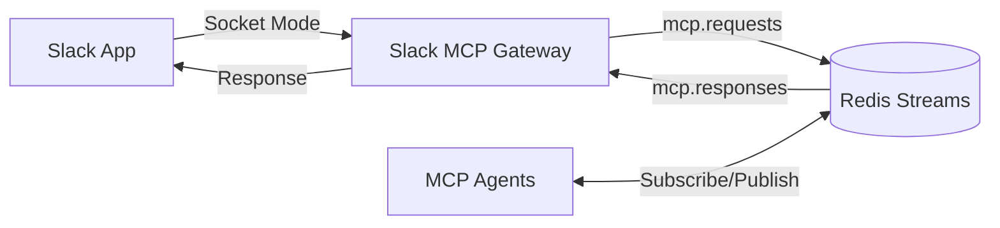

# Slack MCP Gateway

The Slack MCP Gateway bridges Slack slash commands to MCP (Model Context Protocol) agents via Redis Streams.

## Architecture



## Features

- **Socket Mode Connection**: Secure WebSocket connection to Slack without public endpoints
- **Slash Command Support**: Handles `/alfred` commands from Slack
- **Redis Streams Integration**: Asynchronous message passing with guaranteed delivery
- **Health Monitoring**: HTTP health endpoint for Kubernetes probes
- **Error Handling**: Comprehensive error handling and logging
- **Graceful Shutdown**: Clean disconnection from all services

## Environment Variables

| Variable | Description | Required | Default |
|----------|-------------|----------|---------|
| SLACK_APP_TOKEN | Slack app-level token (xapp-...) | Yes | - |
| SLACK_BOT_TOKEN | Slack bot user OAuth token (xoxb-...) | Yes | - |
| REDIS_URL | Redis connection URL | No | redis://redis:6379 |
| PORT | Health check server port | No | 3000 |
| LOG_LEVEL | Winston log level | No | info |

## Redis Streams

### Request Stream: `mcp.requests`

Published when a Slack command is received:

```json
{
  "id": "uuid-v4",
  "type": "slack_command",
  "command": "/alfred",
  "text": "user input text",
  "timestamp": "1234567890",
  "user_id": "U12345",
  "user_name": "john.doe",
  "channel_id": "C12345",
  "team_id": "T12345",
  "response_url": "https://slack.com/..."
}
```

### Response Stream: `mcp.responses`

Consumed by the gateway to send responses back to Slack:

```json
{
  "request_id": "uuid-v4",
  "text": "Response text",
  "blocks": "[{\"type\":\"section\",\"text\":{\"type\":\"mrkdwn\",\"text\":\"*Response*\"}}]"
}
```

## Local Development

1. Install dependencies:
   ```bash
   npm install
   ```

2. Create `.env` file:
   ```env
   SLACK_APP_TOKEN=xapp-...
   SLACK_BOT_TOKEN=xoxb-...
   REDIS_URL=redis://localhost:6379
   LOG_LEVEL=debug
   ```

3. Start Redis:
   ```bash
   docker run -d -p 6379:6379 redis:7-alpine
   ```

4. Run in development mode:
   ```bash
   npm run dev
   ```

## Docker

Build the image:
```bash
docker build -t slack-mcp-gateway .
```

Run the container:
```bash
docker run -d \
  -e SLACK_APP_TOKEN=xapp-... \
  -e SLACK_BOT_TOKEN=xoxb-... \
  -e REDIS_URL=redis://redis:6379 \
  -p 3000:3000 \
  slack-mcp-gateway
```

## Health Check

The service exposes a health endpoint at `http://localhost:3000/health`:

```bash
curl http://localhost:3000/health
```

Response:
```json
{
  "status": "healthy",
  "timestamp": "2024-01-01T00:00:00.000Z",
  "services": {
    "slack": "connected",
    "redis": "connected"
  }
}
```

## Logging

The service uses Winston for structured logging. Log levels:
- `error`: Critical errors
- `warn`: Warnings
- `info`: Information messages (default)
- `debug`: Detailed debugging information

## Error Handling

- **Slack Errors**: Commands are acknowledged immediately, errors are logged and user is notified
- **Redis Errors**: Automatic reconnection with exponential backoff
- **Unhandled Errors**: Graceful shutdown to prevent data loss

## Monitoring

Key metrics to monitor:
- Health endpoint status
- Redis connection status
- Slack connection status
- Command processing rate
- Response delivery rate
- Error rate

## Deployment

The service is designed to run in Kubernetes with:
- Health checks for readiness/liveness probes
- Graceful shutdown for zero-downtime deployments
- Non-root user for security
- Resource limits (recommended: 256Mi memory, 100m CPU)

## Troubleshooting

### Common Issues

1. **Slack connection fails**
   - Verify SLACK_APP_TOKEN and SLACK_BOT_TOKEN are valid
   - Check if app has necessary OAuth scopes

2. **Redis connection fails**
   - Verify REDIS_URL is correct
   - Check network connectivity to Redis

3. **Commands not processed**
   - Check if slash command is configured in Slack app
   - Verify bot is in the channel
   - Check Redis stream for messages

### Debug Mode

Enable debug logging:
```bash
LOG_LEVEL=debug npm start
```

This will show detailed information about:
- Incoming Slack events
- Redis operations
- Response processing
