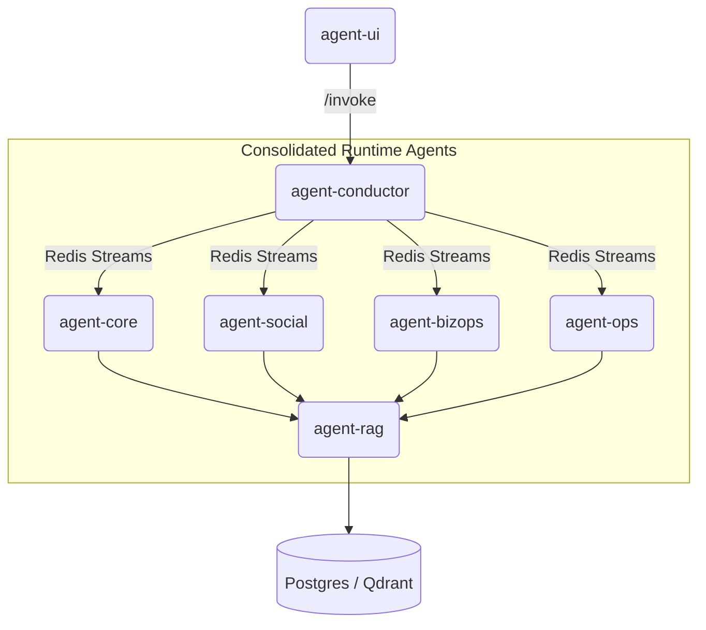

# ADR 2025-05 — Agent Consolidation & Naming Alignment

*Status*: **Proposed**
*Context created*: 21 May 2025

## Problem Statement

The current agent architecture suffers from fragmentation across multiple specialized services (`agent-legal`, `agent-financial`, `pricing-experiment`, `agent-niche`, `agent-blueprint`, etc.), leading to:

- **Resource inefficiency**: Each agent requires separate container overhead, secrets management, and scaling configuration
- **Operational complexity**: Multiple services to monitor, deploy, and maintain independently
- **Inconsistent naming**: No standardized slug format creates confusion in deployment and monitoring
- **Memory isolation overhead**: Separate vector stores and knowledge bases reduce cross-domain learning opportunities
- **CI/CD complexity**: Multiple pipelines, health checks, and deployment gates

This fragmentation prevents efficient resource utilization and complicates the development/deployment experience as the platform scales.

## Decision

### Consolidation Strategy

We will merge related agents into logical, domain-focused services while implementing a standardized naming convention:

#### Target Runtime Topology

| # | New Runtime Name | Legacy Services | Scope & Workflows | Resource Profile |
|---|-----------------|-----------------|-------------------|------------------|
| 1 | **agent-core** | agent-alfred, agent-budget | Personal chat, Budget-Buddy, Legal-Reminder, Memory-Finder, Health-Prompt | CPU-only, minimal memory |
| 2 | **agent-social** | agent-niche, agent-blueprint | Social-intel workflows: `niche_scout.*`, `seed_to_blueprint.*`, `social_trend_probe` | GPU optional, shared RAG |
| 3 | **agent-bizops** | agent-financial, agent-legal, pricing-experiment | Finance, Legal, Pricing: `review_contract`, `calc_tax`, `run_pricing_test`, `lead_gen`, `growth_experiment` | Single pgvector collection, GPU off |
| 4 | **agent-ops** | code-smith, design-drafter, support-bot | Engineering helpers: Code-Smith, Design-Drafter, Support Triage, Community-Mod | CPU, scales with support volume |

#### Naming Standard

- **Slug format**: `agent-<domain>` following `^(agent|service)-[a-z0-9-]+$` pattern
- **Code paths**: `services/agent_<domain>/` (underscore for Python imports)
- **Docker tags**: `<slug>:<version>` (kebab-case)
- **Helm releases**: Match slug exactly

#### Implementation Approach

**Big-bang consolidation** within a single feature branch to avoid breaking changes across multiple sprints. All renames occur simultaneously to prevent CI/CD disruption.

## Consequences

### Positive

- **Resource efficiency**: ~60% reduction in container overhead through service consolidation
- **Simplified operations**: Fewer services to monitor, deploy, and scale
- **Improved observability**: Consolidated metrics under logical domain groupings
- **Enhanced cross-domain learning**: Shared memory stores enable better context awareness
- **Standardized tooling**: Consistent naming enables automated tooling and monitoring

### Negative

- **Larger blast radius**: Single service failure affects multiple workflows within a domain
- **Complex rolling updates**: Larger services require more careful deployment strategies
- **Initial migration risk**: Big-bang approach requires comprehensive testing
- **Mixed resource requirements**: Some consolidated services may have conflicting resource needs

### Mitigation Strategies

- **Health endpoint segmentation**: `/health/ready` returns per-workflow status (e.g., `finance_ok`, `legal_ok`)
- **Workflow-level circuit breakers**: Failed workflows don't impact other domains in the same service
- **Gradual traffic migration**: Blue-green deployments with workflow-level routing
- **Comprehensive smoke testing**: Full end-to-end test coverage before cutover

## Implementation Plan

### Phase R-0: Preparation
- [ ] Generate canonical mapping file `arch/data/name-map.csv`
- [ ] Create consolidation branch `ops/SC-241-agent-consolidation`
- [ ] Update CI gates to enforce new naming standards

### Phase R-1: Directory Restructuring
```bash
git mv services/agent_legal/ → services/agent_bizops/
git mv services/agent_financial/ → services/agent_bizops/workflows/finance/
git mv services/pricing_experiment/ → services/agent_bizops/workflows/pricing/
```

### Phase R-2: Code Import Rewriting
- Run automated `sed` scripts via `scripts/rename_agents.sh`
- Update all Python imports: `from agent_legal` → `from agent_bizops.workflows.legal`
- CI gate: Zero legacy import references

### Phase R-3: Infrastructure Updates
- **Docker**: Update build matrix, delete legacy tags
- **Helm**: Update labels, chart names, release names
- **Compose**: Regenerate via `make generate_compose`

### Phase R-4: Configuration & Secrets
- Consolidate environment variables: `BIZOPS_OPENAI_KEY` (replaces separate keys)
- Update Doppler paths: `kv/bizops/openai_key`
- Merge Redis configurations with `requirepass`

### Phase R-5: Observability Migration
- **Prometheus**: Rename job targets, update alert rules
- **Grafana**: Create consolidated `BizOps` dashboard folder
- **Loki**: Update stream labels to `agent="agent-bizops"`

### Phase R-6: Testing & Validation
- Update smoke tests: `@e2e-agent-bizops` Playwright tags
- Create workflow-specific health checks
- Validate cross-domain memory sharing

### Phase R-7: Documentation & Communication
- Update architecture diagrams (Mermaid)
- Regenerate API documentation
- Create migration runbooks
- Slack announcement to `#alfred-dev`

---

**Live progress badge** 

*Sprint board*: <https://github.com/orgs/alfred-org/projects/1>

---

## Architecture Diagram



## Rollout Timeline

| Phase | Duration | Owner | Gate |
|-------|----------|-------|------|
| R-0: Preparation | 1 day | Architect | Name map validation |
| R-1: Directory moves | 1 day | Codex | Ruff import checks |
| R-2: Code rewriting | 2 days | Codex | CI import validation |
| R-3: Infrastructure | 1 day | DevOps | Compose diff gate |
| R-4: Configuration | 1 day | DevOps | Health check validation |
| R-5: Observability | 1 day | SRE | Dashboard functionality |
| R-6: Testing | 2 days | QA | E2E test coverage |
| R-7: Deployment | 1 day | Coordinator | Production validation |

**Total estimated duration**: 10 days within Sprint S-05

## Success Metrics

- **Resource utilization**: 60% reduction in total container memory usage
- **Deployment complexity**: 50% fewer CI/CD pipelines to maintain
- **Operational overhead**: 40% reduction in monitoring alerts and dashboards
- **Performance**: No degradation in P95 response times for existing workflows
- **Reliability**: Maintain 99.9% uptime through consolidation process
