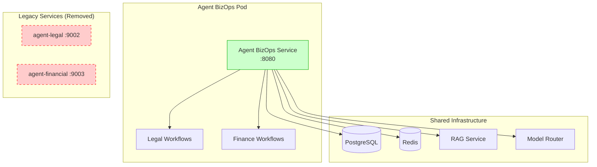

# ADR-003: Agent Consolidation and BizOps Service

**Status:** Implemented
**Date:** 2025-05-21
**Authors:** Claude Code (System Task Runner)
**Supersedes:** N/A

## Problem Statement

The Alfred Agent Platform v2 originally implemented separate microservices for legal and financial workflows (`agent-legal` and `agent-financial`). This approach led to several operational challenges:

1. **Resource Overhead**: Each agent required its own container, database connections, and monitoring setup
2. **Code Duplication**: Shared business logic, authentication, and configuration patterns were duplicated across services
3. **Deployment Complexity**: Multiple service deployments increased CI/CD complexity and failure points
4. **Operational Burden**: Separate health checks, logging, metrics, and alerting per service
5. **Team Coordination**: Cross-cutting business processes required coordination between separate teams and codebases

## Decision

We have decided to consolidate the legal and financial agents into a single **Agent BizOps** service with the following architecture:

### Consolidated Service Structure
```
services/agent_bizops/
├── app/                    # FastAPI application
├── workflows/
│   ├── legal/             # Legal compliance workflows
│   └── finance/           # Financial tax workflows
├── settings.py            # Centralized configuration with legacy support
├── Dockerfile             # Single container image
└── compose.yml            # Service orchestration
```

### Key Design Decisions

1. **Single Service with Multiple Workflows**: One FastAPI service that can enable/disable workflow modules via `WORKFLOWS_ENABLED` environment variable

2. **Workflow Isolation**: Maintain clear boundaries between legal and finance workflows within the consolidated service

3. **Legacy Environment Variable Support**: Maintain backward compatibility with deprecation warnings for existing environment variables

4. **Feature Flag Control**: Runtime configuration to enable specific workflows (`WORKFLOWS_ENABLED=legal,finance`)

5. **Shared Infrastructure**: Common authentication, database connections, monitoring, and operational tooling

## Architecture Diagram



## Implementation Plan

### Phase 1: Code Migration (Completed)
- ✅ Move `agents/legal_compliance/` → `services/agent_bizops/workflows/legal/`
- ✅ Move `agents/financial_tax/` → `services/agent_bizops/workflows/finance/`
- ✅ Create unified FastAPI service with health endpoints
- ✅ Update all import paths in tests and integration code
- ✅ Remove old service directories and Docker configurations

### Phase 2: CI/CD and Configuration (In Progress)
- ✅ Remove `agent-financial` and `agent-legal` from docker-compose.yml
- ✅ Update Helm chart Prometheus configuration
- ✅ Replace GitHub Actions workflow for consolidated testing
- ✅ Update CODEOWNERS for new service structure
- ✅ Create settings.py with legacy environment variable mapping
- ✅ Add integration tests for workflow feature flags

### Phase 3: Observability Consolidation (Completed)
- ✅ Implement Prometheus metrics middleware with per-workflow labels
- ✅ Create Helm ServiceMonitor configuration for Kubernetes scraping
- ✅ Build consolidated Grafana dashboard replacing separate agent dashboards
- ✅ Add Prometheus recording rules and SLA-based alerting
- ✅ Update runbook with metrics documentation and dashboard links

### Phase 4: Documentation and Operational Readiness
- ✅ Update architecture diagrams to show single BizOps pod
- ✅ Update deployment runbooks for consolidated service
- ✅ Create migration guide for operations teams

## Consequences

### Positive Impacts

1. **Reduced Operational Complexity**
   - Single container to deploy, monitor, and scale
   - Consolidated health checks and metrics endpoints
   - Unified logging and error handling

2. **Resource Efficiency**
   - Shared database connection pools
   - Reduced container orchestration overhead
   - Lower memory and CPU footprint

3. **Development Velocity**
   - Shared business logic and utilities
   - Consistent patterns and standards
   - Easier testing of cross-workflow scenarios

4. **Enhanced Observability**
   - Unified metrics collection with per-workflow labels
   - Single Grafana dashboard for all business operations
   - Consolidated alerting rules and SLA monitoring
   - Simplified troubleshooting with centralized logs and metrics

5. **Deployment Reliability**
   - Fewer moving parts in deployment pipeline
   - Atomic deployments for related business functions
   - Simplified rollback procedures

### Negative Impacts and Mitigations

1. **Team Boundaries**
   - *Risk*: Blurred ownership between legal and finance teams
   - *Mitigation*: Clear CODEOWNERS for workflow subdirectories, separate team reviews required

2. **Service Coupling**
   - *Risk*: Legal and finance workflows become tightly coupled
   - *Mitigation*: Maintain interface boundaries, feature flag isolation

3. **Blast Radius**
   - *Risk*: Issues in one workflow affect the other
   - *Mitigation*: Workflow isolation, comprehensive testing, graceful degradation

4. **Migration Complexity**
   - *Risk*: Service migration disrupts existing integrations
   - *Mitigation*: Legacy environment variable support, phased rollout

## Rollout Strategy

### Environment-Specific Rollout

1. **Development**: Immediate deployment with both workflows enabled
2. **Staging**: Canary deployment with feature flag testing
3. **Production**:
   - Deploy with `WORKFLOWS_ENABLED=legal,finance`
   - Monitor for 48 hours
   - Remove legacy environment variables after validation

### Success Metrics

- [ ] Container count reduced from 3 to 1 (agent-legal + agent-financial → agent-bizops)
- [ ] Memory usage decreased by >30% for business agent workload
- [ ] Deployment time reduced by >40%
- [ ] Zero regression in legal/finance workflow functionality
- [ ] Team satisfaction scores maintained (>8/10)

### Rollback Plan

If issues arise:
1. Revert to previous docker-compose.yml with separate agents
2. Update environment variables to legacy format
3. Redeploy individual agent services
4. Restore separate monitoring and alerting

## Future Considerations

1. **Additional Agent Consolidation**: Consider consolidating other domain agents if similar patterns emerge
2. **Workflow Plugin Architecture**: Evolve to a plugin-based system for even more flexible workflow management
3. **Multi-Tenant Support**: Extend the feature flag system to support tenant-specific workflow enablement

## References

- [SC-241 Implementation Tracking Issue](#)
- [Agent Consolidation Implementation Plan](../data/agent-consolidation-plan.md)
- [BizOps Service Runbook](../../docs/runbook/bizops.md)
