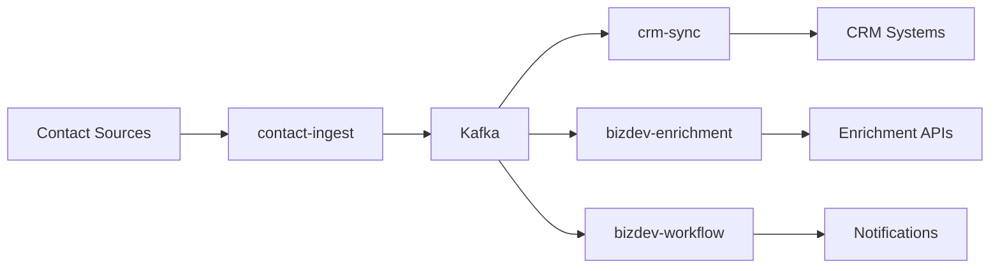

# ADR-013: BizDev Service Architecture

Date: 2025-05-26
Status: Draft
Authors: @alfred-architect-o3, @claude-code

## Context

The BizDev vertical requires a specialized architecture to support business development workflows, including contact management, CRM synchronization, and strategic intelligence gathering. This ADR defines the technical architecture for Epic #404.

Current state:
- No centralized contact management system
- Manual CRM data entry with high error rate (15%)
- Disconnected intelligence sources requiring manual correlation
- No automated enrichment or validation pipelines

### Requirements Analysis

1. **Contact Ingestion** (from Epic #404):
   - Multi-source ingestion (CSV, API, webhooks)
   - Deduplication and normalization
   - Data quality scoring
   - GDPR-compliant storage

2. **CRM Synchronization**:
   - Bi-directional sync with Salesforce/HubSpot
   - Field mapping and transformation
   - Conflict resolution
   - Audit trail

3. **Intelligence Enrichment**:
   - Company data enrichment (Clearbit, Apollo)
   - Social media signal correlation
   - News and press monitoring
   - Competitive intelligence

4. **Workflow Automation**:
   - Lead scoring and routing
   - Automated outreach sequences
   - Task generation for sales team
   - Performance analytics

## Decision

Implement a microservice architecture with the following components:

### 1. Contact Ingest Service (`contact-ingest`)
- **Technology**: FastAPI + PostgreSQL
- **Responsibilities**:
  - CSV/Excel file parsing
  - API endpoint for webhooks
  - Data validation and normalization
  - Deduplication logic
  - Quality scoring algorithm
- **Interfaces**:
  - REST API for uploads
  - Kafka producer for downstream events
  - Prometheus metrics

### 2. CRM Sync Service (`crm-sync`)
- **Technology**: Python + APScheduler + Redis
- **Responsibilities**:
  - Periodic sync with CRM APIs
  - Field mapping configuration
  - Conflict detection and resolution
  - Change data capture (CDC)
- **Interfaces**:
  - CRM API adapters (Salesforce, HubSpot)
  - Redis for sync state management
  - PostgreSQL for audit logs

### 3. Enrichment Pipeline (`bizdev-enrichment`)
- **Technology**: Celery + Redis + MinIO
- **Responsibilities**:
  - Third-party API orchestration
  - Data enrichment workflows
  - Caching to minimize API costs
  - Result aggregation
- **Interfaces**:
  - Celery task queue
  - MinIO for enriched data storage
  - GraphQL API for queries

### 4. Workflow Engine (`bizdev-workflow`)
- **Technology**: Temporal.io
- **Responsibilities**:
  - Lead scoring workflows
  - Outreach sequence management
  - Task assignment logic
  - SLA monitoring
- **Interfaces**:
  - Temporal workflows
  - Webhook notifications
  - REST API for workflow triggers

### Data Flow Architecture



### Database Schema (Core Tables)

```sql
-- Contacts table with GDPR fields
CREATE TABLE contacts (
    id UUID PRIMARY KEY,
    email VARCHAR(255) UNIQUE,
    first_name VARCHAR(100),
    last_name VARCHAR(100),
    company_id UUID,
    quality_score DECIMAL(3,2),
    gdpr_consent BOOLEAN DEFAULT FALSE,
    gdpr_consent_date TIMESTAMP,
    created_at TIMESTAMP DEFAULT NOW(),
    updated_at TIMESTAMP DEFAULT NOW()
);

-- Sync state tracking
CREATE TABLE crm_sync_state (
    id UUID PRIMARY KEY,
    crm_type VARCHAR(50),
    last_sync_at TIMESTAMP,
    sync_cursor JSONB,
    status VARCHAR(20),
    error_count INTEGER DEFAULT 0
);

-- Enrichment cache
CREATE TABLE enrichment_cache (
    id UUID PRIMARY KEY,
    source VARCHAR(50),
    query_hash VARCHAR(64),
    result JSONB,
    expires_at TIMESTAMP,
    created_at TIMESTAMP DEFAULT NOW()
);
```

## Consequences

### Positive
- Scalable architecture supporting 100k+ contacts
- API cost optimization through intelligent caching
- GDPR compliance built-in from day one
- Extensible for future CRM integrations
- Full audit trail for compliance

### Negative
- Additional operational complexity (4 new services)
- Requires Temporal.io expertise for workflow engine
- Initial setup cost for enrichment APIs (~$500/month)
- Learning curve for team on new stack

### Neutral
- Need to establish data retention policies
- Monitoring and alerting strategy required
- Documentation for field mapping configurations

## Implementation Plan

### Phase 1: Core Services (Week 1-2)
- [ ] Set up contact-ingest with basic CSV parsing
- [ ] Implement PostgreSQL schema and migrations
- [ ] Create health check endpoints
- [ ] Deploy to staging with docker-compose

### Phase 2: CRM Integration (Week 3-4)
- [ ] Build Salesforce adapter
- [ ] Implement sync state management
- [ ] Add conflict resolution logic
- [ ] Create sync monitoring dashboard

### Phase 3: Enrichment Pipeline (Week 5-6)
- [ ] Integrate Clearbit API
- [ ] Set up Celery with Redis backend
- [ ] Implement caching layer
- [ ] Add cost tracking metrics

### Phase 4: Workflow Automation (Week 7-8)
- [ ] Deploy Temporal.io cluster
- [ ] Create lead scoring workflow
- [ ] Build notification system
- [ ] End-to-end testing

## Security Considerations

1. **Data Privacy**:
   - PII encryption at rest (AES-256)
   - Field-level access controls
   - GDPR consent tracking
   - Right-to-deletion implementation

2. **API Security**:
   - Rate limiting on all endpoints
   - JWT authentication
   - API key rotation for third-party services
   - Request signing for webhooks

3. **Compliance**:
   - SOC2 audit logging
   - Data residency controls
   - Regular security scans
   - Incident response playbook

## Monitoring Strategy

- **SLIs**: Contact ingestion latency, CRM sync success rate, enrichment cache hit ratio
- **SLOs**: 99.9% uptime, <5min sync delay, <2s API response time
- **Dashboards**: Grafana for metrics, Kibana for logs, Sentry for errors
- **Alerts**: PagerDuty integration for critical failures

## Open Questions

1. **Multi-tenancy**: Single-tenant initially or design for multi-tenant from start?
2. **Data Lake**: Should we archive all ingested data to S3 for ML training?
3. **Real-time sync**: Is 5-minute sync interval sufficient or do we need real-time?
4. **Enrichment vendors**: Stick with Clearbit or evaluate Apollo.io as well?

## Review Process

1. Technical review by platform team (by May 30)
2. Security review for GDPR compliance
3. Cost analysis for enrichment APIs
4. Pilot with 3 sales team members
5. Full rollout target: July 15, 2025

## References

- [Epic #404: BizDev Groundwork](https://github.com/locotoki/alfred-agent-platform-v2/issues/404)
- [Temporal.io Architecture Guide](https://docs.temporal.io/architecture)
- [GDPR Technical Compliance Checklist](https://gdpr.eu/checklist/)
- [Salesforce Bulk API Best Practices](https://developer.salesforce.com/docs/atlas.en-us.api_asynch.meta/api_asynch/best_practices.htm)
