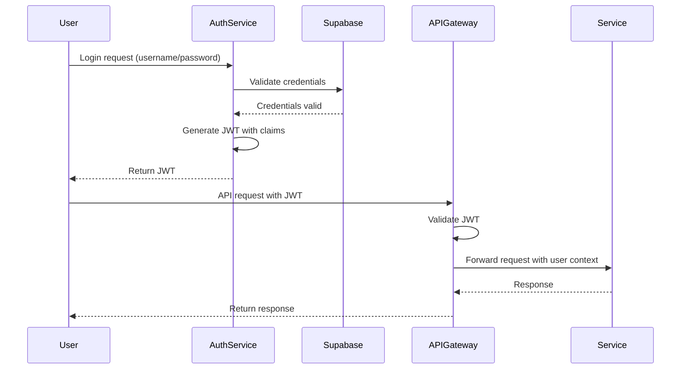
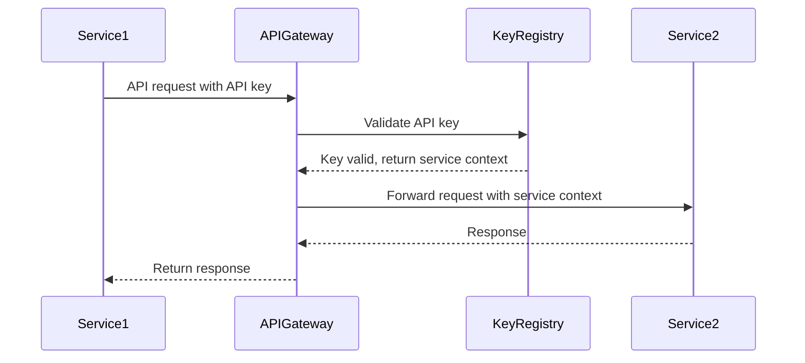

# Authentication

*Last Updated: 2025-05-13*  
*Owner: API Team*  
*Status: Active*

## Overview

This document describes the authentication mechanisms used in the Alfred Agent Platform v2. The platform implements a comprehensive authentication system that secures both external API access and internal service-to-service communication. The authentication system supports JSON Web Tokens (JWT), API keys, and role-based access control (RBAC) to provide secure, flexible access management across the platform.

## Authentication Methods

The Alfred Agent Platform supports two primary authentication methods:

### JWT Authentication

JWT (JSON Web Token) is used for user authentication and session management. JWTs are stateless, self-contained tokens that include user identity and permission claims in a secure, signed format.

**Use Cases:**
- User authentication to Mission Control UI
- Agent APIs accessed via the API Gateway
- Session-based operations with time-limited access
- Workflows requiring user context

**JWT Structure:**
```
header.payload.signature
```

**JWT Payload Example:**
```json
{
  "sub": "user-123",
  "name": "Jane Doe",
  "role": "admin",
  "tenant_id": "org-456",
  "permissions": ["read:agents", "write:tasks"],
  "iat": 1683123456,
  "exp": 1683127056
}
```

### API Key Authentication

API keys are used for service-to-service authentication and programmatic access to APIs. API keys are long-lived credentials that identify the calling service or application.

**Use Cases:**
- Service-to-service communication
- External integrations with Alfred APIs
- Automated scripts and processes
- Continuous access without user context

**API Key Format:**
```
alfred_api_<environment>_<key-id>
```

Example: `alfred_api_prod_xC7nPzT9a4g2Lq5R`

## Authentication Flow

### User Authentication Flow

1. User provides credentials (username/password) to authentication service
2. Authentication service validates credentials against Supabase Auth
3. Upon successful validation, a JWT is generated with appropriate claims
4. JWT is returned to the client and stored securely (HTTP-only cookie)
5. Client includes JWT in subsequent requests (Authorization header)
6. API Gateway validates the JWT signature and claims
7. If valid, the request is forwarded to the appropriate service



### Service Authentication Flow

1. Service registers and receives an API key
2. Service stores API key securely
3. Service includes API key in requests to other services
4. Receiving service validates the API key against the key registry
5. If valid, the request is processed with the service's permissions



## Implementation Details

### JWT Configuration

JWTs are configured with the following settings:

| Setting | Value | Description |
|---------|-------|-------------|
| Algorithm | RS256 | Asymmetric signing with RSA |
| Expiration | 1 hour | Default token lifetime |
| Refresh | 14 days | Default refresh token lifetime |
| Issuer | `alfred-auth.example.com` | Token issuer identifier |
| Audience | `alfred-platform-api` | Intended recipient of tokens |

### JWT Secret Management

The platform uses asymmetric key pairs for JWT signing and verification:
- Private key (for signing) is stored securely in the authentication service
- Public key (for verification) is distributed to services that need to validate tokens
- Keys are rotated every 90 days with a grace period to handle in-flight tokens

### API Key Management

API keys are managed through the following process:
- Generated using a cryptographically secure random generator
- Stored as securely hashed values in the database
- Associated with specific permissions and rate limits
- Can be revoked immediately when necessary
- Rotated regularly based on security policy

### RBAC (Role-Based Access Control)

The platform implements RBAC to control access to resources:

**Built-in Roles:**
- `admin`: Full platform access
- `operator`: Can manage agents and workflows
- `developer`: Can view and test APIs
- `agent`: Limited to specific agent operations
- `viewer`: Read-only access to dashboards and reports

**Custom Roles:**
Custom roles can be created with specific permission sets tailored to organizational needs.

**Permission Format:**
Permissions follow the format `action:resource[:qualifier]`

Examples:
- `read:agents`: View agent information
- `write:tasks:financial-agent`: Create tasks for the financial agent
- `execute:workflows:niche-scout`: Run the niche scout workflow

## Implementation Examples

### Python Implementation (JWT)

```python
import jwt
import requests
from datetime import datetime, timedelta

# Client-side authentication
def login(username, password, auth_url="https://api.alfred-platform.example.com/auth/login"):
    """Authenticate user and get JWT token."""
    response = requests.post(auth_url, json={
        "username": username,
        "password": password
    })
    response.raise_for_status()
    auth_data = response.json()
    return auth_data["token"]

# Using JWT in API calls
def call_api(endpoint, token, method="GET", data=None):
    """Make an authenticated API call."""
    headers = {
        "Authorization": f"Bearer {token}",
        "Content-Type": "application/json"
    }
    url = f"https://api.alfred-platform.example.com{endpoint}"
    response = requests.request(
        method=method,
        url=url,
        headers=headers,
        json=data
    )
    response.raise_for_status()
    return response.json()

# Server-side JWT verification
def verify_token(token, public_key):
    """Verify JWT token and extract claims."""
    try:
        payload = jwt.decode(
            token,
            public_key,
            algorithms=["RS256"],
            audience="alfred-platform-api",
            issuer="alfred-auth.example.com"
        )
        return payload
    except jwt.PyJWTError as e:
        raise ValueError(f"Invalid token: {str(e)}")

# Check permissions
def has_permission(payload, required_permission):
    """Check if token has required permission."""
    if "permissions" not in payload:
        return False
    
    if "admin" in payload.get("role", "").lower():
        return True  # Admin role has all permissions
        
    permissions = payload["permissions"]
    return required_permission in permissions
```

### JavaScript Implementation (JWT)

```javascript
const axios = require('axios');
const jwt = require('jsonwebtoken');
const fs = require('fs');

// Client-side authentication
async function login(username, password, authUrl = 'https://api.alfred-platform.example.com/auth/login') {
  try {
    const response = await axios.post(authUrl, {
      username,
      password
    });
    return response.data.token;
  } catch (error) {
    console.error('Authentication failed:', error.response?.data || error.message);
    throw error;
  }
}

// Using JWT in API calls
async function callApi(endpoint, token, method = 'GET', data = null) {
  try {
    const response = await axios({
      method,
      url: `https://api.alfred-platform.example.com${endpoint}`,
      headers: {
        'Authorization': `Bearer ${token}`,
        'Content-Type': 'application/json'
      },
      data
    });
    return response.data;
  } catch (error) {
    console.error('API call failed:', error.response?.data || error.message);
    throw error;
  }
}

// Server-side JWT verification
function verifyToken(token, publicKeyPath) {
  try {
    const publicKey = fs.readFileSync(publicKeyPath, 'utf8');
    const payload = jwt.verify(token, publicKey, {
      algorithms: ['RS256'],
      audience: 'alfred-platform-api',
      issuer: 'alfred-auth.example.com'
    });
    return payload;
  } catch (error) {
    throw new Error(`Invalid token: ${error.message}`);
  }
}

// Check permissions
function hasPermission(payload, requiredPermission) {
  if (!payload.permissions) {
    return false;
  }
  
  if (payload.role && payload.role.toLowerCase().includes('admin')) {
    return true;  // Admin role has all permissions
  }
  
  return payload.permissions.includes(requiredPermission);
}
```

### Python Implementation (API Key)

```python
import hashlib
import hmac
import secrets
import time
import requests

# Generate API key
def generate_api_key(service_id, environment="dev"):
    """Generate a new API key for a service."""
    key_id = secrets.token_hex(8)
    key_value = secrets.token_hex(16)
    key = f"alfred_api_{environment}_{key_id}"
    
    # In a real implementation, store the hashed key value
    hashed_key = hashlib.sha256(key_value.encode()).hexdigest()
    
    # Store in database: service_id, key, hashed_key, creation time, etc.
    
    return f"{key}_{key_value}"

# Using API key in requests
def call_service_api(endpoint, api_key, method="GET", data=None):
    """Make an authenticated API call using API key."""
    headers = {
        "X-API-Key": api_key,
        "Content-Type": "application/json"
    }
    url = f"https://api.alfred-platform.example.com{endpoint}"
    response = requests.request(
        method=method,
        url=url,
        headers=headers,
        json=data
    )
    response.raise_for_status()
    return response.json()

# Validate API key (server-side)
def validate_api_key(api_key):
    """Validate an API key against stored keys."""
    if not api_key or "_" not in api_key:
        return None
    
    # Parse the key to extract key ID
    parts = api_key.split("_")
    if len(parts) < 4:
        return None
    
    prefix, api_text, environment, key_id = parts[0], parts[1], parts[2], parts[3]
    
    if prefix != "alfred" or api_text != "api":
        return None
    
    # In a real implementation, look up the key_id in the database
    # and verify the key value by comparing hashes
    
    # If valid, return the service context
    return {
        "service_id": "example-service",
        "permissions": ["read:metrics", "write:logs"],
        "rate_limit": 1000
    }
```

### JavaScript Implementation (API Key)

```javascript
const crypto = require('crypto');
const axios = require('axios');

// Generate API key
function generateApiKey(serviceId, environment = 'dev') {
  const keyId = crypto.randomBytes(8).toString('hex');
  const keyValue = crypto.randomBytes(16).toString('hex');
  const key = `alfred_api_${environment}_${keyId}`;
  
  // In a real implementation, store the hashed key value
  const hashedKey = crypto.createHash('sha256').update(keyValue).digest('hex');
  
  // Store in database: serviceId, key, hashedKey, creation time, etc.
  
  return `${key}_${keyValue}`;
}

// Using API key in requests
async function callServiceApi(endpoint, apiKey, method = 'GET', data = null) {
  try {
    const response = await axios({
      method,
      url: `https://api.alfred-platform.example.com${endpoint}`,
      headers: {
        'X-API-Key': apiKey,
        'Content-Type': 'application/json'
      },
      data
    });
    return response.data;
  } catch (error) {
    console.error('API call failed:', error.response?.data || error.message);
    throw error;
  }
}

// Validate API key (server-side)
function validateApiKey(apiKey) {
  if (!apiKey || !apiKey.includes('_')) {
    return null;
  }
  
  // Parse the key to extract key ID
  const parts = apiKey.split('_');
  if (parts.length < 4) {
    return null;
  }
  
  const [prefix, apiText, environment, keyId] = parts;
  
  if (prefix !== 'alfred' || apiText !== 'api') {
    return null;
  }
  
  // In a real implementation, look up the keyId in the database
  // and verify the key value by comparing hashes
  
  // If valid, return the service context
  return {
    serviceId: 'example-service',
    permissions: ['read:metrics', 'write:logs'],
    rateLimit: 1000
  };
}
```

## Security Considerations

### JWT Security

1. **Token Storage**:
   - Store JWTs in secure, HTTP-only cookies to prevent XSS attacks
   - For mobile apps, use secure storage mechanisms (Keychain, KeyStore)
   - Never store JWTs in local storage or session storage in browsers

2. **Token Validation**:
   - Always validate token signature using the correct public key
   - Verify expiration (exp) and issuance time (iat) claims
   - Validate issuer (iss) and audience (aud) claims
   - Implement token revocation for security incidents

3. **Token Refresh**:
   - Use refresh tokens to obtain new JWTs without re-authentication
   - Store refresh tokens securely with higher protection than access tokens
   - Implement refresh token rotation to prevent token theft

### API Key Security

1. **Key Protection**:
   - Never include API keys in client-side code
   - Never commit API keys to source control
   - Use environment variables or secure vaults for key storage

2. **Key Rotation**:
   - Rotate API keys regularly (every 90-180 days)
   - Implement key versioning to allow smooth transitions
   - Have emergency key revocation procedures

3. **Key Scope Limitation**:
   - Restrict API keys to minimum required permissions
   - Use different keys for different services/environments
   - Apply rate limiting to all API key access

## Troubleshooting

### Common JWT Issues

| Issue | Possible Causes | Resolution |
|-------|----------------|------------|
| Invalid signature | Wrong public key, tampered token | Verify correct public key, request new token |
| Token expired | Token lifetime exceeded | Refresh token or re-authenticate |
| Invalid audience | Token used with wrong service | Ensure token is used with intended service |
| Missing permissions | Insufficient privileges | Request elevated permissions or use different account |

### Common API Key Issues

| Issue | Possible Causes | Resolution |
|-------|----------------|------------|
| Invalid key format | Malformed key | Verify key format matches expected pattern |
| Key not found | Revoked or non-existent key | Generate new API key |
| Rate limit exceeded | Too many requests | Implement backoff strategy, request limit increase |
| Insufficient permissions | Key missing required permissions | Update key permissions or use different key |

## Related Documentation

- [API Gateway](api-gateway.md): Documentation for the central API gateway
- [A2A Protocol](a2a-protocol.md): Details about service-to-service communication
- [RBAC Configuration](../operations/rbac-configuration.md): How to configure roles and permissions
- [Security Implementation](../architecture/security-architecture.md): Platform security architecture

## References

- [JWT RFC 7519](https://tools.ietf.org/html/rfc7519)
- [OWASP Authentication Cheat Sheet](https://cheatsheetseries.owasp.org/cheatsheets/Authentication_Cheat_Sheet.html)
- [API Key Best Practices](https://cloud.google.com/endpoints/docs/openapi/when-why-api-key)
- [Supabase Auth Documentation](https://supabase.io/docs/reference/javascript/auth-signup)