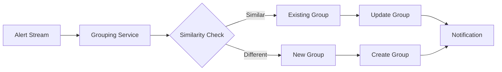

# Alert Grouping Feature

## Overview

The alert grouping feature reduces notification noise by intelligently grouping related alerts based on similarity and temporal proximity.

## Architecture



## Feature Flag Configuration

Enable alert grouping via environment variable:
```bash
export ALERT_GROUPING_ENABLED=true
```

To check feature flag status in code:
```python
from alfred.alerts.feature_flags import AlertFeatureFlags

if AlertFeatureFlags.is_enabled(AlertFeatureFlags.ALERT_GROUPING_ENABLED):
    # Feature is enabled
    pass
```

## API Documentation

### POST /api/v1/alerts/grouped

Groups alerts based on similarity and time window.

**Request:**
```bash
curl -X POST http://localhost:8000/api/v1/alerts/grouped \
  -H "Content-Type: application/json" \
  -H "X-Feature-Flag: on" \
  -d '{
    "strategy": "jaccard",
    "time_window": 900
  }'
```

**Request Body:**
```json
{
  "strategy": "jaccard",      // Grouping strategy (only "jaccard" supported)
  "time_window": 900          // Time window in seconds (default: 900)
}
```

**Response:**
```json
{
  "groups": [
    {
      "id": "550e8400-e29b-41d4-a716-446655440000",
      "key": "api-gateway:HighCPU:warning",
      "count": 5,
      "first_seen": "2025-05-20T10:00:00Z",
      "last_seen": "2025-05-20T10:14:00Z",
      "severity": "warning"
    }
  ]
}
```

**Headers:**
- `X-Feature-Flag: on` - Required when feature flag is disabled globally

## Algorithm Details

The grouping algorithm uses Jaccard similarity on alert labels:

1. **Group Key Generation**: `{service}:{alert_name}:{severity}`
2. **Similarity Calculation**: 
   - Jaccard index on label sets
   - +0.3 bonus for matching alert names
   - +0.1 bonus for matching severity
3. **Time Window**: Default 15 minutes, configurable
4. **Threshold**: 0.5 minimum similarity score

## UI Component

The GroupedAlerts React component displays grouped alerts in an accordion:

```typescript
import { GroupedAlerts } from '@/components/GroupedAlerts';

<GroupedAlerts 
  groups={alertGroups}
  featureFlags={{ ALERT_GROUPING_ENABLED: true }}
/>
```

Features:
- Severity-based color coding
- Alert count badges
- Expandable details
- Time range display

## Performance Metrics

Target performance:
- P95 latency: < 150ms at 50 RPS
- Memory usage: < 256MB for 10k alerts
- CPU: < 50% on 2 cores

Load testing command:
```bash
locust -f load/alert_group.py --headless -u 50 -r 10 -t 2m
```

## Rollout Plan

1. **Phase 1**: Deploy with flag disabled
2. **Phase 2**: Enable in staging (10% traffic)
3. **Phase 3**: Monitor for 48 hours
4. **Phase 4**: Enable in production (25% → 50% → 100%)
5. **Phase 5**: Remove feature flag after 1 week stable

## Monitoring

Key metrics to track:
- Alert noise reduction percentage
- API latency (P50, P95, P99)
- Memory usage
- Error rates
- User engagement with grouped alerts

## Troubleshooting

Common issues:

1. **Feature not working**: Check `ALERT_GROUPING_ENABLED` env var
2. **High latency**: Reduce time window or similarity threshold
3. **Too many groups**: Increase similarity threshold
4. **Too few groups**: Decrease similarity threshold