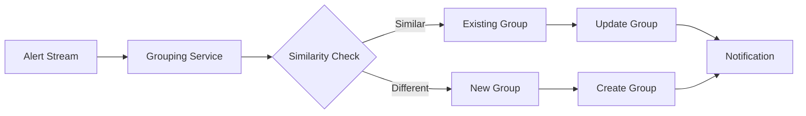

# Alert Grouping Feature

## Overview

The alert grouping feature reduces notification noise by intelligently grouping related alerts based on similarity and temporal proximity.

## Architecture



## Configuration

Enable alert grouping via environment variable:
```bash
export ALERT_GROUPING_ENABLED=true
```

## Algorithm

The grouping algorithm considers:
1. Alert metadata similarity (service, environment, error type)
2. Time proximity (configurable window, default 5 minutes)
3. Severity correlation
4. Custom rules (regex patterns, field matching)

## API Endpoints

### Get Grouped Alerts
```http
GET /api/v1/alerts/grouped
X-Feature-Flag: on
```

Response:
```json
{
  "groups": [
    {
      "id": "group-uuid",
      "key": "api-gateway:high-cpu",
      "count": 5,
      "first_seen": "2025-05-20T10:00:00Z",
      "last_seen": "2025-05-20T10:04:00Z",
      "severity": "high"
    }
  ]
}
```

## Performance

Target performance metrics:
- P95 latency: < 150ms
- Throughput: 50 RPS
- Memory usage: < 256MB for 10k alerts

## Rollout Plan

1. Deploy behind feature flag (disabled)
2. Enable for 10% of staging traffic
3. Monitor metrics and error rates
4. Gradual rollout to production
5. Full enablement after 1 week stable