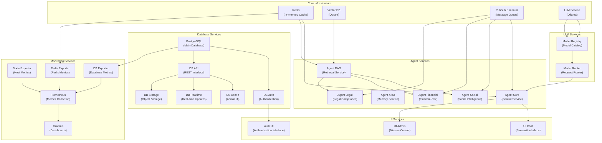

# Docker Compose Configuration

*Last Updated: 2025-05-13*  
*Owner: Infrastructure Team*  
*Status: Active*

## Overview

The Alfred Agent Platform v2 uses Docker Compose as its primary containerization strategy for local development, testing, and production deployment. This document provides a comprehensive guide to the platform's Docker Compose configuration, including service organization, networking, volumes, and environment-specific configurations.

The platform uses a modular Docker Compose approach with a base configuration file (`docker-compose.yml`) and multiple overlay files for environment-specific and component-specific configurations. This allows for flexible deployment scenarios while maintaining a consistent foundation.

## Architecture

The Docker Compose configuration organizes services into logical groups that reflect the platform's architecture:



## Service Groups

### Core Infrastructure

| Service | Description | Port | Dependencies |
|---------|-------------|------|--------------|
| `redis` | In-memory data store for caching and message passing | 6379 | None |
| `vector-db` | Qdrant vector database for embeddings and similarity search | 6333, 6334 | None |
| `pubsub-emulator` | Google Cloud Pub/Sub emulator for message queue | 8085 | None |
| `llm-service` | Ollama for local LLM inference | 11434 | None |

### Database Services (Supabase)

| Service | Description | Port | Dependencies |
|---------|-------------|------|--------------|
| `db-postgres` | PostgreSQL database with Supabase extensions | 5432 | None |
| `db-auth` | Authentication service | 9999 | `db-postgres` |
| `db-api` | REST API for database access | 3000 | `db-postgres` |
| `db-admin` | Admin UI for database management | 3001 | `db-postgres`, `db-api` |
| `db-realtime` | Real-time updates for database changes | 4000 | `db-postgres` |
| `db-storage` | Object storage service | 5000 | `db-postgres`, `db-api` |

### Agent Services

| Service | Description | Port | Dependencies |
|---------|-------------|------|--------------|
| `agent-core` | Core agent service | 8011 | `db-postgres`, `pubsub-emulator`, `redis` |
| `agent-rag` | Retrieval-Augmented Generation service | 8501 | `vector-db`, `redis` |
| `agent-atlas` | Memory management service | 8000 | `agent-rag`, `redis`, `pubsub-emulator` |
| `agent-social` | Social intelligence agent | 9000 | `db-postgres`, `pubsub-emulator`, `redis`, `agent-rag` |
| `agent-financial` | Financial tax agent | 9003 | `db-postgres`, `pubsub-emulator`, `redis`, `agent-rag` |
| `agent-legal` | Legal compliance agent | 9002 | `db-postgres`, `pubsub-emulator`, `redis`, `agent-rag` |

### UI Services

| Service | Description | Port | Dependencies |
|---------|-------------|------|--------------|
| `ui-chat` | Streamlit-based chat interface | 8502 | `agent-core` |
| `ui-admin` | Mission Control dashboard | 3007 | `agent-core`, `agent-social` |
| `auth-ui` | Authentication UI | 3006 | `db-auth` |

### LLM Services

| Service | Description | Port | Dependencies |
|---------|-------------|------|--------------|
| `model-registry` | Model registry and catalog | 8079 | `db-postgres`, `llm-service` |
| `model-router` | Routes LLM requests to appropriate backend | 8080 | `model-registry` |

### Monitoring Services

| Service | Description | Port | Dependencies |
|---------|-------------|------|--------------|
| `monitoring-metrics` | Prometheus for metrics collection | 9090 | None |
| `monitoring-dashboard` | Grafana for visualization | 3005 | None |
| `monitoring-node` | Node exporter for host metrics | 9100 | None |
| `monitoring-db` | PostgreSQL exporter | 9187 | `db-postgres` |
| `monitoring-redis` | Redis exporter | 9122 | `redis` |

### Mail Services

| Service | Description | Port | Dependencies |
|---------|-------------|------|--------------|
| `mail-server` | MailHog for local email testing | 1025, 8025 | None |

## Configuration Files

The Docker Compose configuration is split across multiple files for better organization and modularity:

### Base Configuration

- `docker-compose.yml` - Base configuration with all services

### Environment-Specific Configurations

- `docker-compose.dev.yml` - Development environment configuration
- `docker-compose.prod.yml` - Production environment configuration
- `docker-compose.test.yml` - Testing environment configuration

### Component-Specific Configurations

- `docker-compose.core.yml` - Core services only
- `docker-compose.agents.yml` - Agent services only
- `docker-compose.ui.yml` - UI services only
- `docker-compose.monitoring.yml` - Monitoring services only
- `docker-compose.llm.yml` - LLM services only

### Specialized Configurations

- `docker-compose.unified.yml` - Unified configuration for simplified deployment
- `docker-compose.optimized.yml` - Resource-optimized configuration

## Health Checks

All services in the Docker Compose configuration have standardized health checks:

```yaml
healthcheck:
  test: ["CMD", "curl", "-f", "http://localhost:{port}/health"]
  interval: 30s
  timeout: 10s
  retries: 3
  start_period: 10s
```

Health checks ensure that containers are functioning correctly and dependencies are properly managed. For services that don't have HTTP health endpoints, process-based health checks are used:

```yaml
healthcheck:
  test: ["CMD-SHELL", "pgrep {process_name} || exit 1"]
  interval: 30s
  timeout: 10s
  retries: 3
  start_period: 10s
```

## Networking

The platform uses a shared Docker network named `alfred-network` for all services:

```yaml
networks:
  alfred-network:
    name: alfred-network
    driver: bridge
    external: true
```

The network is defined as external, which means it must be created before starting the services. This approach allows for greater flexibility in network management and ensures services can communicate across different Docker Compose configurations.

## Volumes

Persistent data is stored in named volumes:

```yaml
volumes:
  redis-data:
    name: redis-data
  vector-db-data:
    name: vector-db-data
  llm-service-data:
    name: llm-service-data
  db-postgres-data:
    name: db-postgres-data
  db-storage-data:
    name: db-storage-data
  monitoring-metrics-data:
    name: monitoring-metrics-data
  monitoring-dashboard-data:
    name: monitoring-dashboard-data
```

Named volumes are used for several reasons:
- They persist data across container restarts
- They provide better performance than bind mounts
- They can be managed with Docker commands
- They allow for consistent naming across different environments

## Environment Variables

The Docker Compose configuration uses environment variables for flexible configuration:

```yaml
environment:
  - ALFRED_ENVIRONMENT=${ALFRED_ENVIRONMENT:-development}
  - ALFRED_DEBUG=${ALFRED_DEBUG:-true}
  - ALFRED_DATABASE_URL=${ALFRED_DATABASE_URL:-postgresql://${DB_USER:-postgres}:${DB_PASSWORD:-your-super-secret-password}@db-postgres:5432/${DB_NAME:-postgres}}
```

Default values are provided for ease of use, and sensitive values should be set in a `.env` file that is not committed to the repository. The environment variables follow a consistent naming convention:

- `ALFRED_*` - Platform-specific variables
- `DB_*` - Database-specific variables
- Service-specific prefixes for service variables

## Resource Management

Resource limits and reservations can be configured for services:

```yaml
deploy:
  resources:
    limits:
      cpus: '1.0'
      memory: 1G
    reservations:
      cpus: '0.5'
      memory: 512M
```

For GPU-enabled services like LLM inference, GPU resources can be allocated:

```yaml
deploy:
  resources:
    reservations:
      devices:
        - driver: nvidia
          count: all
          capabilities: [gpu]
```

## Dependency Management

Services are configured with explicit dependencies:

```yaml
depends_on:
  db-postgres:
    condition: service_healthy
  pubsub-emulator:
    condition: service_started
  redis:
    condition: service_started
```

Dependencies ensure that services start in the correct order and only when their dependencies are ready. The `condition: service_healthy` option waits for the dependency's health check to pass before starting the dependent service.

## Deployment

### Development Environment

To start the platform in a development environment:

```bash
# Create the network if it doesn't exist
docker network create alfred-network

# Start all services
docker-compose -f docker-compose.yml -f docker-compose.dev.yml up -d

# View logs
docker-compose -f docker-compose.yml -f docker-compose.dev.yml logs -f
```

### Production Environment

For production deployment:

```bash
# Create the network if it doesn't exist
docker network create alfred-network

# Start all services
docker-compose -f docker-compose.yml -f docker-compose.prod.yml up -d

# View logs
docker-compose -f docker-compose.yml -f docker-compose.prod.yml logs -f
```

### Simplified Deployment

For quick deployment with all services:

```bash
# Use the restart script
./restart-all-containers.sh
```

The script handles network creation, volume management, and service startup in the correct order.

## Scaling

Services can be scaled using Docker Compose:

```bash
# Scale Agent Core service to 3 instances
docker-compose -f docker-compose.yml -f docker-compose.dev.yml up -d --scale agent-core=3
```

Note that scaled services must be stateless and configured for horizontal scaling.

## Monitoring

The platform includes a comprehensive monitoring stack with Prometheus and Grafana:

- Prometheus collects metrics from exporters
- Grafana provides visualization dashboards
- Exporters collect metrics from various services

To access the monitoring dashboard:

```
http://localhost:3005
```

Default credentials:
- Username: admin
- Password: admin (or the value of `MONITORING_ADMIN_PASSWORD`)

## Troubleshooting

### Common Issues

1. **Network Not Found**
   - Error: "Network alfred-network not found"
   - Solution: Create the network manually:
     ```bash
     docker network create alfred-network
     ```

2. **Container Health Checks Failing**
   - Error: "unhealthy: starting" or "unhealthy: failed"
   - Solution: Check the container logs:
     ```bash
     docker logs <container-name>
     ```

3. **Port Conflicts**
   - Error: "Bind for 0.0.0.0:8080 failed: port is already allocated"
   - Solution: Check for existing services using the port:
     ```bash
     sudo lsof -i :<port>
     ```
   - Modify the port mapping in the Docker Compose file

4. **Database Initialization Issues**
   - Error: "Error: Database not initialized" or migration errors
   - Solution: Check database logs and ensure migrations are running:
     ```bash
     docker logs db-postgres
     ```

5. **Volume Permissions**
   - Error: "Permission denied" on volume access
   - Solution: Fix permissions or recreate volumes:
     ```bash
     docker volume rm <volume-name>
     ```

### Debugging Commands

Check container status:
```bash
docker ps -a
```

View container logs:
```bash
docker logs <container-name>
```

Access container shell:
```bash
docker exec -it <container-name> sh
```

Inspect network connections:
```bash
docker network inspect alfred-network
```

Check volume details:
```bash
docker volume inspect <volume-name>
```

## Migration from Legacy Setup

To migrate from the legacy configuration to the unified setup:

1. Stop all running containers:
   ```bash
   docker-compose down
   ```

2. Backup volumes if needed:
   ```bash
   ./scripts/backup-volumes.sh
   ```

3. Start with the unified configuration:
   ```bash
   docker-compose -f docker-compose.unified.yml up -d
   ```

4. Verify the migration:
   ```bash
   ./scripts/verify-migration.sh
   ```

## Related Documentation

- [Infrastructure Overview](../infrastructure/infrastructure-overview.md)
- [Kubernetes Deployment](../kubernetes/kubernetes-deployment.md)
- [Database Configuration](../database/database-configuration.md)
- [Service Containerization](../../SERVICE_CONTAINERIZATION.md)

## References

- [Docker Compose Documentation](https://docs.docker.com/compose/)
- [Docker Networking](https://docs.docker.com/network/)
- [Docker Volumes](https://docs.docker.com/storage/volumes/)
- [Health Checks](https://docs.docker.com/compose/compose-file/compose-file-v3/#healthcheck)