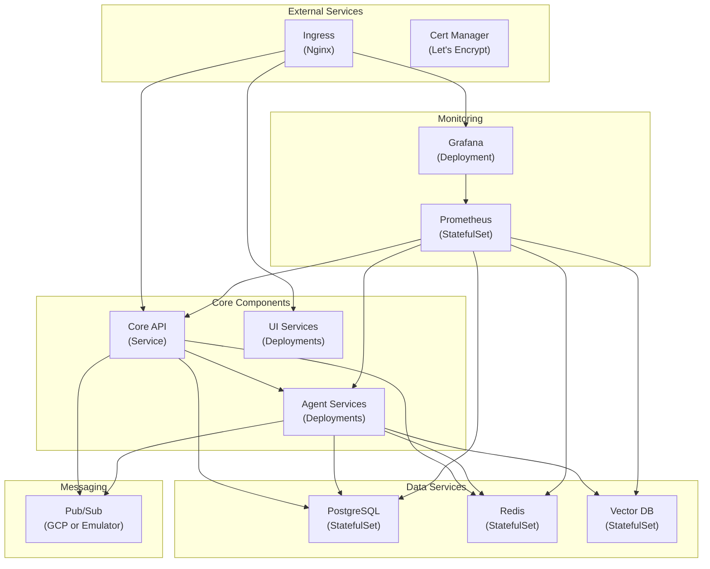

# Kubernetes Deployment

*Last Updated: 2025-05-13*  
*Owner: Infrastructure Team*  
*Status: Active*

## Overview

This document outlines the Kubernetes deployment architecture for the Alfred Agent Platform v2. Kubernetes provides a scalable, resilient infrastructure for running the platform in production environments. While the platform is currently primarily deployed using Docker Compose, this Kubernetes configuration provides a path for scaling to larger deployments.

The Kubernetes configuration is organized using Kustomize, which allows for environment-specific customizations of a base configuration. This approach enables consistent deployment across development, staging, and production environments.

## Architecture

The Kubernetes deployment follows a standard microservices architecture pattern with the following core components:



## Directory Structure

The Kubernetes configuration is organized using Kustomize with the following structure:

```
infra/k8s/
├── base/                  # Base configurations for all environments
│   ├── namespace.yaml     # Platform namespace definition
│   ├── core/              # Core services (agent-core, etc.)
│   ├── agents/            # Agent services (financial, social, etc.)
│   ├── data/              # Data services (PostgreSQL, Redis, Vector DB)
│   ├── ui/                # UI services (chat-ui, admin-ui)
│   └── monitoring/        # Monitoring services (Prometheus, Grafana)
│
└── overlays/              # Environment-specific overlays
    ├── dev/               # Development environment
    ├── staging/           # Staging environment
    └── prod/              # Production environment
```

## Key Components

### Namespace

All platform resources are deployed in a dedicated namespace:

```yaml
apiVersion: v1
kind: Namespace
metadata:
  name: alfred-platform
  labels:
    app: alfred-platform
```

### Deployments

Services are deployed using Deployment resources:

```yaml
apiVersion: apps/v1
kind: Deployment
metadata:
  name: agent-core
  namespace: alfred-platform
  labels:
    app: alfred-platform
    component: agent-core
spec:
  replicas: 3
  selector:
    matchLabels:
      app: alfred-platform
      component: agent-core
  template:
    metadata:
      labels:
        app: alfred-platform
        component: agent-core
    spec:
      containers:
      - name: agent-core
        image: alfred-platform/agent-core:latest
        ports:
        - containerPort: 8011
        env:
        - name: ALFRED_ENVIRONMENT
          valueFrom:
            configMapKeyRef:
              name: alfred-config
              key: environment
        - name: ALFRED_DATABASE_URL
          valueFrom:
            secretKeyRef:
              name: alfred-secrets
              key: database-url
        resources:
          requests:
            cpu: "500m"
            memory: "512Mi"
          limits:
            cpu: "1000m"
            memory: "1Gi"
        livenessProbe:
          httpGet:
            path: /health
            port: 8011
          initialDelaySeconds: 30
          periodSeconds: 10
        readinessProbe:
          httpGet:
            path: /health
            port: 8011
          initialDelaySeconds: 5
          periodSeconds: 5
```

### StatefulSets

Stateful services like databases use StatefulSet resources:

```yaml
apiVersion: apps/v1
kind: StatefulSet
metadata:
  name: postgres
  namespace: alfred-platform
  labels:
    app: alfred-platform
    component: postgres
spec:
  serviceName: postgres
  replicas: 1
  selector:
    matchLabels:
      app: alfred-platform
      component: postgres
  template:
    metadata:
      labels:
        app: alfred-platform
        component: postgres
    spec:
      containers:
      - name: postgres
        image: supabase/postgres:15.1.0.117
        ports:
        - containerPort: 5432
        env:
        - name: POSTGRES_USER
          valueFrom:
            secretKeyRef:
              name: alfred-secrets
              key: db-user
        - name: POSTGRES_PASSWORD
          valueFrom:
            secretKeyRef:
              name: alfred-secrets
              key: db-password
        - name: POSTGRES_DB
          valueFrom:
            configMapKeyRef:
              name: alfred-config
              key: db-name
        volumeMounts:
        - name: postgres-data
          mountPath: /var/lib/postgresql/data
  volumeClaimTemplates:
  - metadata:
      name: postgres-data
    spec:
      accessModes: [ "ReadWriteOnce" ]
      storageClassName: "standard"
      resources:
        requests:
          storage: 10Gi
```

### Services

Services expose deployments internally and externally:

```yaml
apiVersion: v1
kind: Service
metadata:
  name: agent-core
  namespace: alfred-platform
  labels:
    app: alfred-platform
    component: agent-core
spec:
  selector:
    app: alfred-platform
    component: agent-core
  ports:
  - name: http
    port: 8011
    targetPort: 8011
  type: ClusterIP
```

### Ingress

External access is managed through an Ingress resource:

```yaml
apiVersion: networking.k8s.io/v1
kind: Ingress
metadata:
  name: alfred-platform
  namespace: alfred-platform
  annotations:
    kubernetes.io/ingress.class: "nginx"
    cert-manager.io/cluster-issuer: "letsencrypt-prod"
spec:
  tls:
  - hosts:
    - api.alfred-platform.example.com
    - ui.alfred-platform.example.com
    secretName: alfred-platform-tls
  rules:
  - host: api.alfred-platform.example.com
    http:
      paths:
      - path: /
        pathType: Prefix
        backend:
          service:
            name: agent-core
            port:
              number: 8011
  - host: ui.alfred-platform.example.com
    http:
      paths:
      - path: /
        pathType: Prefix
        backend:
          service:
            name: ui-chat
            port:
              number: 8501
```

### ConfigMaps and Secrets

Configuration is managed through ConfigMaps and Secrets:

```yaml
apiVersion: v1
kind: ConfigMap
metadata:
  name: alfred-config
  namespace: alfred-platform
data:
  environment: "production"
  log-level: "info"
  db-name: "postgres"
  redis-host: "redis"
  pubsub-project: "alfred-agent-platform"
  vector-db-url: "http://vector-db:6333"

---
apiVersion: v1
kind: Secret
metadata:
  name: alfred-secrets
  namespace: alfred-platform
type: Opaque
data:
  db-user: cG9zdGdyZXM=  # base64-encoded "postgres"
  db-password: eW91ci1zdXBlci1zZWNyZXQtcGFzc3dvcmQ=  # base64-encoded
  database-url: cG9zdGdyZXNxbDovL3Bvc3RncmVzOnlvdXItc3VwZXItc2VjcmV0LXBhc3N3b3JkQHBvc3RncmVzOjU0MzIvcG9zdGdyZXM=
  openai-api-key: c2stbW9jay1rZXktZm9yLWRldmVsb3BtZW50LW9ubHk=
  jwt-secret: eW91ci1zdXBlci1zZWNyZXQtand0LXRva2Vu
```

## Environment-Specific Configurations

### Development

Development environments use the development overlay:

```yaml
# infra/k8s/overlays/dev/kustomization.yaml
apiVersion: kustomize.config.k8s.io/v1beta1
kind: Kustomization
resources:
- ../../base
- dev-config.yaml

patchesStrategicMerge:
- patches/set-replicas.yaml
- patches/set-resource-limits.yaml

configMapGenerator:
- name: alfred-config
  behavior: merge
  literals:
  - environment=development
  - log-level=debug
```

Resource limits are reduced for development:

```yaml
# infra/k8s/overlays/dev/patches/set-resource-limits.yaml
apiVersion: apps/v1
kind: Deployment
metadata:
  name: agent-core
  namespace: alfred-platform
spec:
  template:
    spec:
      containers:
      - name: agent-core
        resources:
          requests:
            cpu: "100m"
            memory: "256Mi"
          limits:
            cpu: "500m"
            memory: "512Mi"
```

### Production

Production environments use the production overlay with increased replicas and resources:

```yaml
# infra/k8s/overlays/prod/kustomization.yaml
apiVersion: kustomize.config.k8s.io/v1beta1
kind: Kustomization
resources:
- ../../base
- prod-config.yaml
- prod-ingress.yaml

patchesStrategicMerge:
- patches/set-replicas.yaml
- patches/set-resource-limits.yaml
- patches/enable-hpa.yaml

configMapGenerator:
- name: alfred-config
  behavior: merge
  literals:
  - environment=production
  - log-level=info
```

Increased replicas for production:

```yaml
# infra/k8s/overlays/prod/patches/set-replicas.yaml
apiVersion: apps/v1
kind: Deployment
metadata:
  name: agent-core
  namespace: alfred-platform
spec:
  replicas: 5
```

## Horizontal Pod Autoscaling

Production deployment uses Horizontal Pod Autoscaling (HPA) for automatic scaling:

```yaml
apiVersion: autoscaling/v2
kind: HorizontalPodAutoscaler
metadata:
  name: agent-core
  namespace: alfred-platform
spec:
  scaleTargetRef:
    apiVersion: apps/v1
    kind: Deployment
    name: agent-core
  minReplicas: 3
  maxReplicas: 10
  metrics:
  - type: Resource
    resource:
      name: cpu
      target:
        type: Utilization
        averageUtilization: 75
  - type: Resource
    resource:
      name: memory
      target:
        type: Utilization
        averageUtilization: 75
```

## Persistent Storage

Stateful services use persistent storage through PersistentVolumeClaims:

```yaml
apiVersion: v1
kind: PersistentVolumeClaim
metadata:
  name: vector-db-data
  namespace: alfred-platform
spec:
  accessModes:
    - ReadWriteOnce
  storageClassName: standard
  resources:
    requests:
      storage: 10Gi
```

## Resource Management

Resources are carefully managed to ensure efficient operation:

1. **Resource Requests and Limits**:
   ```yaml
   resources:
     requests:
       cpu: "500m"
       memory: "512Mi"
     limits:
       cpu: "1000m"
       memory: "1Gi"
   ```

2. **Pod Disruption Budgets** for critical services:
   ```yaml
   apiVersion: policy/v1
   kind: PodDisruptionBudget
   metadata:
     name: agent-core
     namespace: alfred-platform
   spec:
     minAvailable: 2
     selector:
       matchLabels:
         app: alfred-platform
         component: agent-core
   ```

3. **Quality of Service** classes based on resource configuration:
   - Guaranteed: Equal requests and limits
   - Burstable: Limits greater than requests
   - BestEffort: No requests or limits

## Deployment Process

### Prerequisites

- Kubernetes cluster (GKE, EKS, AKS, or local like kind, k3s)
- kubectl configured for the cluster
- kustomize installed
- Helm for third-party dependencies

### Installation Steps

1. Create the namespace:
   ```bash
   kubectl apply -f infra/k8s/base/namespace.yaml
   ```

2. Deploy environment-specific configuration:
   ```bash
   # For development
   kubectl apply -k infra/k8s/overlays/dev

   # For production
   kubectl apply -k infra/k8s/overlays/prod
   ```

3. Verify the deployment:
   ```bash
   kubectl get pods -n alfred-platform
   ```

4. Configure external access:
   ```bash
   kubectl get ingress -n alfred-platform
   ```

### Updating

To update the platform:

```bash
# Update the image tag in the kustomization file
# Then apply the changes
kubectl apply -k infra/k8s/overlays/prod
```

For zero-downtime updates, Deployments are configured with appropriate update strategies:

```yaml
spec:
  strategy:
    type: RollingUpdate
    rollingUpdate:
      maxSurge: 1
      maxUnavailable: 0
```

## Monitoring

Monitoring is implemented using Prometheus and Grafana:

1. **ServiceMonitor** resources for Prometheus Operator:
   ```yaml
   apiVersion: monitoring.coreos.com/v1
   kind: ServiceMonitor
   metadata:
     name: agent-core
     namespace: alfred-platform
   spec:
     selector:
       matchLabels:
         app: alfred-platform
         component: agent-core
     endpoints:
     - port: http
       path: /metrics
       interval: 15s
   ```

2. **Grafana Dashboards** deployed as ConfigMaps:
   ```yaml
   apiVersion: v1
   kind: ConfigMap
   metadata:
     name: alfred-platform-dashboard
     namespace: alfred-platform
     labels:
       grafana_dashboard: "1"
   data:
     alfred-platform-dashboard.json: |
       {
         "dashboard": { ... }
       }
   ```

## Security

Security is implemented at multiple levels:

1. **NetworkPolicies** for pod-to-pod communication:
   ```yaml
   apiVersion: networking.k8s.io/v1
   kind: NetworkPolicy
   metadata:
     name: agent-core
     namespace: alfred-platform
   spec:
     podSelector:
       matchLabels:
         app: alfred-platform
         component: agent-core
     policyTypes:
     - Ingress
     - Egress
     ingress:
     - from:
       - podSelector:
           matchLabels:
             app: alfred-platform
     egress:
     - to:
       - podSelector:
           matchLabels:
             app: alfred-platform
   ```

2. **RBAC** for service accounts:
   ```yaml
   apiVersion: v1
   kind: ServiceAccount
   metadata:
     name: agent-core
     namespace: alfred-platform
   ---
   apiVersion: rbac.authorization.k8s.io/v1
   kind: Role
   metadata:
     name: agent-core
     namespace: alfred-platform
   rules:
   - apiGroups: [""]
     resources: ["configmaps", "secrets"]
     verbs: ["get", "list"]
   ---
   apiVersion: rbac.authorization.k8s.io/v1
   kind: RoleBinding
   metadata:
     name: agent-core
     namespace: alfred-platform
   subjects:
   - kind: ServiceAccount
     name: agent-core
     namespace: alfred-platform
   roleRef:
     kind: Role
     name: agent-core
     apiGroup: rbac.authorization.k8s.io
   ```

3. **Sealed Secrets** for secure secret management:
   ```yaml
   apiVersion: bitnami.com/v1alpha1
   kind: SealedSecret
   metadata:
     name: alfred-secrets
     namespace: alfred-platform
   spec:
     encryptedData:
       db-password: AgBy8hgI...
       openai-api-key: AgBy8hgI...
   ```

## Troubleshooting

### Common Issues

1. **Pod Startup Failures**:
   ```bash
   kubectl describe pod <pod-name> -n alfred-platform
   kubectl logs <pod-name> -n alfred-platform
   ```

2. **Service Connectivity Issues**:
   ```bash
   kubectl exec -it <pod-name> -n alfred-platform -- curl <service-name>:8011/health
   ```

3. **Resource Constraints**:
   ```bash
   kubectl top pods -n alfred-platform
   kubectl describe nodes | grep -A 10 "Allocated resources"
   ```

4. **Configuration Issues**:
   ```bash
   kubectl get configmap <configmap-name> -n alfred-platform -o yaml
   kubectl describe deployment <deployment-name> -n alfred-platform
   ```

### Debugging Strategies

1. **Debugging with Ephemeral Containers**:
   ```bash
   kubectl debug <pod-name> -n alfred-platform --image=busybox --target=<container-name>
   ```

2. **Network Debugging**:
   ```bash
   kubectl run network-test --image=nicolaka/netshoot --rm -it --namespace alfred-platform -- /bin/bash
   ```

3. **Log Analysis**:
   ```bash
   kubectl logs -l app=alfred-platform,component=agent-core -n alfred-platform --tail=100
   ```

## Related Documentation

- [Docker Compose Configuration](docker-compose-configuration.md)
- [Infrastructure Overview](../infrastructure/infrastructure-overview.md)
- [CI/CD Pipeline](../ci-cd/ci-cd-pipeline.md)
- [Monitoring Setup](../monitoring/monitoring-setup.md)

## References

- [Kubernetes Documentation](https://kubernetes.io/docs/home/)
- [Kustomize Documentation](https://kubectl.docs.kubernetes.io/references/kustomize/)
- [Prometheus Operator](https://github.com/prometheus-operator/prometheus-operator)
- [Sealed Secrets](https://github.com/bitnami-labs/sealed-secrets)