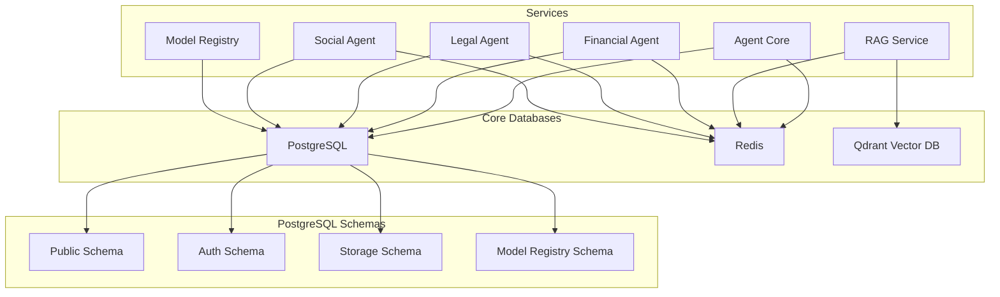

# Infrastructure Component: Database Infrastructure

*Last Updated: 2025-05-13*
*Owner: Infrastructure Team*
*Status: Active*

## Overview

This document describes the database infrastructure for the Alfred Agent Platform v2. The platform utilizes multiple database systems including PostgreSQL, Redis, and a vector database (Qdrant) to support various application requirements. These databases are critical for data persistence, caching, message queuing, and vector embeddings storage, enabling the platform's core functionality, agent communication, and data retrieval capabilities.

## Architecture

The database infrastructure is organized into three main components:



## Configuration

### PostgreSQL Database

PostgreSQL serves as the platform's primary relational database, storing application data, authentication information, and configuration settings.

#### Base Configuration

```yaml
services:
  db-postgres:
    image: supabase/postgres:15.1.0.117
    ports:
      - "5432:5432"
    environment:
      POSTGRES_USER: ${DB_USER:-postgres}
      POSTGRES_PASSWORD: ${DB_PASSWORD:-your-super-secret-password}
      POSTGRES_DB: ${DB_NAME:-postgres}
      JWT_SECRET: ${DB_JWT_SECRET:-your-super-secret-jwt-token}
      JWT_EXP: ${DB_JWT_EXP:-3600}
    volumes:
      - db-postgres-data:/var/lib/postgresql/data
      - ./migrations/supabase:/docker-entrypoint-initdb.d
    command:
      - postgres
      - -c
      - wal_level=logical
      - -c
      - max_connections=1000
      - -c
      - listen_addresses=*
```

#### Environment-Specific Configurations

##### Development

```yaml
services:
  db-postgres:
    environment:
      POSTGRES_USER: postgres
      POSTGRES_PASSWORD: your-super-secret-password
      POSTGRES_DB: postgres
      JWT_SECRET: your-super-secret-jwt-token
      JWT_EXP: 3600
    ports:
      - "5432:5432"
```

##### Production

```yaml
services:
  db-postgres:
    environment:
      POSTGRES_USER: ${DB_USER}
      POSTGRES_PASSWORD: ${DB_PASSWORD}
      POSTGRES_DB: ${DB_NAME}
      JWT_SECRET: ${DB_JWT_SECRET}
      JWT_EXP: ${DB_JWT_EXP}
    ports:
      - "127.0.0.1:5432:5432"  # Only accessible locally in production
    deploy:
      resources:
        limits:
          cpus: '2'
          memory: 4G
        reservations:
          cpus: '1'
          memory: 2G
```

### Redis Database

Redis is used for caching, session management, and as a message broker for service communication.

#### Base Configuration

```yaml
services:
  redis:
    image: redis:7-alpine
    ports:
      - "6379:6379"
    volumes:
      - redis-data:/data
    healthcheck:
      test: ["CMD", "redis-cli", "ping"]
      interval: 10s
      timeout: 5s
      retries: 3
      start_period: 5s
```

#### Environment-Specific Configurations

##### Development

```yaml
services:
  redis:
    ports:
      - "6379:6379"
```

##### Production

```yaml
services:
  redis:
    ports:
      - "127.0.0.1:6379:6379"  # Only accessible locally in production
    command: ["redis-server", "--appendonly", "yes", "--maxmemory", "2gb", "--maxmemory-policy", "allkeys-lru"]
    deploy:
      resources:
        limits:
          cpus: '1'
          memory: 3G
        reservations:
          cpus: '0.5'
          memory: 1G
```

### Vector Database (Qdrant)

Qdrant is used for storing and retrieving vector embeddings, enabling semantic search and retrieval augmented generation (RAG).

#### Base Configuration

```yaml
services:
  vector-db:
    image: qdrant/qdrant:v1.7.4
    ports:
      - "6333:6333"
      - "6334:6334"
    volumes:
      - vector-db-data:/qdrant/storage
    healthcheck:
      test: ["CMD", "curl", "-f", "http://localhost:6333/healthz"]
      interval: 10s
      timeout: 5s
      retries: 3
      start_period: 10s
```

#### Environment-Specific Configurations

##### Development

```yaml
services:
  vector-db:
    ports:
      - "6333:6333"
      - "6334:6334"
```

##### Production

```yaml
services:
  vector-db:
    ports:
      - "127.0.0.1:6333:6333"  # Only accessible locally in production
      - "127.0.0.1:6334:6334"
    deploy:
      resources:
        limits:
          cpus: '2'
          memory: 4G
        reservations:
          cpus: '1'
          memory: 2G
```

## Database Schema

### PostgreSQL Schemas

The PostgreSQL database is organized into multiple schemas:

#### Public Schema

Contains core application tables:

```sql
-- Task management tables
CREATE TABLE tasks (
    id UUID PRIMARY KEY DEFAULT extensions.uuid_generate_v4(),
    task_id TEXT UNIQUE NOT NULL,
    intent TEXT NOT NULL,
    status TEXT NOT NULL DEFAULT 'pending' CHECK (status IN ('pending', 'processing', 'completed', 'failed', 'cancelled')),
    content JSONB DEFAULT '{}',
    priority INTEGER DEFAULT 1 CHECK (priority BETWEEN 1 AND 5),
    created_by TEXT,
    assigned_to TEXT,
    parent_task_id UUID REFERENCES tasks(id),
    created_at TIMESTAMPTZ DEFAULT NOW(),
    updated_at TIMESTAMPTZ DEFAULT NOW(),
    started_at TIMESTAMPTZ,
    completed_at TIMESTAMPTZ,
    failed_at TIMESTAMPTZ,
    error_message TEXT,
    retry_count INTEGER DEFAULT 0,
    max_retries INTEGER DEFAULT 3,
    timeout_seconds INTEGER DEFAULT 300,
    metadata JSONB DEFAULT '{}'
);

-- Task results table
CREATE TABLE task_results (
    id UUID PRIMARY KEY DEFAULT extensions.uuid_generate_v4(),
    task_id UUID REFERENCES tasks(id) ON DELETE CASCADE,
    result_type TEXT NOT NULL,
    content JSONB NOT NULL,
    created_at TIMESTAMPTZ DEFAULT NOW(),
    metadata JSONB DEFAULT '{}'
);

-- Message deduplication table
CREATE TABLE processed_messages (
    message_id TEXT PRIMARY KEY,
    processed_at TIMESTAMPTZ DEFAULT NOW(),
    expires_at TIMESTAMPTZ DEFAULT NOW() + INTERVAL '48 hours'
);

-- Agent registry table
CREATE TABLE agent_registry (
    id UUID PRIMARY KEY DEFAULT extensions.uuid_generate_v4(),
    name TEXT UNIQUE NOT NULL,
    type TEXT NOT NULL,
    version TEXT NOT NULL,
    status TEXT DEFAULT 'inactive' CHECK (status IN ('active', 'inactive', 'maintenance')),
    endpoint_url TEXT,
    health_check_url TEXT,
    capabilities JSONB DEFAULT '[]',
    configuration JSONB DEFAULT '{}',
    last_heartbeat TIMESTAMPTZ,
    registered_at TIMESTAMPTZ DEFAULT NOW(),
    updated_at TIMESTAMPTZ DEFAULT NOW()
);
```

#### Auth Schema

Contains authentication and authorization tables managed by Supabase GoTrue:

```sql
-- Users table
CREATE TABLE auth.users (
    id UUID PRIMARY KEY,
    email TEXT UNIQUE,
    phone TEXT UNIQUE,
    encrypted_password TEXT,
    email_confirmed_at TIMESTAMPTZ,
    phone_confirmed_at TIMESTAMPTZ,
    confirmation_token TEXT,
    confirmation_sent_at TIMESTAMPTZ,
    recovery_token TEXT,
    recovery_sent_at TIMESTAMPTZ,
    email_change_token TEXT,
    email_change TEXT,
    email_change_sent_at TIMESTAMPTZ,
    last_sign_in_at TIMESTAMPTZ,
    raw_app_meta_data JSONB,
    raw_user_meta_data JSONB,
    created_at TIMESTAMPTZ,
    updated_at TIMESTAMPTZ,
    deleted_at TIMESTAMPTZ
);
```

#### Model Registry Schema

Contains tables for the model registry service:

```sql
-- Create model_registry schema if not exists
CREATE SCHEMA IF NOT EXISTS model_registry;

-- Create models table
CREATE TABLE IF NOT EXISTS model_registry.models (
    id SERIAL PRIMARY KEY,
    name VARCHAR(100) UNIQUE NOT NULL,
    display_name VARCHAR(200) NOT NULL,
    provider VARCHAR(50) NOT NULL,
    model_type VARCHAR(50) NOT NULL,
    version VARCHAR(50),
    description TEXT,
    created_at TIMESTAMPTZ DEFAULT NOW(),
    updated_at TIMESTAMPTZ DEFAULT NOW()
);

-- Create model_endpoints table
CREATE TABLE IF NOT EXISTS model_registry.model_endpoints (
    id SERIAL PRIMARY KEY,
    model_id INTEGER REFERENCES model_registry.models(id) ON DELETE CASCADE,
    endpoint_type VARCHAR(50) NOT NULL,
    endpoint_url VARCHAR(255),
    auth_type VARCHAR(50),
    headers JSONB,
    created_at TIMESTAMPTZ DEFAULT NOW(),
    updated_at TIMESTAMPTZ DEFAULT NOW()
);

-- Create model_capabilities table
CREATE TABLE IF NOT EXISTS model_registry.model_capabilities (
    id SERIAL PRIMARY KEY,
    model_id INTEGER REFERENCES model_registry.models(id) ON DELETE CASCADE,
    capability VARCHAR(50) NOT NULL,
    capability_score FLOAT NOT NULL,
    UNIQUE(model_id, capability)
);
```

### Redis Data Organization

Redis is organized by database index:

| Database | Purpose | Keys |
|----------|---------|------|
| 0 | General cache | Various keys with `alfred:cache:*` prefix |
| 1 | Session storage | Session keys with `alfred:session:*` prefix |
| 2 | Rate limiting | Rate limit counters with `alfred:ratelimit:*` prefix |
| 3 | Task queues | Queue keys with `alfred:queue:*` prefix |
| 4 | Pub/Sub | Pub/Sub channels for service communication |

### Vector Database Collections

Qdrant vector database is organized into collections:

| Collection | Purpose | Vector Dimensions | Distance Metric |
|------------|---------|-------------------|----------------|
| general-knowledge | General RAG knowledge base | 1536 | Cosine |
| financial-knowledge | Financial domain knowledge | 1536 | Cosine |
| legal-knowledge | Legal domain knowledge | 1536 | Cosine |
| social-knowledge | Social media domain knowledge | 1536 | Cosine |

## Deployment

### Prerequisites

- Docker and Docker Compose installed
- Kubernetes cluster (for K8s deployment)
- Storage volumes provisioned
- Network policies configured
- Database credentials configured as environment variables or secrets

### Deployment Steps

1. **Prepare Environment**
   ```bash
   # Set required environment variables
   export DB_USER=postgres
   export DB_PASSWORD=your-super-secret-password
   export DB_NAME=postgres
   export DB_JWT_SECRET=your-super-secret-jwt-token
   ```

2. **Deploy Databases**
   ```bash
   # Using Docker Compose
   docker-compose -f docker-compose.yml up -d db-postgres redis vector-db

   # Or using Kubernetes
   kubectl apply -f k8s/database/postgres.yaml
   kubectl apply -f k8s/database/redis.yaml
   kubectl apply -f k8s/database/vector-db.yaml
   ```

3. **Initialize Database Schema**
   ```bash
   # For PostgreSQL, migrations are run automatically from the mounted volume
   # Verify migration status
   docker exec -it db-postgres psql -U postgres -c "SELECT * FROM migrations ORDER BY id DESC LIMIT 5;"

   # For Qdrant, create collections if needed
   curl -X PUT "http://localhost:6333/collections/general-knowledge" \
     -H "Content-Type: application/json" \
     -d '{"vectors":{"size":1536,"distance":"Cosine"}}'
   ```

4. **Verify Deployment**
   ```bash
   # Check PostgreSQL
   docker exec -it db-postgres psql -U postgres -c "\dt"

   # Check Redis
   docker exec -it redis redis-cli ping

   # Check Qdrant
   curl -X GET "http://localhost:6333/collections"
   ```

## Scaling

### PostgreSQL Scaling

#### Horizontal Scaling

For read-heavy workloads, PostgreSQL can be configured with read replicas:

```yaml
# Example Kubernetes configuration for PostgreSQL with read replicas
apiVersion: apps/v1
kind: StatefulSet
metadata:
  name: postgres-primary
spec:
  replicas: 1
  template:
    spec:
      containers:
        - name: postgres
          image: supabase/postgres:15.1.0.117
          args:
            - -c
            - wal_level=logical
            - -c
            - max_wal_senders=10
            - -c
            - max_replication_slots=10
---
apiVersion: apps/v1
kind: Deployment
metadata:
  name: postgres-replica
spec:
  replicas: 3
  template:
    spec:
      containers:
        - name: postgres
          image: supabase/postgres:15.1.0.117
          args:
            - -c
            - hot_standby=on
            - -c
            - primary_conninfo=host=postgres-primary
```

#### Vertical Scaling

PostgreSQL can be scaled vertically by adjusting resource allocation:

```yaml
# Example Docker Compose configuration for vertical scaling
services:
  db-postgres:
    deploy:
      resources:
        limits:
          cpus: '4'
          memory: 8G
        reservations:
          cpus: '2'
          memory: 4G
```

### Redis Scaling

#### Horizontal Scaling

Redis can be deployed in cluster mode for horizontal scaling:

```yaml
# Example Redis cluster configuration
services:
  redis-cluster:
    image: redis:7-cluster
    deploy:
      replicas: 6
      placement:
        constraints:
          - node.role == worker
    command: ["redis-server", "/usr/local/etc/redis/redis.conf"]
```

#### Vertical Scaling

Redis can be scaled vertically by adjusting resource allocation:

```yaml
# Example Docker Compose configuration for vertical scaling
services:
  redis:
    deploy:
      resources:
        limits:
          cpus: '2'
          memory: 4G
        reservations:
          cpus: '1'
          memory: 2G
```

### Vector Database Scaling

#### Horizontal Scaling

Qdrant can be deployed in cluster mode for horizontal scaling:

```yaml
# Example Kubernetes configuration for Qdrant cluster
apiVersion: apps/v1
kind: StatefulSet
metadata:
  name: qdrant
spec:
  replicas: 3
  template:
    spec:
      containers:
        - name: qdrant
          image: qdrant/qdrant:v1.7.4
          env:
            - name: QDRANT_CLUSTER_ENABLED
              value: "true"
            - name: QDRANT_CLUSTER_URL
              value: "http://qdrant-0.qdrant.alfred-platform.svc.cluster.local:6335"
```

#### Vertical Scaling

Qdrant can be scaled vertically by adjusting resource allocation:

```yaml
# Example Docker Compose configuration for vertical scaling
services:
  vector-db:
    deploy:
      resources:
        limits:
          cpus: '4'
          memory: 8G
        reservations:
          cpus: '2'
          memory: 4G
```

## Monitoring

### Health Checks

```yaml
# PostgreSQL health check
healthcheck:
  test: ["CMD", "pg_isready", "-U", "${DB_USER:-postgres}", "-h", "localhost"]
  interval: 5s
  timeout: 5s
  retries: 10

# Redis health check
healthcheck:
  test: ["CMD", "redis-cli", "ping"]
  interval: 10s
  timeout: 5s
  retries: 3
  start_period: 5s

# Qdrant health check
healthcheck:
  test: ["CMD", "curl", "-f", "http://localhost:6333/healthz"]
  interval: 10s
  timeout: 5s
  retries: 3
  start_period: 10s
```

### Metrics

| Metric | Description | Normal Range | Alert Threshold |
|--------|-------------|--------------|----------------|
| postgres_up | PostgreSQL server is up | 1 | <1 |
| postgres_connections | Number of active connections | 0-500 | >800 |
| postgres_locks | Number of locks | 0-100 | >200 |
| postgres_transaction_duration_seconds | Transaction duration | 0.001-0.5s | >2s |
| postgres_transaction_rate | Transactions per second | 10-1000 | >5000 |
| redis_up | Redis server is up | 1 | <1 |
| redis_connected_clients | Number of clients | 0-100 | >500 |
| redis_memory_used_bytes | Memory usage | 0-1GB | >3GB |
| redis_commands_per_second | Commands processed | 0-10000 | >50000 |
| qdrant_up | Qdrant server is up | 1 | <1 |
| qdrant_collections_count | Number of collections | 1-10 | >20 |
| qdrant_request_duration_seconds | Request duration | 0.001-0.1s | >0.5s |
| qdrant_queries_per_second | Queries per second | 0-1000 | >5000 |

### Dashboards

- [Database Overview Dashboard](http://monitoring-dashboard:3000/d/database-overview)
- [PostgreSQL Performance Dashboard](http://monitoring-dashboard:3000/d/postgres-performance)
- [Redis Performance Dashboard](http://monitoring-dashboard:3000/d/redis-performance)
- [Qdrant Performance Dashboard](http://monitoring-dashboard:3000/d/qdrant-performance)

## Disaster Recovery

### Backup Procedures

#### PostgreSQL Backups

```bash
# Daily logical backup
pg_dump -U postgres -d postgres -F c -f /backups/postgres_$(date +\%Y\%m\%d).dump

# Transaction log archiving (for point-in-time recovery)
archive_command = 'test ! -f /archive/%f && cp %p /archive/%f'
```

#### Redis Backups

```bash
# Redis RDB snapshots
redis-cli SAVE

# Redis AOF persistence
redis-cli CONFIG SET appendonly yes
```

#### Qdrant Backups

```bash
# Create a snapshot
curl -X POST "http://localhost:6333/snapshots"

# Download the snapshot
curl -X GET "http://localhost:6333/snapshots/{snapshot_id}" --output qdrant_snapshot.tar
```

### Restore Procedures

#### PostgreSQL Restore

```bash
# Restore from logical backup
pg_restore -U postgres -d postgres -c /backups/postgres_20250513.dump

# Point-in-time recovery
restore_command = 'cp /archive/%f %p'
recovery_target_time = '2025-05-13 10:00:00'
```

#### Redis Restore

```bash
# Restore from RDB file
cp /backups/dump.rdb /data/dump.rdb
redis-cli SHUTDOWN
# Redis will load the RDB file on restart
```

#### Qdrant Restore

```bash
# Upload the snapshot
curl -X PUT "http://localhost:6333/snapshots/{snapshot_id}" \
  -H "Content-Type: multipart/form-data" \
  --form "snapshot=@/backups/qdrant_snapshot.tar"

# Recover from snapshot
curl -X POST "http://localhost:6333/snapshots/{snapshot_id}/recover"
```

## Security Considerations

### Network Policies

#### PostgreSQL Network Policy

```yaml
# Example Kubernetes network policy for PostgreSQL
apiVersion: networking.k8s.io/v1
kind: NetworkPolicy
metadata:
  name: postgres-network-policy
  namespace: alfred-platform
spec:
  podSelector:
    matchLabels:
      app: db-postgres
  ingress:
  - from:
    - podSelector:
        matchLabels:
          app: alfred-platform
    ports:
    - protocol: TCP
      port: 5432
```

#### Redis Network Policy

```yaml
# Example Kubernetes network policy for Redis
apiVersion: networking.k8s.io/v1
kind: NetworkPolicy
metadata:
  name: redis-network-policy
  namespace: alfred-platform
spec:
  podSelector:
    matchLabels:
      app: redis
  ingress:
  - from:
    - podSelector:
        matchLabels:
          app: alfred-platform
    ports:
    - protocol: TCP
      port: 6379
```

### Secret Management

```yaml
# Example Kubernetes secret for database credentials
apiVersion: v1
kind: Secret
metadata:
  name: database-credentials
  namespace: alfred-platform
type: Opaque
data:
  db-user: cG9zdGdyZXM=  # postgres (base64 encoded)
  db-password: eW91ci1zdXBlci1zZWNyZXQtcGFzc3dvcmQ=  # your-super-secret-password (base64 encoded)
  db-jwt-secret: eW91ci1zdXBlci1zZWNyZXQtand0LXRva2Vu  # your-super-secret-jwt-token (base64 encoded)
```

### Data Encryption

```yaml
# PostgreSQL encryption options
services:
  db-postgres:
    command:
      - postgres
      - -c
      - ssl=on
      - -c
      - ssl_cert_file=/certs/server.crt
      - -c
      - ssl_key_file=/certs/server.key
    volumes:
      - ./certs:/certs
```

## Troubleshooting

### Common Issues

| Issue | Symptoms | Resolution |
|-------|----------|------------|
| PostgreSQL high connections | Slow queries, connection errors | Increase `max_connections`, implement connection pooling |
| PostgreSQL slow queries | Long query times, high CPU | Optimize queries, add indexes, analyze query plans |
| Redis memory pressure | Out of memory errors, evictions | Increase memory, adjust `maxmemory-policy` |
| Redis high latency | Slow response times | Reduce key size, optimize commands, check network |
| Qdrant slow searches | High search latency | Optimize vector size, adjust index parameters, scale resources |
| Qdrant out of memory | OOM errors, crashes | Increase memory allocation, optimize vector storage |

### Logs

```bash
# PostgreSQL logs
docker logs db-postgres
kubectl logs -l app=db-postgres

# Redis logs
docker logs redis
kubectl logs -l app=redis

# Qdrant logs
docker logs vector-db
kubectl logs -l app=vector-db
```

### Debugging Procedures

#### PostgreSQL Debugging

```bash
# Check database size
docker exec -it db-postgres psql -U postgres -c "SELECT pg_size_pretty(pg_database_size('postgres'));"

# Check table sizes
docker exec -it db-postgres psql -U postgres -c "SELECT tablename, pg_size_pretty(pg_total_relation_size(schemaname || '.' || tablename)) FROM pg_tables WHERE schemaname NOT IN ('pg_catalog', 'information_schema') ORDER BY pg_total_relation_size(schemaname || '.' || tablename) DESC LIMIT 10;"

# Check slow queries
docker exec -it db-postgres psql -U postgres -c "SELECT query, calls, total_time, mean_time, rows FROM pg_stat_statements ORDER BY total_time DESC LIMIT 10;"
```

#### Redis Debugging

```bash
# Check memory usage
docker exec -it redis redis-cli info memory

# Check client connections
docker exec -it redis redis-cli info clients

# Monitor commands
docker exec -it redis redis-cli monitor
```

#### Qdrant Debugging

```bash
# Check collections
curl -X GET "http://localhost:6333/collections"

# Check collection info
curl -X GET "http://localhost:6333/collections/general-knowledge"

# Check cluster health
curl -X GET "http://localhost:6333/cluster"
```

## Related Components

- [Networking Architecture](../networking/networking-architecture.md): Describes network configurations for database communication
- [Monitoring Infrastructure](../monitoring/monitoring-infrastructure.md): Details on monitoring system that includes database metrics
- [Docker Compose Configuration](../containerization/docker-compose-configuration.md): Containerization of database services
- [Kubernetes Deployment](../containerization/kubernetes-deployment.md): Kubernetes deployment of database services

## Version History

| Version | Date | Changes | Author |
|---------|------|---------|--------|
| 1.0.0 | 2025-05-13 | Initial version | Infrastructure Team |

## References

- [PostgreSQL Documentation](https://www.postgresql.org/docs/15/index.html)
- [Redis Documentation](https://redis.io/documentation)
- [Qdrant Documentation](https://qdrant.tech/documentation/)
- [Supabase PostgreSQL Extensions](https://supabase.com/docs/guides/database/extensions)
- [Docker Volumes](https://docs.docker.com/storage/volumes/)
- [Kubernetes Storage](https://kubernetes.io/docs/concepts/storage/persistent-volumes/)
