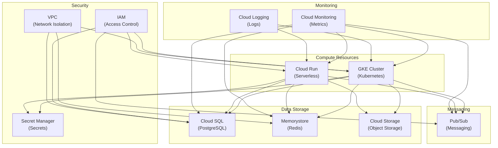

# Terraform Configuration

*Last Updated: 2025-05-13*  
*Owner: Infrastructure Team*  
*Status: Active*

## Overview

This document describes the Terraform configuration for provisioning and managing the infrastructure for the Alfred Agent Platform v2. Terraform is used to ensure infrastructure consistency across environments and enable infrastructure-as-code practices. The configuration is designed to provision cloud resources on multiple cloud providers with a focus on Google Cloud Platform (GCP).

## Architecture

The Terraform configuration follows a modular structure to enable reuse across different environments (development, staging, production). The architecture is designed to create all necessary cloud resources for running the Alfred Agent Platform:



## Directory Structure

The Terraform configuration is organized with the following directory structure:

```
infra/terraform/
├── environments/
│   ├── dev/             # Development environment configuration
│   │   ├── main.tf      # Environment-specific resources
│   │   ├── variables.tf # Environment-specific variables
│   │   ├── outputs.tf   # Environment-specific outputs
│   │   └── terraform.tfvars # Environment-specific values
│   │
│   ├── staging/         # Staging environment configuration
│   │   ├── main.tf
│   │   ├── variables.tf
│   │   ├── outputs.tf
│   │   └── terraform.tfvars
│   │
│   └── prod/            # Production environment configuration
│       ├── main.tf
│       ├── variables.tf
│       ├── outputs.tf
│       └── terraform.tfvars
│
└── modules/             # Reusable Terraform modules
    ├── compute/         # Compute resource modules
    │   ├── gke/         # GKE cluster module
    │   └── cloudrun/    # Cloud Run module
    │
    ├── database/        # Database modules
    │   ├── cloudsql/    # Cloud SQL module
    │   └── redis/       # Redis module
    │
    ├── storage/         # Storage modules
    │   └── gcs/         # Google Cloud Storage module
    │
    ├── messaging/       # Messaging modules
    │   └── pubsub/      # Pub/Sub module
    │
    ├── security/        # Security modules
    │   ├── iam/         # IAM module
    │   ├── secretmanager/ # Secret Manager module
    │   └── vpc/         # VPC module
    │
    └── monitoring/      # Monitoring modules
        └── dashboard/   # Monitoring dashboard module
```

## Modules

### Compute Modules

#### GKE Cluster Module

The GKE cluster module provisions a Google Kubernetes Engine cluster:

```hcl
# infra/terraform/modules/compute/gke/main.tf
resource "google_container_cluster" "alfred_platform" {
  name     = var.cluster_name
  location = var.region
  
  # We create the smallest possible default node pool and delete it
  remove_default_node_pool = true
  initial_node_count       = 1

  networking_mode = "VPC_NATIVE"
  network         = var.network_id
  subnetwork      = var.subnetwork_id

  ip_allocation_policy {
    cluster_ipv4_cidr_block  = var.cluster_ipv4_cidr_block
    services_ipv4_cidr_block = var.services_ipv4_cidr_block
  }

  master_authorized_networks_config {
    cidr_blocks {
      cidr_block   = var.master_authorized_cidr
      display_name = "Authorized Network"
    }
  }

  private_cluster_config {
    enable_private_nodes    = var.private_cluster
    enable_private_endpoint = var.private_endpoint
    master_ipv4_cidr_block  = var.master_ipv4_cidr_block
  }

  workload_identity_config {
    workload_pool = "${var.project_id}.svc.id.goog"
  }
}

resource "google_container_node_pool" "primary_nodes" {
  name       = "${var.cluster_name}-primary-nodes"
  location   = var.region
  cluster    = google_container_cluster.alfred_platform.name
  node_count = var.node_count

  node_config {
    preemptible  = var.preemptible
    machine_type = var.machine_type

    service_account = var.service_account
    oauth_scopes    = var.oauth_scopes

    workload_metadata_config {
      mode = "GKE_METADATA"
    }

    labels = {
      app = "alfred-platform"
      env = var.environment
    }

    taint {
      key    = "dedicated"
      value  = "alfred-platform"
      effect = "NO_SCHEDULE"
    }
  }

  management {
    auto_repair  = true
    auto_upgrade = true
  }

  autoscaling {
    min_node_count = var.min_node_count
    max_node_count = var.max_node_count
  }
}
```

#### Cloud Run Module

The Cloud Run module provisions serverless services:

```hcl
# infra/terraform/modules/compute/cloudrun/main.tf
resource "google_cloud_run_service" "alfred_service" {
  name     = var.service_name
  location = var.region

  template {
    spec {
      containers {
        image = var.container_image
        
        resources {
          limits = {
            cpu    = var.cpu_limit
            memory = var.memory_limit
          }
        }

        env {
          name  = "ENVIRONMENT"
          value = var.environment
        }

        # Add environment variables from secret manager
        dynamic "env" {
          for_each = var.secret_environment_variables
          content {
            name = env.value.name
            value_from {
              secret_key_ref {
                name = env.value.secret_name
                key  = env.value.secret_key
              }
            }
          }
        }
      }

      service_account_name = var.service_account
    }

    metadata {
      annotations = {
        "autoscaling.knative.dev/minScale" = var.min_instances
        "autoscaling.knative.dev/maxScale" = var.max_instances
        "run.googleapis.com/vpc-access-connector" = var.vpc_connector
      }
    }
  }

  traffic {
    percent         = 100
    latest_revision = true
  }

  autogenerate_revision_name = true
}

resource "google_cloud_run_service_iam_binding" "public_access" {
  count    = var.public_access ? 1 : 0
  service  = google_cloud_run_service.alfred_service.name
  location = google_cloud_run_service.alfred_service.location
  role     = "roles/run.invoker"
  members  = var.allowed_members
}
```

### Database Modules

#### Cloud SQL Module

The Cloud SQL module provisions a PostgreSQL database:

```hcl
# infra/terraform/modules/database/cloudsql/main.tf
resource "google_sql_database_instance" "alfred_instance" {
  name             = var.instance_name
  database_version = "POSTGRES_14"
  region           = var.region
  
  settings {
    tier = var.tier
    
    backup_configuration {
      enabled    = var.backup_enabled
      start_time = "02:00"
      location   = var.backup_location
    }
    
    ip_configuration {
      ipv4_enabled    = var.public_ip
      private_network = var.private_network
      
      dynamic "authorized_networks" {
        for_each = var.authorized_networks
        content {
          name  = authorized_networks.value.name
          value = authorized_networks.value.cidr
        }
      }
    }
    
    database_flags {
      name  = "max_connections"
      value = var.max_connections
    }
    
    database_flags {
      name  = "log_min_duration_statement"
      value = var.log_min_duration
    }
    
    maintenance_window {
      day          = var.maintenance_day
      hour         = var.maintenance_hour
      update_track = "stable"
    }
    
    insights_config {
      query_insights_enabled  = true
      query_string_length     = 1024
      record_application_tags = true
      record_client_address   = true
    }
  }
  
  deletion_protection = var.deletion_protection
}

resource "google_sql_database" "alfred_database" {
  name      = var.db_name
  instance  = google_sql_database_instance.alfred_instance.name
  charset   = "UTF8"
  collation = "en_US.UTF8"
}

resource "google_sql_user" "alfred_user" {
  name     = var.db_user
  instance = google_sql_database_instance.alfred_instance.name
  password = var.db_password
}
```

#### Redis Module

The Redis module provisions a Memorystore for Redis instance:

```hcl
# infra/terraform/modules/database/redis/main.tf
resource "google_redis_instance" "alfred_redis" {
  name           = var.name
  memory_size_gb = var.memory_size_gb
  region         = var.region
  
  authorized_network = var.network
  connect_mode       = "PRIVATE_SERVICE_ACCESS"
  
  redis_version      = var.redis_version
  display_name       = "Alfred Platform Redis"
  redis_configs      = var.redis_configs
  
  tier               = var.ha_enabled ? "STANDARD_HA" : "BASIC"
  
  maintenance_policy {
    weekly_maintenance_window {
      day      = var.maintenance_day
      start_time {
        hours   = var.maintenance_hour
        minutes = 0
      }
    }
  }
  
  auth_enabled = var.auth_enabled
}
```

### Storage Modules

#### Google Cloud Storage Module

The GCS module provisions Google Cloud Storage buckets:

```hcl
# infra/terraform/modules/storage/gcs/main.tf
resource "google_storage_bucket" "alfred_bucket" {
  name          = var.bucket_name
  location      = var.location
  storage_class = var.storage_class
  
  uniform_bucket_level_access = true
  
  versioning {
    enabled = var.versioning
  }
  
  lifecycle_rule {
    condition {
      age = var.archive_age_days
    }
    action {
      type          = "SetStorageClass"
      storage_class = "ARCHIVE"
    }
  }
  
  lifecycle_rule {
    condition {
      age = var.delete_age_days
    }
    action {
      type = "Delete"
    }
  }
  
  cors {
    origin          = var.cors_origins
    method          = var.cors_methods
    response_header = var.cors_headers
    max_age_seconds = 3600
  }
  
  logging {
    log_bucket        = var.log_bucket
    log_object_prefix = var.log_prefix
  }
}

resource "google_storage_bucket_iam_binding" "binding" {
  bucket  = google_storage_bucket.alfred_bucket.name
  role    = "roles/storage.objectViewer"
  members = var.viewer_members
}
```

### Messaging Modules

#### Pub/Sub Module

The Pub/Sub module provisions messaging resources:

```hcl
# infra/terraform/modules/messaging/pubsub/main.tf
resource "google_pubsub_topic" "alfred_topics" {
  for_each = toset(var.topics)
  
  name         = each.value
  project      = var.project_id
  labels       = var.labels
  
  message_retention_duration = var.message_retention_duration
  
  message_storage_policy {
    allowed_persistence_regions = var.allowed_regions
  }
}

resource "google_pubsub_subscription" "alfred_subscriptions" {
  for_each = var.subscriptions
  
  name    = each.key
  topic   = google_pubsub_topic.alfred_topics[each.value.topic].name
  project = var.project_id
  
  ack_deadline_seconds       = each.value.ack_deadline_seconds
  message_retention_duration = each.value.retention_duration
  retain_acked_messages      = each.value.retain_acked_messages
  
  expiration_policy {
    ttl = each.value.ttl
  }
  
  retry_policy {
    minimum_backoff = each.value.min_retry_delay
    maximum_backoff = each.value.max_retry_delay
  }
  
  enable_message_ordering = each.value.enable_ordering
  
  dynamic "dead_letter_policy" {
    for_each = each.value.dead_letter_topic != "" ? [1] : []
    content {
      dead_letter_topic     = google_pubsub_topic.alfred_topics[each.value.dead_letter_topic].name
      max_delivery_attempts = each.value.max_delivery_attempts
    }
  }
  
  dynamic "push_config" {
    for_each = each.value.push_endpoint != "" ? [1] : []
    content {
      push_endpoint = each.value.push_endpoint
      
      attributes = each.value.push_attributes
      
      oidc_token {
        service_account_email = each.value.service_account
        audience              = each.value.audience
      }
    }
  }
}
```

### Security Modules

#### IAM Module

The IAM module manages Identity and Access Management:

```hcl
# infra/terraform/modules/security/iam/main.tf
resource "google_service_account" "alfred_service_accounts" {
  for_each     = var.service_accounts
  
  account_id   = each.key
  display_name = each.value.display_name
  description  = each.value.description
  project      = var.project_id
}

resource "google_project_iam_member" "alfred_iam_bindings" {
  for_each = {
    for binding in local.flattened_bindings :
    "${binding.service_account}|${binding.role}" => binding
  }
  
  project = var.project_id
  role    = each.value.role
  member  = "serviceAccount:${google_service_account.alfred_service_accounts[each.value.service_account].email}"
}

resource "google_service_account_key" "alfred_service_account_keys" {
  for_each = {
    for sa_key in local.service_account_keys :
    "${sa_key.service_account}|${sa_key.key_id}" => sa_key
    if sa_key.create_key
  }
  
  service_account_id = google_service_account.alfred_service_accounts[each.value.service_account].name
  key_algorithm      = "KEY_ALG_RSA_2048"
}

resource "google_service_account_iam_binding" "workload_identity_binding" {
  for_each = {
    for wi in local.workload_identity_bindings :
    "${wi.service_account}|${wi.namespace}|${wi.k8s_service_account}" => wi
    if wi.enable_workload_identity
  }
  
  service_account_id = google_service_account.alfred_service_accounts[each.value.service_account].name
  role               = "roles/iam.workloadIdentityUser"
  members = [
    "serviceAccount:${var.project_id}.svc.id.goog[${each.value.namespace}/${each.value.k8s_service_account}]"
  ]
}
```

#### Secret Manager Module

The Secret Manager module manages secrets:

```hcl
# infra/terraform/modules/security/secretmanager/main.tf
resource "google_secret_manager_secret" "alfred_secrets" {
  for_each  = var.secrets
  
  secret_id = each.key
  project   = var.project_id
  
  replication {
    automatic = true
  }
  
  labels = merge(var.labels, each.value.labels)
}

resource "google_secret_manager_secret_version" "alfred_secret_versions" {
  for_each = {
    for secret_key, secret in var.secrets :
    secret_key => secret
    if secret.initial_value != null
  }
  
  secret      = google_secret_manager_secret.alfred_secrets[each.key].id
  secret_data = each.value.initial_value
}

resource "google_secret_manager_secret_iam_binding" "alfred_secret_access" {
  for_each  = var.secrets
  
  project   = var.project_id
  secret_id = google_secret_manager_secret.alfred_secrets[each.key].secret_id
  role      = "roles/secretmanager.secretAccessor"
  members   = each.value.accessors
}
```

#### VPC Module

The VPC module manages networking:

```hcl
# infra/terraform/modules/security/vpc/main.tf
resource "google_compute_network" "alfred_vpc" {
  name                    = var.vpc_name
  auto_create_subnetworks = false
  routing_mode            = "GLOBAL"
  project                 = var.project_id
}

resource "google_compute_subnetwork" "alfred_subnets" {
  for_each      = var.subnets
  
  name          = each.key
  ip_cidr_range = each.value.ip_range
  region        = each.value.region
  network       = google_compute_network.alfred_vpc.id
  project       = var.project_id
  
  private_ip_google_access = true
  
  log_config {
    aggregation_interval = "INTERVAL_5_MIN"
    flow_sampling        = 0.5
    metadata             = "INCLUDE_ALL_METADATA"
  }
  
  secondary_ip_range = [
    for range_name, range in each.value.secondary_ranges : {
      range_name    = range_name
      ip_cidr_range = range
    }
  ]
}

resource "google_compute_router" "alfred_router" {
  for_each = var.nat_regions
  
  name    = "alfred-router-${each.key}"
  region  = each.key
  network = google_compute_network.alfred_vpc.id
  project = var.project_id
}

resource "google_compute_router_nat" "alfred_nat" {
  for_each = var.nat_regions
  
  name                               = "alfred-nat-${each.key}"
  router                             = google_compute_router.alfred_router[each.key].name
  region                             = each.key
  project                            = var.project_id
  nat_ip_allocate_option             = "AUTO_ONLY"
  source_subnetwork_ip_ranges_to_nat = "ALL_SUBNETWORKS_ALL_IP_RANGES"
  
  log_config {
    enable = true
    filter = "ERRORS_ONLY"
  }
}

resource "google_compute_firewall" "alfred_internal" {
  name    = "alfred-allow-internal"
  network = google_compute_network.alfred_vpc.id
  project = var.project_id
  
  allow {
    protocol = "tcp"
  }
  
  allow {
    protocol = "udp"
  }
  
  allow {
    protocol = "icmp"
  }
  
  source_ranges = var.internal_ranges
}
```

### Monitoring Modules

#### Dashboard Module

The Dashboard module provisions monitoring resources:

```hcl
# infra/terraform/modules/monitoring/dashboard/main.tf
resource "google_monitoring_dashboard" "alfred_dashboard" {
  dashboard_json = jsonencode({
    displayName = "Alfred Platform Overview"
    
    gridLayout = {
      widgets = [
        {
          title = "CPU Usage by Service"
          xyChart = {
            dataSets = [
              for service in var.services : {
                timeSeriesQuery = {
                  timeSeriesFilter = {
                    filter = "metric.type=\"kubernetes.io/container/cpu/core_usage_time\" resource.type=\"k8s_container\" resource.label.\"container_name\"=\"${service}\""
                    aggregation = {
                      alignmentPeriod = "60s"
                      perSeriesAligner = "ALIGN_RATE"
                      crossSeriesReducer = "REDUCE_SUM"
                      groupByFields = ["resource.label.\"container_name\""]
                    }
                  }
                  unitOverride = "1"
                }
                plotType = "LINE"
                legendTemplate = "${service}"
              }
            ]
            yAxis = {
              label = "CPU cores"
              scale = "LINEAR"
            }
          }
        },
        {
          title = "Memory Usage by Service"
          xyChart = {
            dataSets = [
              for service in var.services : {
                timeSeriesQuery = {
                  timeSeriesFilter = {
                    filter = "metric.type=\"kubernetes.io/container/memory/used_bytes\" resource.type=\"k8s_container\" resource.label.\"container_name\"=\"${service}\""
                    aggregation = {
                      alignmentPeriod = "60s"
                      perSeriesAligner = "ALIGN_MEAN"
                      crossSeriesReducer = "REDUCE_SUM"
                      groupByFields = ["resource.label.\"container_name\""]
                    }
                  }
                  unitOverride = "By"
                }
                plotType = "LINE"
                legendTemplate = "${service}"
              }
            ]
            yAxis = {
              label = "Memory bytes"
              scale = "LINEAR"
            }
          }
        },
        {
          title = "Request Count by Service"
          xyChart = {
            dataSets = [
              for service in var.services : {
                timeSeriesQuery = {
                  timeSeriesFilter = {
                    filter = "metric.type=\"prometheus.googleapis.com/requests_total/counter\" resource.type=\"prometheus_target\" metric.label.\"service\"=\"${service}\""
                    aggregation = {
                      alignmentPeriod = "60s"
                      perSeriesAligner = "ALIGN_RATE"
                      crossSeriesReducer = "REDUCE_SUM"
                      groupByFields = ["metric.label.\"service\""]
                    }
                  }
                }
                plotType = "LINE"
                legendTemplate = "${service}"
              }
            ]
            yAxis = {
              label = "Requests/second"
              scale = "LINEAR"
            }
          }
        }
      ]
    }
  })
}
```

## Environment Configuration

### Development Environment

The development environment configuration:

```hcl
# infra/terraform/environments/dev/main.tf
provider "google" {
  project = var.project_id
  region  = var.region
  zone    = var.zone
}

module "vpc" {
  source   = "../../modules/security/vpc"
  vpc_name = "alfred-platform-dev"
  project_id = var.project_id
  
  subnets = {
    "alfred-platform-dev-gke" = {
      ip_range = "10.0.0.0/22"
      region   = var.region
      secondary_ranges = {
        "pods"     = "10.10.0.0/16"
        "services" = "10.20.0.0/16"
      }
    }
  }
  
  nat_regions    = { (var.region) = true }
  internal_ranges = ["10.0.0.0/8"]
}

module "gke" {
  source       = "../../modules/compute/gke"
  cluster_name = "alfred-platform-dev"
  region       = var.region
  project_id   = var.project_id
  
  network_id    = module.vpc.vpc_id
  subnetwork_id = module.vpc.subnet_ids["alfred-platform-dev-gke"]
  
  cluster_ipv4_cidr_block  = "10.10.0.0/16"
  services_ipv4_cidr_block = "10.20.0.0/16"
  
  master_authorized_cidr   = "0.0.0.0/0"  # For development only
  private_cluster          = false  # For development only
  private_endpoint         = false  # For development only
  master_ipv4_cidr_block   = "172.16.0.0/28"
  
  node_count    = 1
  machine_type  = "e2-standard-4"
  preemptible   = true
  
  min_node_count = 1
  max_node_count = 3
  
  service_account = module.iam.service_account_emails["gke-node-sa"]
  oauth_scopes    = [
    "https://www.googleapis.com/auth/cloud-platform"
  ]
  
  environment = "development"
}

module "cloudsql" {
  source        = "../../modules/database/cloudsql"
  instance_name = "alfred-platform-dev"
  region        = var.region
  
  tier             = "db-g1-small"
  backup_enabled   = false  # For development only
  backup_location  = var.region
  
  public_ip         = true  # For development only
  private_network   = module.vpc.vpc_id
  
  authorized_networks = [
    {
      name = "development"
      cidr = "0.0.0.0/0"  # For development only
    }
  ]
  
  max_connections  = "100"
  log_min_duration = "1000"  # 1 second
  
  maintenance_day  = 1  # Monday
  maintenance_hour = 2  # 2:00 AM
  
  deletion_protection = false  # For development only
  
  db_name     = var.db_name
  db_user     = var.db_user
  db_password = var.db_password
}

module "redis" {
  source         = "../../modules/database/redis"
  name           = "alfred-platform-dev"
  memory_size_gb = 1
  region         = var.region
  
  network       = module.vpc.vpc_id
  redis_version = "REDIS_6_X"
  redis_configs = {
    "maxmemory-policy" = "allkeys-lru"
  }
  
  ha_enabled      = false  # For development only
  
  maintenance_day  = 1  # Monday
  maintenance_hour = 2  # 2:00 AM
  
  auth_enabled = true
}

module "storage" {
  source      = "../../modules/storage/gcs"
  bucket_name = "alfred-platform-dev-${var.project_id}"
  location    = var.region
  
  storage_class = "STANDARD"
  versioning    = false  # For development only
  
  archive_age_days = 30
  delete_age_days  = 90
  
  cors_origins = ["*"]  # For development only
  cors_methods = ["GET", "POST", "PUT", "DELETE", "HEAD"]
  cors_headers = ["*"]
  
  log_bucket = null  # No logging for development
  log_prefix = null
  
  viewer_members = [
    "serviceAccount:${module.iam.service_account_emails["storage-sa"]}"
  ]
}

module "pubsub" {
  source     = "../../modules/messaging/pubsub"
  project_id = var.project_id
  
  topics = [
    "a2a-tasks-create",
    "a2a-tasks-completed",
    "a2a-events",
    "a2a-heartbeats",
    "a2a-deadletter"
  ]
  
  labels = {
    environment = "development"
    app         = "alfred-platform"
  }
  
  message_retention_duration = "86400s"  # 24 hours
  allowed_regions            = [var.region]
  
  subscriptions = {
    "agent-core-tasks" = {
      topic                  = "a2a-tasks-create"
      ack_deadline_seconds   = 60
      retention_duration     = "86400s"  # 24 hours
      retain_acked_messages  = false
      ttl                    = "2592000s"  # 30 days
      min_retry_delay        = "10s"
      max_retry_delay        = "600s"  # 10 minutes
      enable_ordering        = true
      dead_letter_topic      = "a2a-deadletter"
      max_delivery_attempts  = 5
      push_endpoint          = ""  # Pull subscription
      push_attributes        = {}
      service_account        = ""
      audience               = ""
    }
  }
}

module "iam" {
  source     = "../../modules/security/iam"
  project_id = var.project_id
  
  service_accounts = {
    "gke-node-sa" = {
      display_name = "GKE Node Service Account"
      description  = "Service account for GKE nodes"
      roles        = [
        "roles/container.nodeServiceAccount",
        "roles/monitoring.metricWriter",
        "roles/logging.logWriter",
        "roles/stackdriver.resourceMetadata.writer"
      ]
      create_key              = false
      enable_workload_identity = false
    },
    "storage-sa" = {
      display_name = "Storage Service Account"
      description  = "Service account for storage access"
      roles        = [
        "roles/storage.objectAdmin"
      ]
      create_key              = true
      enable_workload_identity = true
      workload_identity_bindings = [
        {
          namespace            = "alfred-platform"
          k8s_service_account  = "storage-sa"
        }
      ]
    }
  }
}

module "secrets" {
  source     = "../../modules/security/secretmanager"
  project_id = var.project_id
  
  labels = {
    environment = "development"
    app         = "alfred-platform"
  }
  
  secrets = {
    "db-password" = {
      labels       = {}
      initial_value = var.db_password
      accessors    = [
        "serviceAccount:${module.iam.service_account_emails["gke-node-sa"]}"
      ]
    },
    "openai-api-key" = {
      labels       = {}
      initial_value = var.openai_api_key
      accessors    = [
        "serviceAccount:${module.iam.service_account_emails["gke-node-sa"]}"
      ]
    }
  }
}

module "monitoring" {
  source   = "../../modules/monitoring/dashboard"
  services = [
    "agent-core",
    "agent-rag",
    "agent-financial",
    "agent-legal",
    "agent-social",
    "ui-chat",
    "ui-admin"
  ]
}
```

### Production Environment

The production environment configuration has stricter security, higher availability, and more resources:

```hcl
# infra/terraform/environments/prod/main.tf
# Similar to dev but with production settings:
# - Private clusters for GKE
# - Higher availability for databases
# - Stricter security settings
# - More resources and higher limits
# - Backup and disaster recovery
```

## Deployment

### Prerequisites

- Google Cloud SDK installed and configured
- Terraform v1.5.0 or later installed
- Service account with appropriate permissions
- Project created in Google Cloud

### Deployment Steps

1. Initialize Terraform:
   ```bash
   cd infra/terraform/environments/dev
   terraform init
   ```

2. Create a plan:
   ```bash
   terraform plan -out=plan.out
   ```

3. Apply the plan:
   ```bash
   terraform apply plan.out
   ```

4. Verify the deployment:
   ```bash
   terraform output
   gcloud container clusters get-credentials alfred-platform-dev --region us-central1
   kubectl get nodes
   ```

### Management

To update the infrastructure:

```bash
cd infra/terraform/environments/dev
terraform plan -out=plan.out
terraform apply plan.out
```

To destroy the infrastructure (development only):

```bash
cd infra/terraform/environments/dev
terraform destroy
```

## Terraform State Management

Terraform state is managed remotely to enable collaboration:

```hcl
# infra/terraform/environments/dev/backend.tf
terraform {
  backend "gcs" {
    bucket = "alfred-platform-terraform-state"
    prefix = "terraform/state/dev"
  }
}
```

## Security Considerations

1. **Sensitive Data Management**:
   - Sensitive values are stored in Secret Manager
   - Terraform variables use sensitive flag for passwords, keys, etc.
   - CI/CD uses environment secrets for automation

2. **IAM and Service Accounts**:
   - Least privilege principle for all service accounts
   - Workload Identity for Kubernetes authentication
   - Separate service accounts for different components

3. **Network Security**:
   - Private GKE clusters in production
   - VPC with controlled ingress/egress
   - Cloud NAT for egress-only traffic
   - Network policies in Kubernetes

4. **Infrastructure Hardening**:
   - Shielded nodes for GKE
   - Binary Authorization for container images
   - Regular updates and patching
   - Audit logging enabled

## Disaster Recovery

1. **Database Backups**:
   - Automated daily backups for Cloud SQL
   - Point-in-time recovery enabled
   - Cross-region backups for production

2. **State Recovery**:
   - Remote state stored in GCS with versioning
   - Multiple back-end state to prevent concurrent changes
   - Regular terraform state pull and backup

3. **Infrastructure Recovery**:
   - Ability to recreate infrastructure from code
   - Automated deployment through CI/CD
   - Reduced time-to-recovery through automation

## Related Documentation

- [Docker Compose Configuration](../containerization/docker-compose-configuration.md)
- [Kubernetes Deployment](../containerization/kubernetes-deployment.md)
- [CI/CD Pipeline](../ci-cd/ci-cd-pipeline.md)
- [Monitoring Setup](../monitoring/monitoring-setup.md)

## References

- [Terraform Documentation](https://www.terraform.io/docs)
- [Google Cloud Provider](https://registry.terraform.io/providers/hashicorp/google/latest/docs)
- [GKE Best Practices](https://cloud.google.com/kubernetes-engine/docs/best-practices)
- [Terraform Best Practices](https://www.terraform-best-practices.com/)