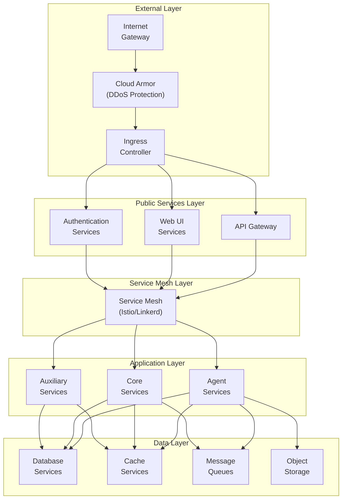
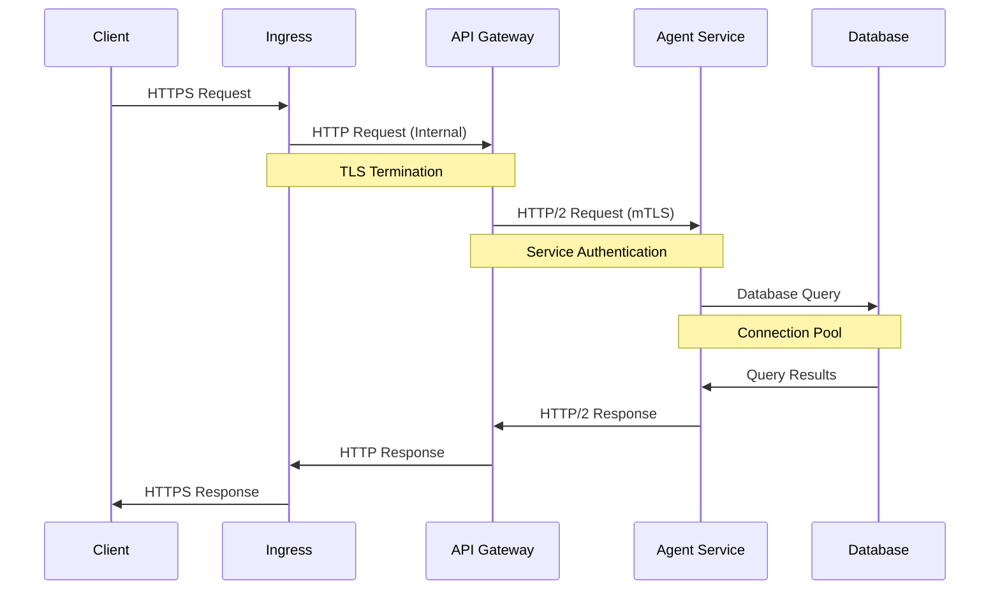
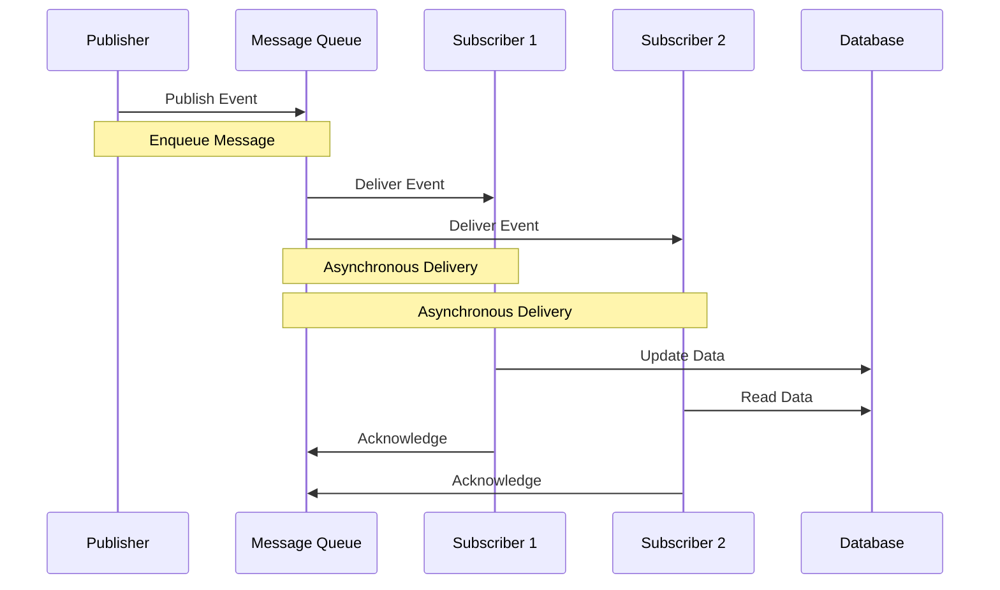

# Networking Architecture

*Last Updated: 2025-05-13*
*Owner: Infrastructure Team*
*Status: Active*

## Overview

This document describes the networking architecture of the Alfred Agent Platform v2. The platform is designed with a secure, scalable, and resilient network infrastructure that supports local development, testing, and production deployments. The networking architecture follows cloud-native principles and best practices for microservices communication.

## Network Architecture

The Alfred Agent Platform's network architecture is organized into multiple logical tiers with specific connectivity patterns:



## Network Components

### External Layer

#### Internet Gateway

The Internet Gateway provides the entry point for external traffic to the platform:

- **Public IP Addresses**:
  - Production: Static IP addresses with global anycast
  - Development: Ephemeral IP addresses

- **DNS Configuration**:
  - Production: Managed DNS with global load balancing
  - Development: Local DNS or ngrok-based tunneling

#### Ingress Controller

The Ingress Controller manages external traffic routing:

- **Controller Type**:
  - Kubernetes: NGINX Ingress Controller
  - Cloud-specific: Google Cloud Load Balancer

- **TLS Termination**:
  - Production: TLS termination with managed certificates
  - Development: Self-signed certificates or Let's Encrypt

#### DDoS Protection

Cloud Armor or equivalent provides DDoS protection:

- **Rate Limiting**:
  - API Gateway: 1000 requests per minute per IP
  - Authentication: 60 requests per minute per IP

- **Layer 7 Protection**:
  - WAF rules for common attack patterns
  - Geo-blocking for restricted regions

### Public Services Layer

#### API Gateway

The API Gateway serves as the central entry point for API requests:

- **Routing Rules**:
  - Path-based routing to backend services
  - Header-based routing for versioning

- **Authentication**:
  - JWT validation
  - API key verification
  - OAuth token validation

- **Rate Limiting**:
  - Per-user rate limits
  - Per-client rate limits
  - Global rate limits

#### Authentication Services

The Authentication Services manage user authentication:

- **Protocols**:
  - OAuth 2.0 / OpenID Connect
  - JWT-based authentication
  - API key authentication

- **Security**:
  - Token rotation
  - Session management
  - Brute force protection

#### Web UI Services

The Web UI Services provide browser-based interfaces:

- **Access Control**:
  - CORS configuration
  - CSP headers
  - Session management

- **Static Content**:
  - CDN-backed content delivery
  - Caching headers

### Service Mesh Layer

The Service Mesh Layer provides advanced networking capabilities for service-to-service communication:

- **Service Discovery**:
  - DNS-based service discovery
  - Service registry integration

- **Traffic Management**:
  - Load balancing
  - Circuit breaking
  - Retry policies
  - Timeout management

- **Security**:
  - Mutual TLS (mTLS)
  - Service identity
  - Authorization policies

- **Observability**:
  - Distributed tracing
  - Traffic metrics
  - Request logging

### Application Layer

#### Agent Services

Agent Services communicate with specific patterns:

- **Internal Communication**:
  - REST APIs over HTTP/2
  - gRPC for high-performance calls
  - Event-driven using message queues

- **External Integration**:
  - Webhook callbacks
  - Polling mechanisms
  - API client libraries

#### Core Services

Core Services provide platform capabilities:

- **Connectivity**:
  - Internal network access only
  - No direct external exposure
  - Service mesh managed communication

#### Auxiliary Services

Auxiliary Services provide supporting functionality:

- **Integration Points**:
  - Internal APIs
  - Shared databases
  - Message queues

### Data Layer

#### Database Services

Database Services store persistent data:

- **Access Patterns**:
  - Direct SQL access for internal services
  - Connection pooling
  - Read/write separation

- **Security**:
  - Network-level isolation
  - VPC peering or private service access
  - Database firewalls

#### Cache Services

Cache Services provide high-speed data access:

- **Distribution**:
  - Clustered Redis
  - Consistent hashing
  - Multi-zone replication

- **Security**:
  - AUTH-enabled Redis
  - Network isolation
  - Transport encryption

#### Message Queues

Message Queues enable asynchronous communication:

- **Technologies**:
  - Google Cloud Pub/Sub
  - Redis Streams
  - Kafka (for high-volume scenarios)

- **Patterns**:
  - Publish-subscribe
  - Queue-based processing
  - Dead-letter queues

#### Object Storage

Object Storage provides blob storage capabilities:

- **Access Control**:
  - IAM-based access control
  - Signed URLs for temporary access
  - CORS configuration for web access

## Network Access Controls

### Network Policies

Kubernetes Network Policies define allowed traffic flows:

```yaml
apiVersion: networking.k8s.io/v1
kind: NetworkPolicy
metadata:
  name: allow-api-gateway
  namespace: alfred-platform
spec:
  podSelector:
    matchLabels:
      app: api-gateway
  ingress:
  - from:
    - ipBlock:
        cidr: 0.0.0.0/0  # Allow external access
    ports:
    - protocol: TCP
      port: 443
  egress:
  - to:
    - podSelector:
        matchLabels:
          app: alfred-platform
    ports:
    - protocol: TCP
```

Key characteristics:
- Default deny-all
- Explicit allow rules
- Service-specific policies
- Namespace isolation

### Service-to-Service Authentication

Authentication between services is enforced through:

1. **Mutual TLS (mTLS)**:
   - Certificate-based authentication
   - Automatic certificate rotation
   - Certificate authority validation

2. **JWT Tokens**:
   - Short-lived service tokens
   - Role-specific permissions
   - Audience validation

3. **Network-Level Controls**:
   - IP allowlisting within the cluster
   - Service mesh authorization policies
   - Istio AuthorizationPolicy objects

## Multi-Environment Networking

### Development Environment

The development environment uses simplified networking:

- **Local Network**:
  - Docker networks with bridge mode
  - Port mappings for external access
  - Container DNS resolution

- **Service Discovery**:
  - DNS-based using container names
  - Environment variables for service endpoints
  - Direct container-to-container communication

### Production Environment

The production environment uses enterprise-grade networking:

- **Cloud VPC**:
  - Private subnets for all components
  - Network segmentation
  - Firewall rules and security groups

- **Global Load Balancing**:
  - Multi-region deployment
  - Health checks and failover
  - CDN integration for static content

- **Private Connectivity**:
  - VPC Service Controls
  - Private Google Access / AWS PrivateLink
  - VPN for administrative access

## Network Port Allocation

### Standard Ports

The platform uses standardized port allocation:

| Service Type | Port Range | Notes |
|--------------|------------|-------|
| Web UIs | 3000-3999 | HTTP interfaces |
| APIs | 8000-8999 | REST/GraphQL APIs |
| Databases | 5000-5999 | DB and cache services |
| Monitoring | 9000-9999 | Metrics and logging |

### Port Reference

Specific port assignments:

| Service | Port | Protocol | Notes |
|---------|------|----------|-------|
| UI Chat | 8502 | HTTP | Streamlit-based UI |
| UI Admin | 3007 | HTTP | Mission Control dashboard |
| Auth UI | 3006 | HTTP | Authentication interface |
| Agent Core | 8011 | HTTP | Core agent service |
| Agent RAG | 8501 | HTTP | RAG service |
| Social Intelligence | 9000 | HTTP | Social agent API |
| Financial-Tax | 9003 | HTTP | Financial agent API |
| Legal Compliance | 9002 | HTTP | Legal agent API |
| Model Registry | 8079 | HTTP | LLM model registry |
| Model Router | 8080 | HTTP | LLM router |
| Postgres | 5432 | TCP | Main database |
| Redis | 6379 | TCP | Cache service |
| Vector DB | 6333 | HTTP | Qdrant vector DB API |
| Vector DB | 6334 | gRPC | Qdrant vector DB gRPC |
| PubSub Emulator | 8085 | HTTP | Message queue |
| Grafana | 3005 | HTTP | Monitoring dashboards |
| Prometheus | 9090 | HTTP | Metrics collection |
| Mail Server | 1025 | SMTP | Local mail (dev only) |
| Mail UI | 8025 | HTTP | Mail web interface |

## Network Traffic Patterns

### Traffic Flow Diagrams

#### API Request Flow



#### Event Processing Flow



## Network Security

### Encryption

1. **Transport Layer Security**:
   - TLS 1.3 for public endpoints
   - Minimum TLS 1.2 for internal services
   - Modern cipher suites (AES-GCM, ChaCha20-Poly1305)
   - Perfect Forward Secrecy

2. **Data at Rest**:
   - Database encryption
   - Object storage encryption
   - Secret Manager for sensitive data

3. **End-to-End Encryption**:
   - Additional application-level encryption for sensitive data
   - Envelope encryption for shared data

### Network Scanning

1. **Vulnerability Scanning**:
   - Regular network scans
   - Open port detection
   - Compliance validation

2. **Penetration Testing**:
   - Quarterly penetration tests
   - External security assessments
   - Bug bounty program

### Compliance Requirements

The network architecture is designed to meet the following compliance requirements:

1. **Data Privacy**:
   - Network segmentation for PII
   - Data residency controls
   - Access logging for sensitive data

2. **Industry Standards**:
   - SOC 2 Type II
   - ISO 27001
   - GDPR (for EU deployments)

## Network Monitoring

### Key Metrics

The following metrics are collected for network monitoring:

1. **Performance Metrics**:
   - Latency (p50, p95, p99)
   - Throughput (requests per second)
   - Error rates (by service)
   - Bandwidth utilization

2. **Security Metrics**:
   - Failed authentication attempts
   - Unusual traffic patterns
   - Network policy violations
   - Certificate expiration monitoring

### Alerting

Alerts are configured for:

1. **Critical Issues**:
   - Service unavailability
   - High error rates (>1%)
   - Latency spikes (>500ms p95)
   - Certificate expiration (<30 days)

2. **Warning Conditions**:
   - Elevated error rates (>0.1%)
   - Latency increases (>200ms p95)
   - Unusual traffic patterns
   - Resource utilization (>80%)

## DNS Configuration

### Domain Structure

The platform uses the following domain structure:

- **Production**: `alfred-platform.example.com`
  - API: `api.alfred-platform.example.com`
  - UI: `ui.alfred-platform.example.com`
  - Admin: `admin.alfred-platform.example.com`

- **Staging**: `staging.alfred-platform.example.com`
  - API: `api.staging.alfred-platform.example.com`
  - UI: `ui.staging.alfred-platform.example.com`
  - Admin: `admin.staging.alfred-platform.example.com`

- **Development**: `dev.alfred-platform.example.com` or local hosts

### DNS Management

DNS is managed through:

1. **Cloud DNS**:
   - Automated DNS updates via Terraform
   - Health-check based routing
   - Global load balancing

2. **Local Development**:
   - Docker DNS resolution
   - `/etc/hosts` entries or dnsmasq
   - ngrok for external access

## Network Troubleshooting

### Common Issues

1. **Connectivity Problems**:
   - Network policy restrictions
   - Service mesh configuration
   - DNS resolution issues
   - Certificate validation failures

2. **Performance Issues**:
   - Network congestion
   - Service overload
   - Misconfigured rate limiting
   - Connection pooling issues

### Troubleshooting Tools

1. **Diagnostic Commands**:
   ```bash
   # Check pod connectivity
   kubectl exec -it <pod-name> -- curl -v <service-name>:<port>/health

   # Test DNS resolution
   kubectl exec -it <pod-name> -- nslookup <service-name>

   # Analyze network policies
   kubectl describe networkpolicy -n alfred-platform

   # Trace network path
   kubectl exec -it <pod-name> -- traceroute <service-name>
   ```

2. **Monitoring Dashboards**:
   - Service mesh dashboard
   - Network traffic visualization
   - Latency heatmaps
   - Error rate tracking

## Related Documentation

- [Docker Compose Configuration](../containerization/docker-compose-configuration.md)
- [Kubernetes Deployment](../containerization/kubernetes-deployment.md)
- [Terraform Configuration](../infrastructure/terraform-configuration.md)
- [Service Mesh Configuration](../networking/service-mesh-configuration.md)

## References

- [Kubernetes Networking](https://kubernetes.io/docs/concepts/services-networking/)
- [Istio Documentation](https://istio.io/latest/docs/)
- [Google Cloud Networking](https://cloud.google.com/vpc/docs)
- [NGINX Ingress Controller](https://kubernetes.github.io/ingress-nginx/)
