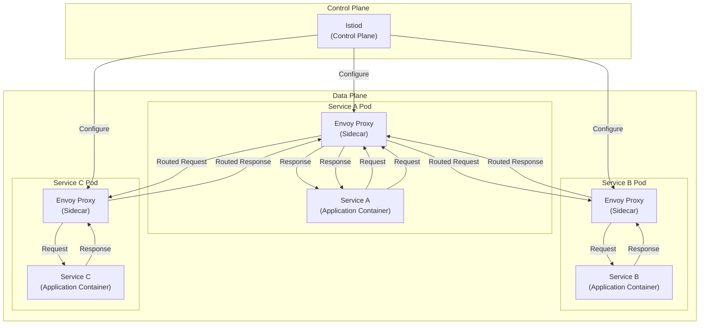

# Service Mesh Configuration

*Last Updated: 2025-05-13*  
*Owner: Infrastructure Team*  
*Status: Active*

## Overview

This document describes the service mesh configuration for the Alfred Agent Platform v2. The platform utilizes a service mesh architecture to enhance communication between microservices, providing features such as traffic management, service discovery, load balancing, failure recovery, metrics collection, and security. The service mesh implementation is based on Istio, a widely-adopted open-source service mesh solution.

## Architecture

The service mesh architecture consists of a data plane and a control plane:



### Components

#### Control Plane

The control plane manages and configures the Envoy proxies to route traffic, enforce policies, and collect telemetry:

- **Istiod**: Central control plane component that provides service discovery, configuration, and certificate management.

#### Data Plane

The data plane consists of Envoy proxies deployed as sidecars to each service instance:

- **Envoy Proxy**: High-performance proxy that mediates all inbound and outbound traffic for all services in the mesh.

## Installation

### Prerequisites

- Kubernetes 1.21+
- Helm 3.8+
- kubectl with administrative access to the cluster

### Installation Steps

1. Add the Istio Helm repository:
   ```bash
   helm repo add istio https://istio-release.storage.googleapis.com/charts
   helm repo update
   ```

2. Install the Istio base chart:
   ```bash
   helm install istio-base istio/base -n istio-system --create-namespace
   ```

3. Install the Istio discovery chart (istiod):
   ```bash
   helm install istiod istio/istiod -n istio-system \
     --set global.jwtPolicy=first-party-jwt \
     --set pilot.resources.requests.cpu=500m \
     --set pilot.resources.requests.memory=2048Mi
   ```

4. Install the Istio ingress gateway:
   ```bash
   helm install istio-ingress istio/gateway -n istio-system \
     --set service.type=LoadBalancer
   ```

5. Enable automatic sidecar injection for the alfred-platform namespace:
   ```bash
   kubectl label namespace alfred-platform istio-injection=enabled
   ```

6. Install the Kiali dashboard for visualization:
   ```bash
   helm install kiali-server kiali/kiali-server -n istio-system \
     --set auth.strategy=token \
     --set auth.token.signing_key=$(openssl rand -base64 32)
   ```

7. Install the Prometheus and Grafana addons for metrics and monitoring:
   ```bash
   kubectl apply -f https://raw.githubusercontent.com/istio/istio/release-1.18/samples/addons/prometheus.yaml
   kubectl apply -f https://raw.githubusercontent.com/istio/istio/release-1.18/samples/addons/grafana.yaml
   ```

## Configuration

### Basic Configurations

The platform uses the following basic service mesh configurations:

#### Service Definitions

Services are defined using Kubernetes Service resources:

```yaml
apiVersion: v1
kind: Service
metadata:
  name: agent-core
  namespace: alfred-platform
  labels:
    app: alfred-platform
    service: agent-core
spec:
  ports:
  - port: 8011
    name: http
  selector:
    app: alfred-platform
    service: agent-core
```

#### Deployment Annotations

Service mesh sidecar injection is controlled using annotations:

```yaml
apiVersion: apps/v1
kind: Deployment
metadata:
  name: agent-core
  namespace: alfred-platform
spec:
  template:
    metadata:
      annotations:
        # Enable sidecar injection
        sidecar.istio.io/inject: "true"
        # Define resource limits for proxy
        sidecar.istio.io/proxyCPU: "100m"
        sidecar.istio.io/proxyMemory: "128Mi"
        # Define which inbound ports to intercept
        traffic.sidecar.istio.io/includeInboundPorts: "8011"
        # Define outbound traffic policy
        traffic.sidecar.istio.io/excludeOutboundPorts: "443,9092"
```

### Traffic Management

#### Virtual Services

Traffic routing is configured using VirtualService resources:

```yaml
apiVersion: networking.istio.io/v1beta1
kind: VirtualService
metadata:
  name: agent-core
  namespace: alfred-platform
spec:
  hosts:
    - agent-core
  http:
    - route:
        - destination:
            host: agent-core
            subset: v1
          weight: 90
        - destination:
            host: agent-core
            subset: v2
          weight: 10
```

#### Destination Rules

Service subsets and load balancing are defined using DestinationRule resources:

```yaml
apiVersion: networking.istio.io/v1beta1
kind: DestinationRule
metadata:
  name: agent-core
  namespace: alfred-platform
spec:
  host: agent-core
  trafficPolicy:
    loadBalancer:
      simple: ROUND_ROBIN
    connectionPool:
      tcp:
        maxConnections: 100
      http:
        http1MaxPendingRequests: 1000
        maxRequestsPerConnection: 10
    outlierDetection:
      consecutive5xxErrors: 5
      interval: 30s
      baseEjectionTime: 30s
  subsets:
    - name: v1
      labels:
        version: v1
    - name: v2
      labels:
        version: v2
```

#### Circuit Breaking

Circuit breaking is configured in the DestinationRule to prevent cascading failures:

```yaml
apiVersion: networking.istio.io/v1beta1
kind: DestinationRule
metadata:
  name: agent-rag
  namespace: alfred-platform
spec:
  host: agent-rag
  trafficPolicy:
    connectionPool:
      tcp:
        maxConnections: 100
      http:
        http1MaxPendingRequests: 1000
        maxRequestsPerConnection: 10
        maxRetries: 3
    outlierDetection:
      consecutive5xxErrors: 5
      interval: 30s
      baseEjectionTime: 30s
      maxEjectionPercent: 100
```

#### Retry Policies

Automatic retries are configured in VirtualService resources:

```yaml
apiVersion: networking.istio.io/v1beta1
kind: VirtualService
metadata:
  name: agent-rag
  namespace: alfred-platform
spec:
  hosts:
    - agent-rag
  http:
    - route:
        - destination:
            host: agent-rag
      retries:
        attempts: 3
        perTryTimeout: 2s
        retryOn: "gateway-error,connect-failure,refused-stream,unavailable,cancelled,resource-exhausted"
```

#### Timeouts

Service timeouts are configured in VirtualService resources:

```yaml
apiVersion: networking.istio.io/v1beta1
kind: VirtualService
metadata:
  name: agent-financial
  namespace: alfred-platform
spec:
  hosts:
    - agent-financial
  http:
    - route:
        - destination:
            host: agent-financial
      timeout: 10s
```

### Security

#### Authentication

Authentication is configured using PeerAuthentication for service-to-service authentication:

```yaml
apiVersion: security.istio.io/v1beta1
kind: PeerAuthentication
metadata:
  name: default
  namespace: alfred-platform
spec:
  mtls:
    mode: STRICT
```

And RequestAuthentication for end-user authentication:

```yaml
apiVersion: security.istio.io/v1beta1
kind: RequestAuthentication
metadata:
  name: jwt-auth
  namespace: alfred-platform
spec:
  selector:
    matchLabels:
      app: alfred-platform
  jwtRules:
    - issuer: "https://auth.alfred-platform.example.com"
      jwksUri: "https://auth.alfred-platform.example.com/.well-known/jwks.json"
```

#### Authorization

Authorization policies control access to services:

```yaml
apiVersion: security.istio.io/v1beta1
kind: AuthorizationPolicy
metadata:
  name: agent-core-policy
  namespace: alfred-platform
spec:
  selector:
    matchLabels:
      app: alfred-platform
      service: agent-core
  rules:
    - from:
        - source:
            principals: ["cluster.local/ns/alfred-platform/sa/ui-service"]
      to:
        - operation:
            methods: ["GET", "POST"]
            paths: ["/api/*"]
      when:
        - key: request.auth.claims[roles]
          values: ["admin", "operator"]
```

### Observability

#### Metrics Collection

Metrics collection is configured using telemetry resources:

```yaml
apiVersion: telemetry.istio.io/v1alpha1
kind: Telemetry
metadata:
  name: alfred-platform-telemetry
  namespace: alfred-platform
spec:
  metrics:
    - providers:
        - name: prometheus
      overrides:
        - match:
            metric: REQUEST_COUNT
            mode: CLIENT_AND_SERVER
        - match:
            metric: REQUEST_DURATION
            mode: CLIENT_AND_SERVER
        - match:
            metric: REQUEST_SIZE
            mode: CLIENT_AND_SERVER
        - match:
            metric: RESPONSE_SIZE
            mode: CLIENT_AND_SERVER
```

#### Distributed Tracing

Distributed tracing is configured in the mesh configuration:

```yaml
apiVersion: install.istio.io/v1alpha1
kind: IstioOperator
spec:
  meshConfig:
    defaultConfig:
      tracing:
        sampling: 100.0
        zipkin:
          address: zipkin.istio-system:9411
```

#### Access Logs

Access logging is configured in the mesh configuration:

```yaml
apiVersion: install.istio.io/v1alpha1
kind: IstioOperator
spec:
  meshConfig:
    accessLogFile: "/dev/stdout"
    accessLogFormat: |
      {
        "protocol": "%PROTOCOL%",
        "upstream_service_time": "%REQ(X-ENVOY-UPSTREAM-SERVICE-TIME)%",
        "upstream_cluster": "%UPSTREAM_CLUSTER%",
        "route_name": "%ROUTE_NAME%",
        "response_code": "%RESPONSE_CODE%",
        "response_flags": "%RESPONSE_FLAGS%",
        "bytes_received": "%BYTES_RECEIVED%",
        "bytes_sent": "%BYTES_SENT%",
        "duration": "%DURATION%",
        "request_method": "%REQ(:METHOD)%",
        "request_path": "%REQ(X-ENVOY-ORIGINAL-PATH?:PATH)%",
        "request_time": "%START_TIME%",
        "source_identity": "%SOURCE_PRINCIPAL%",
        "source_workload": "%SOURCE_WORKLOAD%",
        "source_namespace": "%SOURCE_NAMESPACE%",
        "destination_service": "%DESTINATION_SERVICE%",
        "destination_workload": "%DESTINATION_WORKLOAD%",
        "destination_namespace": "%DESTINATION_NAMESPACE%"
      }
```

## Service-to-Service Communication

### Ingress Gateway

The ingress gateway configuration for external access:

```yaml
apiVersion: networking.istio.io/v1beta1
kind: Gateway
metadata:
  name: alfred-platform-gateway
  namespace: alfred-platform
spec:
  selector:
    istio: ingressgateway
  servers:
    - port:
        number: 80
        name: http
        protocol: HTTP
      hosts:
        - "api.alfred-platform.example.com"
    - port:
        number: 443
        name: https
        protocol: HTTPS
      hosts:
        - "api.alfred-platform.example.com"
      tls:
        mode: SIMPLE
        credentialName: alfred-platform-cert
```

And the corresponding virtual service:

```yaml
apiVersion: networking.istio.io/v1beta1
kind: VirtualService
metadata:
  name: alfred-platform-vs
  namespace: alfred-platform
spec:
  hosts:
    - "api.alfred-platform.example.com"
  gateways:
    - alfred-platform-gateway
  http:
    - match:
        - uri:
            prefix: "/api/core"
      rewrite:
        uri: "/"
      route:
        - destination:
            host: agent-core
            port:
              number: 8011
    - match:
        - uri:
            prefix: "/api/rag"
      rewrite:
        uri: "/"
      route:
        - destination:
            host: agent-rag
            port:
              number: 8501
```

### Service-to-Service Authentication

mTLS (mutual TLS) is enabled for all service-to-service communication:

```yaml
apiVersion: security.istio.io/v1beta1
kind: PeerAuthentication
metadata:
  name: default
  namespace: alfred-platform
spec:
  mtls:
    mode: STRICT
```

### Service Account Configuration

Each service has its own Kubernetes service account:

```yaml
apiVersion: v1
kind: ServiceAccount
metadata:
  name: agent-core
  namespace: alfred-platform
---
apiVersion: v1
kind: ServiceAccount
metadata:
  name: agent-rag
  namespace: alfred-platform
```

## Traffic Policies

### Circuit Breaking Configuration

Circuit breaking settings for the main components:

| Service | Max Connections | HTTP Max Pending | Max Requests Per Connection | Max Retries | Consecutive 5xx Errors | Ejection Duration |
|---------|----------------|-----------------|---------------------------|------------|---------------------|-------------------|
| agent-core | 100 | 1000 | 10 | 3 | 5 | 30s |
| agent-rag | 100 | 1000 | 10 | 3 | 5 | 30s |
| agent-financial | 50 | 500 | 10 | 3 | 5 | 30s |
| agent-legal | 50 | 500 | 10 | 3 | 5 | 30s |
| agent-social | 50 | 500 | 10 | 3 | 5 | 30s |

### Timeout Configuration

Timeout settings for the main components:

| Service | Request Timeout | Connection Timeout | Idle Timeout |
|---------|----------------|-------------------|-------------|
| agent-core | 10s | 5s | 1h |
| agent-rag | 30s | 5s | 1h |
| agent-financial | 20s | 5s | 1h |
| agent-legal | 20s | 5s | 1h |
| agent-social | 20s | 5s | 1h |
| database | 5s | 3s | 1h |
| redis | 2s | 1s | 1h |

### Retry Policies

Retry policies for the main components:

| Service | Retry Attempts | Per-Try Timeout | Retry Conditions |
|---------|---------------|-----------------|------------------|
| agent-core | 3 | 2s | gateway-error, connect-failure, refused-stream |
| agent-rag | 3 | 2s | gateway-error, connect-failure, refused-stream |
| agent-financial | 2 | 1s | gateway-error, connect-failure |
| agent-legal | 2 | 1s | gateway-error, connect-failure |
| agent-social | 2 | 1s | gateway-error, connect-failure |
| database | 0 | - | - |
| redis | 1 | 500ms | connect-failure |

## Load Balancing

### Load Balancing Algorithms

Load balancing configuration for various services:

| Service | Algorithm | Session Affinity | Locality Aware |
|---------|-----------|------------------|----------------|
| agent-core | LEAST_CONN | None | Yes |
| agent-rag | LEAST_CONN | None | Yes |
| agent-financial | ROUND_ROBIN | None | Yes |
| agent-legal | ROUND_ROBIN | None | Yes |
| agent-social | ROUND_ROBIN | None | Yes |
| database | PASSTHROUGH | N/A | N/A |
| redis | PASSTHROUGH | N/A | N/A |

### Locality-Aware Load Balancing

For multi-region deployments, locality-aware load balancing is configured:

```yaml
apiVersion: networking.istio.io/v1beta1
kind: DestinationRule
metadata:
  name: agent-core
  namespace: alfred-platform
spec:
  host: agent-core
  trafficPolicy:
    loadBalancer:
      simple: LEAST_CONN
      localityLbSetting:
        enabled: true
        failover:
          - from: us-west
            to: us-east
        failoverPriority:
          - "topology.kubernetes.io/region"
          - "topology.kubernetes.io/zone"
```

## Canary Deployments

### Traffic Splitting Configuration

For canary deployments, traffic is split between versions:

```yaml
apiVersion: networking.istio.io/v1beta1
kind: VirtualService
metadata:
  name: agent-core
  namespace: alfred-platform
spec:
  hosts:
    - agent-core
  http:
    - route:
        - destination:
            host: agent-core
            subset: v1
          weight: 90
        - destination:
            host: agent-core
            subset: v2
          weight: 10
```

### Canary Release Process

The standard canary release process follows these steps:

1. Deploy the new version with a distinct label:
   ```yaml
   apiVersion: apps/v1
   kind: Deployment
   metadata:
     name: agent-core-v2
     namespace: alfred-platform
   spec:
     template:
       metadata:
         labels:
           app: alfred-platform
           service: agent-core
           version: v2
   ```

2. Create a destination rule with subsets:
   ```yaml
   apiVersion: networking.istio.io/v1beta1
   kind: DestinationRule
   metadata:
     name: agent-core
     namespace: alfred-platform
   spec:
     host: agent-core
     subsets:
       - name: v1
         labels:
           version: v1
       - name: v2
         labels:
           version: v2
   ```

3. Initially direct a small percentage of traffic to the new version:
   ```yaml
   apiVersion: networking.istio.io/v1beta1
   kind: VirtualService
   metadata:
     name: agent-core
     namespace: alfred-platform
   spec:
     hosts:
       - agent-core
     http:
       - route:
           - destination:
               host: agent-core
               subset: v1
             weight: 90
           - destination:
               host: agent-core
               subset: v2
             weight: 10
   ```

4. Gradually increase traffic to the new version:
   ```yaml
   apiVersion: networking.istio.io/v1beta1
   kind: VirtualService
   metadata:
     name: agent-core
     namespace: alfred-platform
   spec:
     hosts:
       - agent-core
     http:
       - route:
           - destination:
               host: agent-core
               subset: v1
             weight: 50
           - destination:
               host: agent-core
               subset: v2
             weight: 50
   ```

5. Complete the migration by sending all traffic to the new version:
   ```yaml
   apiVersion: networking.istio.io/v1beta1
   kind: VirtualService
   metadata:
     name: agent-core
     namespace: alfred-platform
   spec:
     hosts:
       - agent-core
     http:
       - route:
           - destination:
               host: agent-core
               subset: v2
             weight: 100
   ```

6. Remove the old version deployment once the migration is complete.

## Service Mesh Monitoring

### Metrics Collection

The service mesh collects the following metrics:

| Metric Name | Description | Aggregation |
|-------------|-------------|------------|
| istio_requests_total | Total number of requests | count by source, destination, response_code |
| istio_request_duration_milliseconds | Request duration | histogram by source, destination |
| istio_request_size | Size of HTTP requests | histogram by source, destination |
| istio_response_size | Size of HTTP responses | histogram by source, destination |
| istio_tcp_connections_opened_total | TCP connections opened | count by source, destination |
| istio_tcp_connections_closed_total | TCP connections closed | count by source, destination |
| istio_tcp_sent_bytes_total | TCP bytes sent | sum by source, destination |
| istio_tcp_received_bytes_total | TCP bytes received | sum by source, destination |

### Dashboards

The service mesh provides several dashboards for monitoring:

1. **Istio Mesh Dashboard**: Overview of all services in the mesh
2. **Istio Service Dashboard**: Detailed metrics for individual services
3. **Istio Workload Dashboard**: Metrics for Kubernetes workloads
4. **Istio Performance Dashboard**: Proxy and control plane performance metrics

To access the dashboards:

```bash
# Access Grafana
kubectl port-forward svc/grafana -n istio-system 3000:3000

# Access Kiali
kubectl port-forward svc/kiali -n istio-system 20001:20001
```

### Distributed Tracing

Distributed tracing is integrated with Jaeger:

```bash
# Access Jaeger
kubectl port-forward svc/jaeger-query -n istio-system 16686:16686
```

Example trace for a request:

```
[User Request] -> [Ingress Gateway] -> [Agent Core] -> [Agent RAG] -> [Vector DB]
                                                    -> [Agent Financial] -> [Database]
```

## Security Policies

### Authentication Policies

Authentication is enforced using PeerAuthentication and RequestAuthentication:

```yaml
apiVersion: security.istio.io/v1beta1
kind: PeerAuthentication
metadata:
  name: default
  namespace: alfred-platform
spec:
  mtls:
    mode: STRICT
---
apiVersion: security.istio.io/v1beta1
kind: RequestAuthentication
metadata:
  name: jwt-auth
  namespace: alfred-platform
spec:
  selector:
    matchLabels:
      app: alfred-platform
  jwtRules:
    - issuer: "https://auth.alfred-platform.example.com"
      jwksUri: "https://auth.alfred-platform.example.com/.well-known/jwks.json"
```

### Authorization Policies

Access control is enforced using AuthorizationPolicy:

```yaml
apiVersion: security.istio.io/v1beta1
kind: AuthorizationPolicy
metadata:
  name: api-gateway-policy
  namespace: alfred-platform
spec:
  selector:
    matchLabels:
      app: alfred-platform
      service: api-gateway
  rules:
    - from:
        - source:
            notNamespaces: ["alfred-platform"]
      to:
        - operation:
            methods: ["GET", "POST"]
            paths: ["/api/public/*"]
    - from:
        - source:
            namespaces: ["alfred-platform"]
      to:
        - operation:
            methods: ["GET", "POST", "PUT", "DELETE"]
---
apiVersion: security.istio.io/v1beta1
kind: AuthorizationPolicy
metadata:
  name: database-policy
  namespace: alfred-platform
spec:
  selector:
    matchLabels:
      app: alfred-platform
      service: database
  rules:
    - from:
        - source:
            principals: ["cluster.local/ns/alfred-platform/sa/agent-core",
                       "cluster.local/ns/alfred-platform/sa/agent-financial",
                       "cluster.local/ns/alfred-platform/sa/agent-legal"]
```

## Fault Injection

### Fault Injection Configuration

For testing resilience, fault injection can be configured:

```yaml
apiVersion: networking.istio.io/v1beta1
kind: VirtualService
metadata:
  name: agent-rag-fault-injection
  namespace: alfred-platform
spec:
  hosts:
    - agent-rag
  http:
    - fault:
        delay:
          percentage:
            value: 10.0
          fixedDelay: 7s
        abort:
          percentage:
            value: 5.0
          httpStatus: 500
      route:
        - destination:
            host: agent-rag
```

## Service Mesh Operation

### Installation Verification

To verify the service mesh installation:

```bash
# Check control plane components
kubectl get pods -n istio-system

# Check proxies
kubectl get pods -n alfred-platform -o jsonpath='{.items[*].metadata.name}' | xargs -n 1 kubectl describe pod -n alfred-platform | grep -c "istio-proxy"

# Verify mTLS
istioctl x authz check agent-core-pod-name.alfred-platform
```

### Sidecar Injection Verification

To verify sidecar injection:

```bash
# Check if a namespace is labeled for injection
kubectl get namespace alfred-platform -o yaml | grep istio-injection

# Check if a pod has a sidecar
kubectl get pod agent-core-pod-name -n alfred-platform -o jsonpath='{.spec.containers[*].name}'
```

### Common Operations

1. **Check proxy configuration**:
   ```bash
   istioctl proxy-config all agent-core-pod-name.alfred-platform
   ```

2. **Check proxy status**:
   ```bash
   istioctl proxy-status
   ```

3. **Analyze configuration for issues**:
   ```bash
   istioctl analyze -n alfred-platform
   ```

4. **Debug traffic routing**:
   ```bash
   istioctl x describe pod agent-core-pod-name.alfred-platform
   ```

## Troubleshooting

### Common Issues

1. **Sidecar Injection Issues**:
   - Check if the namespace is labeled:
     ```bash
     kubectl get namespace alfred-platform -o yaml | grep istio-injection
     ```
   - Check if pods have the correct annotations:
     ```bash
     kubectl get pod agent-core-pod-name -n alfred-platform -o yaml | grep sidecar.istio.io
     ```

2. **mTLS Issues**:
   - Check if mTLS is enabled:
     ```bash
     istioctl x authz check agent-core-pod-name.alfred-platform
     ```
   - Check the PeerAuthentication policy:
     ```bash
     kubectl get peerauthentication -n alfred-platform
     ```

3. **Traffic Routing Issues**:
   - Check VirtualService configuration:
     ```bash
     kubectl get virtualservice -n alfred-platform
     ```
   - Check DestinationRule configuration:
     ```bash
     kubectl get destinationrule -n alfred-platform
     ```
   - Debug routing:
     ```bash
     istioctl x describe pod agent-core-pod-name.alfred-platform
     ```

4. **Performance Issues**:
   - Check proxy resource usage:
     ```bash
     kubectl top pod -n alfred-platform | grep istio-proxy
     ```
   - Check control plane resource usage:
     ```bash
     kubectl top pod -n istio-system
     ```

### Debug Commands

1. **Get proxy logs**:
   ```bash
   kubectl logs agent-core-pod-name -n alfred-platform -c istio-proxy
   ```

2. **Get Istiod logs**:
   ```bash
   kubectl logs -l app=istiod -n istio-system
   ```

3. **Get proxy configuration**:
   ```bash
   istioctl proxy-config all agent-core-pod-name.alfred-platform
   ```

4. **Get proxy metrics**:
   ```bash
   kubectl exec agent-core-pod-name -n alfred-platform -c istio-proxy -- curl localhost:15000/stats | grep http
   ```

## Upgrade Process

### Upgrading Istio

To upgrade the service mesh:

1. Download the new Istio version:
   ```bash
   curl -L https://istio.io/downloadIstio | sh -
   cd istio-[VERSION]
   ```

2. Create an upgrade plan using IstioOperator:
   ```yaml
   apiVersion: install.istio.io/v1alpha1
   kind: IstioOperator
   metadata:
     name: alfred-platform-istio-upgrade
   spec:
     profile: default
     components:
       pilot:
         k8s:
           resources:
             requests:
               cpu: 500m
               memory: 2Gi
     values:
       global:
         logging:
           level: "default:info"
   ```

3. Verify the upgrade plan:
   ```bash
   istioctl upgrade -f istio-upgrade.yaml --dry-run
   ```

4. Apply the upgrade:
   ```bash
   istioctl upgrade -f istio-upgrade.yaml
   ```

5. Verify the upgrade:
   ```bash
   kubectl get deployments -n istio-system
   istioctl version
   ```

## Related Documentation

- [Networking Architecture](networking-architecture.md)
- [Kubernetes Deployment](../containerization/kubernetes-deployment.md)
- [Monitoring Infrastructure](../monitoring/monitoring-infrastructure.md)

## References

- [Istio Documentation](https://istio.io/latest/docs/)
- [Envoy Proxy Documentation](https://www.envoyproxy.io/docs/envoy/latest/)
- [Kubernetes Service Mesh Best Practices](https://kubernetes.io/docs/concepts/extend-kubernetes/service-mesh/)
- [Istio Security Best Practices](https://istio.io/latest/docs/tasks/security/)