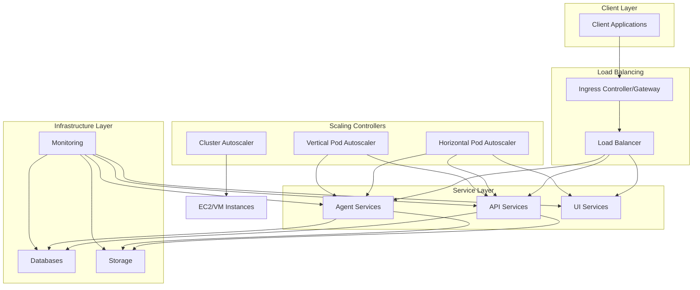
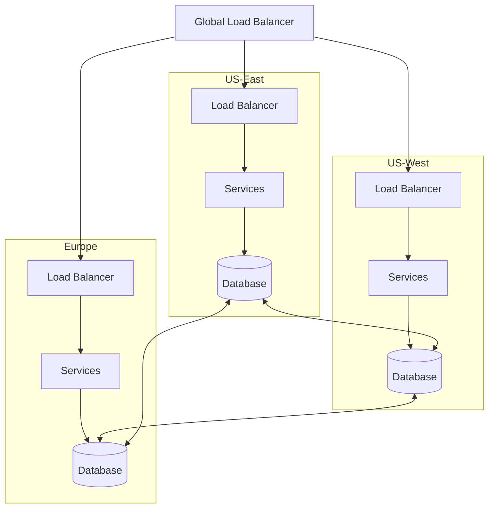

# Infrastructure Component: Scaling Configuration

*Last Updated: 2025-05-13*
*Owner: Infrastructure Team*
*Status: Active*

## Overview

This document describes the scaling configuration for the Alfred Agent Platform v2. The platform implements various scaling strategies to handle changes in workload, ensuring optimal resource utilization, cost efficiency, and performance. This includes both vertical scaling (allocating more resources to individual containers/pods) and horizontal scaling (adding more instances of services), along with auto-scaling policies for different environments.

## Architecture

The scaling architecture of the Alfred Agent Platform v2 consists of multiple layers, each with specific scaling strategies:



## Configuration

### Resource Allocation

#### Base Configuration

The platform services have base resource allocations defined in the Docker Compose configuration:

```yaml
services:
  agent-core:
    deploy:
      resources:
        limits:
          cpus: '2'
          memory: 4G
        reservations:
          cpus: '1'
          memory: 2G
```

#### Environment-Specific Configurations

##### Development

In development, minimal resource constraints are applied to facilitate rapid iteration:

```yaml
services:
  agent-core:
    deploy:
      resources:
        limits:
          cpus: '1'
          memory: 2G
        reservations:
          cpus: '0.5'
          memory: 1G
```

##### Production

In production, resource constraints are optimized for performance and reliability:

```yaml
services:
  agent-core:
    deploy:
      resources:
        limits:
          cpus: '2'
          memory: 4G
        reservations:
          cpus: '1'
          memory: 2G
    command: uvicorn app.main:app --host 0.0.0.0 --port 8011 --workers 4 --log-level info
```

### Horizontal Scaling

#### Docker Compose Scaling

For Docker Compose deployments, services can be scaled with the following command:

```bash
docker-compose up -d --scale agent-core=3 --scale agent-rag=2
```

#### Kubernetes Horizontal Pod Autoscaler (HPA)

In Kubernetes environments, Horizontal Pod Autoscaler is configured:

```yaml
apiVersion: autoscaling/v2
kind: HorizontalPodAutoscaler
metadata:
  name: agent-core-hpa
  namespace: alfred-platform
spec:
  scaleTargetRef:
    apiVersion: apps/v1
    kind: Deployment
    name: agent-core
  minReplicas: 2
  maxReplicas: 10
  metrics:
  - type: Resource
    resource:
      name: cpu
      target:
        type: Utilization
        averageUtilization: 75
  - type: Resource
    resource:
      name: memory
      target:
        type: Utilization
        averageUtilization: 80
  behavior:
    scaleDown:
      stabilizationWindowSeconds: 300
      policies:
      - type: Percent
        value: 50
        periodSeconds: 60
    scaleUp:
      stabilizationWindowSeconds: 60
      policies:
      - type: Percent
        value: 100
        periodSeconds: 60
      - type: Pods
        value: 4
        periodSeconds: 60
      selectPolicy: Max
```

#### Custom Metrics Autoscaler

For services where CPU and memory aren't appropriate scaling indicators, custom metrics can be used:

```yaml
apiVersion: autoscaling/v2
kind: HorizontalPodAutoscaler
metadata:
  name: agent-rag-hpa
  namespace: alfred-platform
spec:
  scaleTargetRef:
    apiVersion: apps/v1
    kind: Deployment
    name: agent-rag
  minReplicas: 2
  maxReplicas: 8
  metrics:
  - type: Pods
    pods:
      metric:
        name: requests_per_second
      target:
        type: AverageValue
        averageValue: 100
  - type: External
    external:
      metric:
        name: queue_messages_ready
        selector:
          matchLabels:
            queue: alfred-tasks
      target:
        type: AverageValue
        averageValue: 30
```

### Vertical Scaling

#### Database Vertical Scaling

For stateful services like databases, vertical scaling configurations are provided:

```yaml
services:
  db-postgres:
    command:
      - postgres
      - -c
      - max_connections=1000
      - -c
      - shared_buffers=1GB
      - -c
      - effective_cache_size=3GB
      - -c
      - maintenance_work_mem=256MB
      - -c
      - work_mem=4MB
    deploy:
      resources:
        limits:
          cpus: '4'
          memory: 8G
        reservations:
          cpus: '2'
          memory: 4G
```

#### Kubernetes Vertical Pod Autoscaler (VPA)

For Kubernetes deployments, a Vertical Pod Autoscaler can be configured:

```yaml
apiVersion: autoscaling.k8s.io/v1
kind: VerticalPodAutoscaler
metadata:
  name: agent-financial-vpa
  namespace: alfred-platform
spec:
  targetRef:
    apiVersion: "apps/v1"
    kind: Deployment
    name: agent-financial
  updatePolicy:
    updateMode: "Auto"
  resourcePolicy:
    containerPolicies:
    - containerName: '*'
      minAllowed:
        cpu: 100m
        memory: 512Mi
      maxAllowed:
        cpu: 4
        memory: 8Gi
      controlledResources: ["cpu", "memory"]
```

### Cloud Provider Auto-Scaling Groups

For cloud deployments, auto-scaling groups are configured for the underlying infrastructure:

#### AWS Auto Scaling Group

```yaml
AWSTemplateFormatVersion: '2010-09-09'
Resources:
  AlfredASG:
    Type: AWS::AutoScaling::AutoScalingGroup
    Properties:
      VPCZoneIdentifier:
        - subnet-1a2b3c4d
        - subnet-5e6f7g8h
      LaunchConfigurationName: !Ref AlfredLaunchConfig
      MinSize: 2
      MaxSize: 10
      DesiredCapacity: 2
      HealthCheckType: ELB
      HealthCheckGracePeriod: 300
      MetricsCollection:
        - Granularity: "1Minute"
          Metrics:
            - "GroupMinSize"
            - "GroupMaxSize"
            - "GroupDesiredCapacity"
            - "GroupInServiceInstances"
            - "GroupTotalInstances"
      Tags:
        - Key: Name
          Value: Alfred-Agent-Node
          PropagateAtLaunch: true
```

#### Scaling Policies

```yaml
  CPUScaleOutPolicy:
    Type: AWS::AutoScaling::ScalingPolicy
    Properties:
      AutoScalingGroupName: !Ref AlfredASG
      PolicyType: TargetTrackingScaling
      TargetTrackingConfiguration:
        PredefinedMetricSpecification:
          PredefinedMetricType: ASGAverageCPUUtilization
        TargetValue: 75.0

  RequestCountScaleOutPolicy:
    Type: AWS::AutoScaling::ScalingPolicy
    Properties:
      AutoScalingGroupName: !Ref AlfredASG
      PolicyType: TargetTrackingScaling
      TargetTrackingConfiguration:
        PredefinedMetricSpecification:
          PredefinedMetricType: ALBRequestCountPerTarget
          ResourceLabel: !Join
            - '/'
            - - !GetAtt ALBTargetGroup.LoadBalancerArn
              - !GetAtt ALBTargetGroup.TargetGroupArn
        TargetValue: 1000.0
```

## Service-Specific Scaling Configuration

### Agent Core

The Agent Core service implements multi-worker scaling for handling concurrent requests:

```yaml
services:
  agent-core:
    command: uvicorn app.main:app --host 0.0.0.0 --port 8011 --workers 4 --log-level info
    deploy:
      resources:
        limits:
          cpus: '2'
          memory: 4G
        reservations:
          cpus: '1'
          memory: 2G
```

Kubernetes HPA configuration:

```yaml
apiVersion: autoscaling/v2
kind: HorizontalPodAutoscaler
metadata:
  name: agent-core-hpa
  namespace: alfred-platform
spec:
  scaleTargetRef:
    apiVersion: apps/v1
    kind: Deployment
    name: agent-core
  minReplicas: 2
  maxReplicas: 10
  metrics:
  - type: Resource
    resource:
      name: cpu
      target:
        type: Utilization
        averageUtilization: 75
```

### RAG Service

The RAG service scales based on vector search load:

```yaml
services:
  agent-rag:
    command: uvicorn app.main:app --host 0.0.0.0 --port 8501 --workers 4 --log-level info
    deploy:
      resources:
        limits:
          cpus: '2'
          memory: 4G
        reservations:
          cpus: '1'
          memory: 2G
```

Kubernetes HPA configuration with custom metrics:

```yaml
apiVersion: autoscaling/v2
kind: HorizontalPodAutoscaler
metadata:
  name: agent-rag-hpa
  namespace: alfred-platform
spec:
  scaleTargetRef:
    apiVersion: apps/v1
    kind: Deployment
    name: agent-rag
  minReplicas: 2
  maxReplicas: 8
  metrics:
  - type: Pods
    pods:
      metric:
        name: vector_searches_per_second
      target:
        type: AverageValue
        averageValue: 50
```

### Database Services

PostgreSQL database utilizes vertical scaling with optimized configuration parameters:

```yaml
services:
  db-postgres:
    command:
      - postgres
      - -c
      - max_connections=1000
      - -c
      - shared_buffers=1GB
      - -c
      - effective_cache_size=3GB
      - -c
      - maintenance_work_mem=256MB
      - -c
      - checkpoint_completion_target=0.9
      - -c
      - wal_buffers=16MB
      - -c
      - default_statistics_target=100
      - -c
      - random_page_cost=1.1
      - -c
      - effective_io_concurrency=200
      - -c
      - work_mem=4MB
      - -c
      - min_wal_size=1GB
      - -c
      - max_wal_size=4GB
      - -c
      - max_worker_processes=8
      - -c
      - max_parallel_workers_per_gather=4
      - -c
      - max_parallel_workers=8
      - -c
      - max_parallel_maintenance_workers=4
    deploy:
      resources:
        limits:
          cpus: '4'
          memory: 8G
        reservations:
          cpus: '2'
          memory: 4G
```

For Kubernetes, StatefulSet with optimized resources:

```yaml
apiVersion: apps/v1
kind: StatefulSet
metadata:
  name: postgres
  namespace: alfred-platform
spec:
  replicas: 1
  selector:
    matchLabels:
      app: postgres
  template:
    spec:
      containers:
      - name: postgres
        resources:
          limits:
            cpu: 4
            memory: 8Gi
          requests:
            cpu: 2
            memory: 4Gi
```

### Redis Scaling

Redis scaling focuses on memory optimization:

```yaml
services:
  redis:
    command: ["redis-server", "--appendonly", "yes", "--save", "60", "1", "--maxmemory", "800mb", "--maxmemory-policy", "allkeys-lru"]
    deploy:
      resources:
        limits:
          cpus: '1'
          memory: 1G
        reservations:
          cpus: '0.5'
          memory: 512M
```

### Vector Database Scaling

Qdrant vector database scaling:

```yaml
services:
  vector-db:
    deploy:
      resources:
        limits:
          cpus: '2'
          memory: 4G
        reservations:
          cpus: '1'
          memory: 2G
```

Kubernetes configuration:

```yaml
apiVersion: apps/v1
kind: StatefulSet
metadata:
  name: vector-db
  namespace: alfred-platform
spec:
  replicas: 1
  selector:
    matchLabels:
      app: vector-db
  template:
    spec:
      containers:
      - name: vector-db
        resources:
          limits:
            cpu: 2
            memory: 4Gi
          requests:
            cpu: 1
            memory: 2Gi
```

## Deployment Scaling Strategies

### Multi-Region Deployment

For high availability and global performance, the platform can be deployed across multiple regions:



Region-specific deployment configuration:

```yaml
# Example Terraform configuration for multi-region deployment
module "alfred_us_east" {
  source       = "./modules/alfred-deployment"
  region       = "us-east-1"
  environment  = "production"
  min_capacity = 2
  max_capacity = 10
  database_replica = true
  database_primary = false
}

module "alfred_us_west" {
  source       = "./modules/alfred-deployment"
  region       = "us-west-2"
  environment  = "production"
  min_capacity = 2
  max_capacity = 10
  database_replica = true
  database_primary = true
}

module "alfred_eu_central" {
  source       = "./modules/alfred-deployment"
  region       = "eu-central-1"
  environment  = "production"
  min_capacity = 2
  max_capacity = 10
  database_replica = true
  database_primary = false
}
```

### Blue-Green Deployment

For zero-downtime deployments, the platform supports blue-green deployment strategy:

```yaml
# Kubernetes Blue-Green deployment
apiVersion: argoproj.io/v1alpha1
kind: Rollout
metadata:
  name: agent-core-rollout
  namespace: alfred-platform
spec:
  replicas: 3
  selector:
    matchLabels:
      app: agent-core
  template:
    metadata:
      labels:
        app: agent-core
    spec:
      containers:
      - name: agent-core
        image: agent-core:latest
        resources:
          limits:
            cpu: "2"
            memory: "4Gi"
          requests:
            cpu: "1"
            memory: "2Gi"
  strategy:
    blueGreen:
      activeService: agent-core-active
      previewService: agent-core-preview
      autoPromotionEnabled: false
```

## Load Testing and Capacity Planning

### Load Testing Configuration

The platform includes load testing configurations to validate scaling strategies:

```yaml
# Example k6 load testing configuration
import http from 'k6/http';
import { sleep } from 'k6';

export const options = {
  stages: [
    { duration: '5m', target: 100 },   // Ramp up to 100 users
    { duration: '10m', target: 100 },  // Stay at 100 users
    { duration: '5m', target: 200 },   // Ramp up to 200 users
    { duration: '10m', target: 200 },  // Stay at 200 users
    { duration: '5m', target: 0 },     // Ramp down to 0 users
  ],
  thresholds: {
    http_req_duration: ['p(95)<500'],  // 95% of requests should be below 500ms
    http_req_failed: ['rate<0.01'],    // Less than 1% of requests should fail
  },
};

export default function () {
  http.get('http://agent-core:8011/api/health');
  http.post('http://agent-core:8011/api/tasks', JSON.stringify({
    intent: 'test_scaling',
    content: { test: 'data' }
  }), {
    headers: { 'Content-Type': 'application/json' },
  });
  sleep(1);
}
```

### Capacity Planning Benchmarks

| Service | Min Instances | Max Instances | CPU per Instance | Memory per Instance | Max RPS per Instance |
|---------|--------------|---------------|------------------|---------------------|----------------------|
| agent-core | 2 | 10 | 2 CPU | 4 GB | 500 |
| agent-rag | 2 | 8 | 2 CPU | 4 GB | 250 |
| agent-financial | 1 | 6 | 2 CPU | 4 GB | 100 |
| agent-legal | 1 | 6 | 2 CPU | 4 GB | 100 |
| agent-social | 1 | 6 | 2 CPU | 4 GB | 100 |
| db-postgres | 1 | 1 | 4 CPU | 8 GB | 2000 |
| redis | 1 | 1 | 1 CPU | 1 GB | 10000 |
| vector-db | 1 | 1 | 2 CPU | 4 GB | 1000 |

## Monitoring

### Scaling Metrics

| Metric | Description | Normal Range | Alert Threshold |
|--------|-------------|--------------|----------------|
| cpu_utilization | CPU usage percentage | 30-70% | >85% |
| memory_utilization | Memory usage percentage | 40-80% | >90% |
| api_request_rate | API requests per second | 0-1000 | >1500 |
| api_response_time | API response time in ms | 50-200ms | >500ms |
| db_connections | Database connections | 50-500 | >800 |
| queue_depth | Message queue depth | 0-100 | >500 |
| vector_search_latency | Vector search response time | 10-100ms | >200ms |
| scaling_events | Number of scaling events per hour | 0-5 | >10 |

### Dashboards

- [Scaling Overview Dashboard](http://monitoring-dashboard:3000/d/scaling-overview)
- [Auto Scaling Activity Dashboard](http://monitoring-dashboard:3000/d/auto-scaling-activity)
- [Service Performance Dashboard](http://monitoring-dashboard:3000/d/service-performance)

## Disaster Recovery

### Scaling-Related Recovery Procedures

#### Handling Sudden Traffic Spikes

```bash
# Emergency horizontal scaling
kubectl scale deployment agent-core --replicas=10 -n alfred-platform
kubectl scale deployment agent-rag --replicas=8 -n alfred-platform

# Apply rate limiting
kubectl apply -f k8s/configs/emergency-rate-limiting.yaml
```

#### Downscaling During Maintenance

```bash
# Graceful downscaling for maintenance
kubectl scale deployment agent-core --replicas=1 -n alfred-platform
kubectl drain node-1 --ignore-daemonsets

# Database connection draining
kubectl exec -it db-postgres-0 -- psql -U postgres -c "SELECT pg_terminate_backend(pid) FROM pg_stat_activity WHERE datname = 'postgres' AND pid <> pg_backend_pid();"
```

## Security Considerations

### Secure Scaling Configuration

```yaml
apiVersion: autoscaling/v2
kind: HorizontalPodAutoscaler
metadata:
  name: agent-core-hpa
  namespace: alfred-platform
  annotations:
    seccomp.security.alpha.kubernetes.io/pod: runtime/default
    container.apparmor.security.beta.kubernetes.io/nginx: runtime/default
spec:
  scaleTargetRef:
    apiVersion: apps/v1
    kind: Deployment
    name: agent-core
  minReplicas: 2
  maxReplicas: 10
  metrics:
  - type: Resource
    resource:
      name: cpu
      target:
        type: Utilization
        averageUtilization: 75
```

### Pod Security Policies

```yaml
apiVersion: policy/v1beta1
kind: PodSecurityPolicy
metadata:
  name: alfred-restricted
spec:
  privileged: false
  allowPrivilegeEscalation: false
  requiredDropCapabilities:
    - ALL
  volumes:
    - 'configMap'
    - 'emptyDir'
    - 'projected'
    - 'secret'
    - 'downwardAPI'
    - 'persistentVolumeClaim'
  hostNetwork: false
  hostIPC: false
  hostPID: false
  runAsUser:
    rule: 'MustRunAsNonRoot'
  seLinux:
    rule: 'RunAsAny'
  supplementalGroups:
    rule: 'MustRunAs'
    ranges:
      - min: 1
        max: 65535
  fsGroup:
    rule: 'MustRunAs'
    ranges:
      - min: 1
        max: 65535
  readOnlyRootFilesystem: false
```

## Troubleshooting

### Common Issues

| Issue | Symptoms | Resolution |
|-------|----------|------------|
| Scaling too frequently | Frequent scale up/down events, pod thrashing | Adjust HPA stabilization window, review metrics thresholds |
| Not scaling fast enough | High latency, resource exhaustion | Reduce stabilization window, increase scale-up rate |
| Resource constraints preventing scaling | Pods stuck in pending state | Check node resources, consider cluster auto-scaling |
| Database connection exhaustion | Connection errors during scale-up | Implement connection pooling, increase max_connections |
| Memory leaks causing restarts | OOM kills, excessive memory usage | Profile memory usage, check for memory leaks in application |
| Cold start latency | High latency after scaling | Implement warm-up procedures, preload caches |

### Scaling Commands

```bash
# Check HPA status
kubectl get hpa -n alfred-platform

# View scaling events
kubectl describe hpa agent-core-hpa -n alfred-platform

# Check current replica count
kubectl get deployment agent-core -n alfred-platform

# Manual scaling
kubectl scale deployment agent-core --replicas=5 -n alfred-platform

# Check node resource utilization
kubectl top nodes

# Check pod resource utilization
kubectl top pods -n alfred-platform
```

### Debugging Procedures

```bash
# Debug HPA
kubectl describe hpa agent-core-hpa -n alfred-platform

# Check metrics server
kubectl get --raw "/apis/metrics.k8s.io/v1beta1/namespaces/alfred-platform/pods" | jq .

# Check events
kubectl get events -n alfred-platform --sort-by='.lastTimestamp'

# View scaling logs
kubectl logs -l app=agent-core -n alfred-platform | grep -i "scale"

# Check resource quotas
kubectl describe resourcequota -n alfred-platform
```

## Related Components

- [Kubernetes Deployment](../containerization/kubernetes-deployment.md)
- [Docker Compose Configuration](../containerization/docker-compose-configuration.md)
- [Monitoring Infrastructure](../monitoring/monitoring-infrastructure.md)
- [Database Infrastructure](../database/database-infrastructure.md)
- [Networking Architecture](../networking/networking-architecture.md)

## Version History

| Version | Date | Changes | Author |
|---------|------|---------|--------|
| 1.0.0 | 2025-05-13 | Initial version | Infrastructure Team |

## References

- [Kubernetes Horizontal Pod Autoscaler](https://kubernetes.io/docs/tasks/run-application/horizontal-pod-autoscale/)
- [Kubernetes Vertical Pod Autoscaler](https://github.com/kubernetes/autoscaler/tree/master/vertical-pod-autoscaler)
- [Docker Compose Deploy Options](https://docs.docker.com/compose/compose-file/deploy/)
- [AWS Auto Scaling Documentation](https://docs.aws.amazon.com/autoscaling/ec2/userguide/what-is-amazon-ec2-auto-scaling.html)
- [PostgreSQL Connection Pooling](https://www.postgresql.org/docs/current/runtime-config-connection.html)
- [Uvicorn Workers](https://www.uvicorn.org/deployment/)
