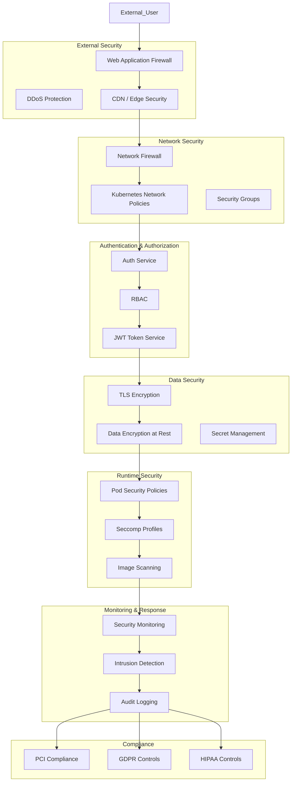

# Infrastructure Component: Infrastructure Security

*Last Updated: 2025-05-13*
*Owner: Security Team*
*Status: Active*

## Overview

This document describes the security infrastructure for the Alfred Agent Platform v2. The platform implements comprehensive security measures at multiple levels to protect data, services, and communications. This security architecture includes network security controls, access management, secret handling, encryption, monitoring, and compliance controls, ensuring a defense-in-depth approach to security across the entire platform.

## Architecture

The security architecture of the Alfred Agent Platform v2 consists of multiple layers of protection:



## Network Security

### Firewall Configuration

#### Base Configuration

The platform implements network firewall rules to restrict traffic:

```yaml
# Example AWS Security Group configuration
SecurityGroup:
  Type: AWS::EC2::SecurityGroup
  Properties:
    GroupDescription: Security group for Alfred Agent Platform
    VpcId: !Ref VpcId
    SecurityGroupIngress:
      - IpProtocol: tcp
        FromPort: 443
        ToPort: 443
        CidrIp: 0.0.0.0/0
      - IpProtocol: tcp
        FromPort: 80
        ToPort: 80
        CidrIp: 0.0.0.0/0
```

#### Kubernetes Network Policies

Network communication between pods is restricted using Kubernetes Network Policies:

```yaml
apiVersion: networking.k8s.io/v1
kind: NetworkPolicy
metadata:
  name: api-server-policy
  namespace: alfred-platform
spec:
  podSelector:
    matchLabels:
      app: agent-core
  policyTypes:
  - Ingress
  - Egress
  ingress:
  - from:
    - namespaceSelector:
        matchLabels:
          name: kube-system
    - podSelector:
        matchLabels:
          app: ui-chat
    ports:
    - protocol: TCP
      port: 8011
  egress:
  - to:
    - podSelector:
        matchLabels:
          app: db-postgres
    ports:
    - protocol: TCP
      port: 5432
  - to:
    - podSelector:
        matchLabels:
          app: redis
    ports:
    - protocol: TCP
      port: 6379
```

### Web Application Firewall (WAF)

For public-facing services, a WAF is deployed to protect against common web vulnerabilities:

```yaml
# AWS WAF Configuration
WAFWebACL:
  Type: AWS::WAFv2::WebACL
  Properties:
    Name: AlfredPlatformWAF
    Scope: REGIONAL
    DefaultAction:
      Allow: {}
    VisibilityConfig:
      SampledRequestsEnabled: true
      CloudWatchMetricsEnabled: true
      MetricName: AlfredPlatformWAF
    Rules:
      - Name: AWSManagedRulesCommonRuleSet
        Priority: 0
        OverrideAction:
          None: {}
        VisibilityConfig:
          SampledRequestsEnabled: true
          CloudWatchMetricsEnabled: true
          MetricName: AWSManagedRulesCommonRuleSet
        Statement:
          ManagedRuleGroupStatement:
            VendorName: AWS
            Name: AWSManagedRulesCommonRuleSet
      - Name: AWSManagedRulesKnownBadInputsRuleSet
        Priority: 1
        OverrideAction:
          None: {}
        VisibilityConfig:
          SampledRequestsEnabled: true
          CloudWatchMetricsEnabled: true
          MetricName: AWSManagedRulesKnownBadInputsRuleSet
        Statement:
          ManagedRuleGroupStatement:
            VendorName: AWS
            Name: AWSManagedRulesKnownBadInputsRuleSet
```

### DDoS Protection

Protection against Distributed Denial of Service attacks is configured:

```yaml
# AWS Shield Advanced Configuration
ShieldProtection:
  Type: AWS::Shield::Protection
  Properties:
    Name: AlfredPlatformShieldProtection
    ResourceArn: !Ref LoadBalancerArn
```

## Authentication and Authorization

### Authentication Service

The platform uses a dedicated authentication service built on Supabase Auth:

```yaml
services:
  db-auth:
    image: supabase/gotrue:v2.132.3
    container_name: db-auth
    ports:
      - "9999:9999"
    environment:
      GOTRUE_API_HOST: 0.0.0.0
      GOTRUE_API_PORT: 9999
      API_EXTERNAL_URL: ${API_EXTERNAL_URL:-http://localhost:8000}
      GOTRUE_DB_DRIVER: postgres
      GOTRUE_DB_DATABASE_URL: postgres://${DB_USER:-postgres}:${DB_PASSWORD:-your-super-secret-password}@db-postgres:5432/${DB_NAME:-postgres}?options=-csearch_path%3Dauth
      GOTRUE_SITE_URL: ${SITE_URL:-http://localhost:3000}
      GOTRUE_URI_ALLOW_LIST: ${ADDITIONAL_REDIRECT_URLS}
      GOTRUE_DISABLE_SIGNUP: ${DISABLE_SIGNUP:-false}
      GOTRUE_JWT_ADMIN_ROLES: service_role
      GOTRUE_JWT_AUD: authenticated
      GOTRUE_JWT_DEFAULT_GROUP_NAME: authenticated
      GOTRUE_JWT_EXP: ${JWT_EXPIRY:-3600}
      GOTRUE_JWT_SECRET: ${DB_JWT_SECRET:-your-super-secret-jwt-token}
```

### Role-Based Access Control (RBAC)

RBAC is implemented to control access to resources:

```yaml
# Example Kubernetes RBAC configuration
apiVersion: rbac.authorization.k8s.io/v1
kind: Role
metadata:
  name: agent-role
  namespace: alfred-platform
rules:
- apiGroups: [""]
  resources: ["pods", "services"]
  verbs: ["get", "list", "watch"]
- apiGroups: ["apps"]
  resources: ["deployments"]
  verbs: ["get", "list", "watch"]
---
apiVersion: rbac.authorization.k8s.io/v1
kind: RoleBinding
metadata:
  name: agent-role-binding
  namespace: alfred-platform
subjects:
- kind: ServiceAccount
  name: agent-service-account
  namespace: alfred-platform
roleRef:
  kind: Role
  name: agent-role
  apiGroup: rbac.authorization.k8s.io
```

### API Authentication

Services are protected using JWT authentication:

```yaml
# AuthorizationPolicy for securing API endpoints
apiVersion: security.istio.io/v1beta1
kind: AuthorizationPolicy
metadata:
  name: agent-core-api-auth
  namespace: alfred-platform
spec:
  selector:
    matchLabels:
      app: agent-core
  action: ALLOW
  rules:
  - from:
    - source:
        principals: ["cluster.local/ns/alfred-platform/sa/ui-service"]
    to:
    - operation:
        methods: ["GET", "POST"]
        paths: ["/api/*"]
    when:
    - key: request.auth.claims[roles]
      values: ["admin", "operator"]
```

## Secret Management

### Environment Variables

Sensitive configuration data is stored in environment variables:

```yaml
# Security-focused environment variables
services:
  agent-core:
    environment:
      - ALFRED_DATABASE_URL=${ALFRED_DATABASE_URL:-postgresql://${DB_USER:-postgres}:${DB_PASSWORD:-your-super-secret-password}@db-postgres:5432/${DB_NAME:-postgres}}
      - ALFRED_REDIS_URL=redis://redis:6379
      - ALFRED_JWT_SECRET=${ALFRED_JWT_SECRET}
      - ALFRED_API_KEYS=${ALFRED_API_KEYS}
```

### Kubernetes Secrets

In Kubernetes environments, sensitive data is stored in Kubernetes Secrets:

```yaml
apiVersion: v1
kind: Secret
metadata:
  name: alfred-platform-secrets
  namespace: alfred-platform
type: Opaque
data:
  db-user: cG9zdGdyZXM=  # base64 encoded "postgres"
  db-password: eW91ci1zdXBlci1zZWNyZXQtcGFzc3dvcmQ=  # base64 encoded
  jwt-secret: eW91ci1zdXBlci1zZWNyZXQtand0LXRva2Vu  # base64 encoded
```

### Mounted Secrets

Secrets are securely mounted into containers:

```yaml
apiVersion: apps/v1
kind: Deployment
metadata:
  name: agent-core
  namespace: alfred-platform
spec:
  template:
    spec:
      containers:
      - name: agent-core
        volumeMounts:
        - name: secrets-volume
          mountPath: /app/secrets
          readOnly: true
      volumes:
      - name: secrets-volume
        secret:
          secretName: alfred-platform-secrets
```

### External Secret Management

For production environments, integration with external secret management services:

```yaml
# AWS Secrets Manager integration
apiVersion: secretsmanager.services.k8s.aws/v1alpha1
kind: SecretProviderClass
metadata:
  name: alfred-aws-secrets
spec:
  provider: aws
  parameters:
    objects: |
      - objectName: alfred/database
        objectType: secretsmanager
        jmesPath:
          - path: username
            objectAlias: DB_USER
          - path: password
            objectAlias: DB_PASSWORD
          - path: host
            objectAlias: DB_HOST
```

## Data Encryption

### Encryption at Rest

Database encryption configuration:

```yaml
# PostgreSQL encryption settings
services:
  db-postgres:
    command:
      - postgres
      - -c
      - ssl=on
      - -c
      - ssl_cert_file=/certs/server.crt
      - -c
      - ssl_key_file=/certs/server.key
      - -c
      - encrypt_mode=on
```

Storage encryption configuration:

```yaml
# Storage encryption settings
services:
  db-storage:
    environment:
      STORAGE_ENCRYPTION_KEY: ${STORAGE_ENCRYPTION_KEY}
      ENCRYPT_DATA_AT_REST: "true"
```

### Encryption in Transit

TLS is configured for all service communications:

```yaml
# Istio TLS configuration
apiVersion: networking.istio.io/v1beta1
kind: DestinationRule
metadata:
  name: agent-core-tls
  namespace: alfred-platform
spec:
  host: agent-core
  trafficPolicy:
    tls:
      mode: ISTIO_MUTUAL
```

### Mutual TLS Authentication

mTLS is enabled for service-to-service communication:

```yaml
# mTLS global policy
apiVersion: security.istio.io/v1beta1
kind: PeerAuthentication
metadata:
  name: default
  namespace: alfred-platform
spec:
  mtls:
    mode: STRICT
```

## Container Security

### Pod Security Policies

Restrictive pod security policies are enforced:

```yaml
apiVersion: policy/v1beta1
kind: PodSecurityPolicy
metadata:
  name: alfred-restricted
spec:
  privileged: false
  allowPrivilegeEscalation: false
  requiredDropCapabilities:
    - ALL
  volumes:
    - 'configMap'
    - 'emptyDir'
    - 'projected'
    - 'secret'
    - 'downwardAPI'
    - 'persistentVolumeClaim'
  hostNetwork: false
  hostIPC: false
  hostPID: false
  runAsUser:
    rule: 'MustRunAsNonRoot'
  seLinux:
    rule: 'RunAsAny'
  supplementalGroups:
    rule: 'MustRunAs'
    ranges:
      - min: 1
        max: 65535
  fsGroup:
    rule: 'MustRunAs'
    ranges:
      - min: 1
        max: 65535
  readOnlyRootFilesystem: false
```

### Image Security

Container image security policies:

```yaml
# Image security policy
apiVersion: securityenforcement.admission.cloud.ibm.com/v1beta1
kind: ImageSecurityPolicy
metadata:
  name: alfred-image-policy
  namespace: alfred-platform
spec:
  repositories:
    - name: ${ALFRED_REGISTRY:-localhost}/*
      policy:
        vulnerabilities:
          enabled: true
          maxScore: 7.0
        trust:
          enabled: true
          signerSecrets:
            - name: alfred-signer-secret
```

### Resource Limitations

Containers are configured with resource limits to prevent DoS attacks:

```yaml
# Resource limitations
services:
  agent-core:
    deploy:
      resources:
        limits:
          cpus: '2'
          memory: 4G
        reservations:
          cpus: '1'
          memory: 2G
```

## Monitoring and Auditing

### Audit Logging

Comprehensive audit logging is implemented:

```yaml
# Audit logging configuration
apiVersion: audit.k8s.io/v1
kind: Policy
metadata:
  name: alfred-audit-policy
rules:
  - level: RequestResponse
    resources:
    - group: ""
      resources: ["pods", "secrets", "configmaps"]
  - level: Metadata
    resources:
    - group: ""
      resources: ["services", "endpoints"]
  - level: None
    resources:
    - group: ""
      resources: ["events"]
```

### Security Monitoring

Security-focused monitoring with Prometheus and Grafana:

```yaml
# Prometheus security monitoring
apiVersion: monitoring.coreos.com/v1
kind: ServiceMonitor
metadata:
  name: security-monitor
  namespace: alfred-platform
spec:
  selector:
    matchLabels:
      app: security-metrics
  endpoints:
  - port: metrics
    interval: 15s
    path: /metrics
```

### Intrusion Detection

Network and host-based intrusion detection:

```yaml
# Falco security monitoring
apiVersion: apps/v1
kind: DaemonSet
metadata:
  name: falco
  namespace: alfred-platform
spec:
  selector:
    matchLabels:
      app: falco
  template:
    metadata:
      labels:
        app: falco
    spec:
      containers:
      - name: falco
        image: falcosecurity/falco:0.33.0
        securityContext:
          privileged: true
        volumeMounts:
        - name: dev-fs
          mountPath: /host/dev
        - name: proc-fs
          mountPath: /host/proc
        - name: boot-fs
          mountPath: /host/boot
        - name: lib-modules
          mountPath: /host/lib/modules
        - name: usr-fs
          mountPath: /host/usr
        - name: falco-config
          mountPath: /etc/falco
      volumes:
      - name: dev-fs
        hostPath:
          path: /dev
      - name: proc-fs
        hostPath:
          path: /proc
      - name: boot-fs
        hostPath:
          path: /boot
      - name: lib-modules
        hostPath:
          path: /lib/modules
      - name: usr-fs
        hostPath:
          path: /usr
      - name: falco-config
        configMap:
          name: falco-config
```

## Compliance Framework

### Data Protection Compliance

GDPR compliance measures:

```yaml
# Data subject rights management
apiVersion: v1
kind: ConfigMap
metadata:
  name: gdpr-compliance-config
  namespace: alfred-platform
data:
  retention-period: "90d"
  data-subject-rights-enabled: "true"
  privacy-policy-url: "https://example.com/privacy"
  data-processor-contacts: |
    {
      "dpo": "dpo@example.com",
      "privacy_team": "privacy@example.com"
    }
```

### Security Compliance

PCI DSS compliance controls:

```yaml
# PCI compliance configurations
apiVersion: v1
kind: ConfigMap
metadata:
  name: pci-compliance-config
  namespace: alfred-platform
data:
  secure-cipher-suites: "TLS_ECDHE_ECDSA_WITH_AES_128_GCM_SHA256,TLS_ECDHE_RSA_WITH_AES_128_GCM_SHA256"
  min-tls-version: "1.2"
  password-policy: |
    {
      "min_length": 12,
      "require_uppercase": true,
      "require_lowercase": true,
      "require_numbers": true,
      "require_special_chars": true,
      "max_age_days": 90
    }
```

## Environment-Specific Security Configurations

### Development Environment

Relaxed security for development with appropriate protections:

```yaml
# Development environment security
services:
  agent-core:
    environment:
      - ALFRED_ENVIRONMENT=development
      - ALFRED_DEBUG=true
      - ALFRED_JWT_EXPIRY=86400  # 24 hours for development
    volumes:
      - ./services/alfred-core:/app  # Source code mounted for development
```

### Production Environment

Hardened security for production environments:

```yaml
# Production environment security
services:
  agent-core:
    environment:
      - ALFRED_ENVIRONMENT=production
      - ALFRED_DEBUG=false
      - ALFRED_JWT_EXPIRY=3600  # 1 hour for production
    # No source code mounting in production
    deploy:
      restart_policy:
        condition: on-failure
        max_attempts: 3
      update_config:
        order: start-first
        failure_action: rollback
```

## Security Hardening

### Operating System Hardening

Base OS security hardening:

```dockerfile
# Dockerfile security example
FROM python:3.11-slim AS builder

# Create non-root user
RUN groupadd -r alfred && useradd -r -g alfred alfred

# Install security updates
RUN apt-get update && \
    apt-get upgrade -y && \
    apt-get install -y --no-install-recommends \
    ca-certificates \
    && apt-get clean \
    && rm -rf /var/lib/apt/lists/*

# Set up app with proper permissions
COPY --chown=alfred:alfred . /app
WORKDIR /app

# Switch to non-root user
USER alfred

# Run with minimal permissions
CMD ["python", "-m", "app.main"]
```

### Database Hardening

Database security hardening:

```yaml
# PostgreSQL security hardening
services:
  db-postgres:
    command:
      - postgres
      - -c
      - ssl=on
      - -c
      - password_encryption=scram-sha-256
      - -c
      - log_connections=on
      - -c
      - log_disconnections=on
      - -c
      - log_statement=ddl
      - -c
      - log_hostname=on
      - -c
      - log_duration=on
```

### Web Server Hardening

Secure web server configuration:

```yaml
# Nginx security configuration
apiVersion: v1
kind: ConfigMap
metadata:
  name: nginx-security-config
  namespace: alfred-platform
data:
  nginx.conf: |
    server {
      listen 80;
      server_name _;

      # Redirect all HTTP to HTTPS
      return 301 https://$host$request_uri;
    }

    server {
      listen 443 ssl;
      server_name _;

      # SSL configuration
      ssl_certificate /etc/nginx/ssl/tls.crt;
      ssl_certificate_key /etc/nginx/ssl/tls.key;
      ssl_protocols TLSv1.2 TLSv1.3;
      ssl_prefer_server_ciphers on;
      ssl_ciphers 'ECDHE-ECDSA-AES128-GCM-SHA256:ECDHE-RSA-AES128-GCM-SHA256';
      ssl_session_cache shared:SSL:10m;
      ssl_session_timeout 10m;

      # Security headers
      add_header Strict-Transport-Security "max-age=31536000; includeSubDomains" always;
      add_header X-Content-Type-Options "nosniff" always;
      add_header X-Frame-Options "SAMEORIGIN" always;
      add_header X-XSS-Protection "1; mode=block" always;
      add_header Content-Security-Policy "default-src 'self'; script-src 'self'; img-src 'self'; style-src 'self'; font-src 'self'; connect-src 'self'" always;
    }
```

## Deployment

### Prerequisites

- Kubernetes cluster with RBAC enabled
- Helm 3.x or later
- Certificate Management solution (cert-manager recommended)
- Service Mesh implementation (Istio preferred)
- Secret Management solution
- Security scanning tools (image scanners, vulnerability scanners)

### Deployment Steps

1. **Prepare Security Infrastructure**
   ```bash
   # Install cert-manager for certificate management
   kubectl apply -f https://github.com/cert-manager/cert-manager/releases/download/v1.11.0/cert-manager.yaml

   # Install Istio with security features enabled
   istioctl install --set profile=default --set values.global.mtls.enabled=true --set values.global.proxy.privileged=false

   # Install security tools
   kubectl apply -f k8s/security/falco.yaml
   kubectl apply -f k8s/security/trivy-operator.yaml
   ```

2. **Configure Network Policies**
   ```bash
   # Apply default deny policy
   kubectl apply -f k8s/security/default-deny-policy.yaml

   # Apply service-specific network policies
   kubectl apply -f k8s/security/network-policies/
   ```

3. **Deploy Security Monitoring**
   ```bash
   # Deploy Prometheus with security alerts
   kubectl apply -f k8s/monitoring/prometheus-security.yaml

   # Deploy Security Dashboard
   kubectl apply -f k8s/monitoring/security-dashboard.yaml

   # Configure alert rules
   kubectl apply -f k8s/monitoring/security-alerts.yaml
   ```

4. **Verify Security Configuration**
   ```bash
   # Validate network policies
   kubectl get networkpolicies -n alfred-platform

   # Verify mTLS is enabled
   istioctl x authz check agent-core-pod-name.alfred-platform

   # Check security context constraints
   kubectl describe pod agent-core -n alfred-platform | grep -A20 "Security Context"
   ```

## Troubleshooting

### Common Issues

| Issue | Symptoms | Resolution |
|-------|----------|------------|
| Certificate expired | TLS handshake failures, 500 errors | Renew certificates with cert-manager or manually |
| Network policy too restrictive | Connection timeouts, service unavailability | Review and adjust network policies |
| RBAC misconfiguration | Permission denied errors, 403 responses | Review RBAC roles and bindings |
| Secret missing or invalid | Service startup failures, authentication failures | Check secret presence and format |
| Security scanning blocks deployment | CI/CD pipeline failures, image pull failures | Address vulnerabilities in container images |

### Security Logs

Locations of key security logs:

```bash
# View security audit logs
kubectl logs -n kube-system -l app=kube-apiserver | grep audit

# Check authorization logs
kubectl logs -n istio-system -l app=istiod | grep "authorization denied"

# View intrusion detection alerts
kubectl logs -n alfred-platform -l app=falco | grep "Warning\|Critical"

# Check application security logs
kubectl logs -n alfred-platform -l app=agent-core | grep "security\|auth\|permission"
```

### Security Validation

Commands to validate security configurations:

```bash
# Validate TLS configuration
openssl s_client -connect api.alfred-platform.example.com:443 -tls1_2

# Test network policies
kubectl run -n alfred-platform security-test --rm -it --image=alpine -- sh -c "ping agent-core"

# Check for exposed secrets
kubectl get secrets -n alfred-platform -o yaml | grep -v "^\s*[a-zA-Z].*:" | grep -v "^\s*-" | grep -v "^apiVersion" | grep -v "^items:" | grep -v "^kind:" | grep -v "^metadata:"

# Verify Pod Security Policies
kubectl get psp
kubectl describe psp alfred-restricted
```

## Related Components

- [Networking Architecture](../networking/networking-architecture.md): Describes network configurations related to security
- [Service Mesh Configuration](../networking/service-mesh-configuration.md): Details on service mesh security features
- [Monitoring Infrastructure](../monitoring/monitoring-infrastructure.md): Information on security monitoring
- [Disaster Recovery](../operations/disaster-recovery.md): Information on security aspects of disaster recovery
- [CI/CD Pipeline Infrastructure](../operations/ci-cd-pipeline-infrastructure.md): Security in the CI/CD pipeline

## Version History

| Version | Date | Changes | Author |
|---------|------|---------|--------|
| 1.0.0 | 2025-05-13 | Initial version | Security Team |

## References

- [Kubernetes Security Best Practices](https://kubernetes.io/docs/concepts/security/overview/)
- [Docker Security Best Practices](https://docs.docker.com/engine/security/)
- [OWASP Kubernetes Security Cheat Sheet](https://cheatsheetseries.owasp.org/cheatsheets/Kubernetes_Security_Cheat_Sheet.html)
- [Istio Security Best Practices](https://istio.io/latest/docs/tasks/security/)
- [PostgreSQL Security](https://www.postgresql.org/docs/current/security.html)
- [NIST Container Security Guide](https://nvlpubs.nist.gov/nistpubs/SpecialPublications/NIST.SP.800-190.pdf)
