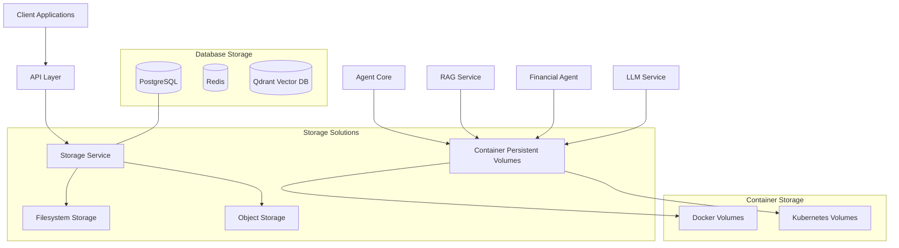

# Infrastructure Component: Storage Configuration

*Last Updated: 2025-05-13*  
*Owner: Infrastructure Team*  
*Status: Active*

## Overview

This document describes the storage configuration for the Alfred Agent Platform v2. The platform implements multiple storage solutions to handle various data persistence requirements, including file storage, object storage, and persistent volumes for containerized applications. These storage mechanisms are critical for platform functionality, data resilience, and scalable operations.

## Architecture

The storage architecture of the Alfred Agent Platform v2 consists of several specialized storage systems, each serving different needs within the platform:



## Configuration

### File Storage Service

#### Base Configuration

The platform uses a dedicated storage service built on top of PostgreSQL's storage schema:

```yaml
services:
  db-storage:
    image: alpine:latest
    container_name: db-storage
    ports:
      - "5000:5000"
    environment:
      ANON_KEY: ${ANON_KEY}
      SERVICE_KEY: ${SERVICE_ROLE_KEY}
      POSTGREST_URL: http://db-api:3000
      PGRST_JWT_SECRET: ${DB_JWT_SECRET:-your-super-secret-jwt-token}
      DATABASE_URL: postgres://supabase_storage_admin:${DB_PASSWORD:-your-super-secret-password}@db-postgres:5432/${DB_NAME:-postgres}
      FILE_SIZE_LIMIT: 52428800
      GLOBAL_S3_BUCKET: ${GLOBAL_S3_BUCKET}
      STORAGE_BACKEND: ${STORAGE_BACKEND}
      FILE_STORAGE_BACKEND_PATH: ${FILE_STORAGE_BACKEND_PATH:-/var/lib/storage}
      REGION: ${REGION}
      TENANT_ID: ${TENANT_ID}
      IS_MULTITENANT: ${IS_MULTITENANT}
    volumes:
      - db-storage-data:/var/lib/storage
    depends_on:
      db-postgres:
        condition: service_healthy
      db-api:
        condition: service_started
```

#### Storage Schema in PostgreSQL

The storage metadata is managed in a dedicated PostgreSQL schema:

```sql
-- Create storage schema
CREATE SCHEMA IF NOT EXISTS storage;

-- Create objects table
CREATE TABLE IF NOT EXISTS storage.objects (
    id UUID DEFAULT gen_random_uuid() PRIMARY KEY,
    bucket_id TEXT NOT NULL,
    name TEXT NOT NULL,
    owner UUID,
    created_at TIMESTAMPTZ DEFAULT NOW(),
    updated_at TIMESTAMPTZ DEFAULT NOW(),
    last_accessed_at TIMESTAMPTZ DEFAULT NOW(),
    metadata JSONB,
    path_tokens TEXT[] GENERATED ALWAYS AS (string_to_array(name, '/')) STORED,
    version UUID
);

-- Create buckets table
CREATE TABLE IF NOT EXISTS storage.buckets (
    id TEXT PRIMARY KEY,
    name TEXT NOT NULL UNIQUE,
    owner UUID,
    created_at TIMESTAMPTZ DEFAULT NOW(),
    updated_at TIMESTAMPTZ DEFAULT NOW(),
    public BOOLEAN DEFAULT FALSE,
    avif_autodetection BOOLEAN DEFAULT FALSE,
    file_size_limit BIGINT DEFAULT 0,
    allowed_mime_types TEXT[]
);
```

### Persistent Volume Configuration

#### Docker Volumes

The platform uses Docker named volumes for data persistence:

```yaml
volumes:
  redis-data:
    name: redis-data
  vector-db-data:
    name: vector-db-data
  llm-service-data:
    name: llm-service-data
  db-postgres-data:
    name: db-postgres-data
  db-storage-data:
    name: db-storage-data
  monitoring-metrics-data:
    name: monitoring-metrics-data
  monitoring-dashboard-data:
    name: monitoring-dashboard-data
```

#### Kubernetes PersistentVolumes

For Kubernetes deployments, persistent volumes are configured using PersistentVolume and PersistentVolumeClaim resources:

```yaml
# Example PostgreSQL PersistentVolumeClaim
apiVersion: v1
kind: PersistentVolumeClaim
metadata:
  name: postgres-data
  namespace: alfred-platform
spec:
  accessModes:
    - ReadWriteOnce
  resources:
    requests:
      storage: 20Gi
  storageClassName: standard

# Example Redis PersistentVolumeClaim
apiVersion: v1
kind: PersistentVolumeClaim
metadata:
  name: redis-data
  namespace: alfred-platform
spec:
  accessModes:
    - ReadWriteOnce
  resources:
    requests:
      storage: 10Gi
  storageClassName: standard

# Example Vector DB PersistentVolumeClaim
apiVersion: v1
kind: PersistentVolumeClaim
metadata:
  name: vector-db-data
  namespace: alfred-platform
spec:
  accessModes:
    - ReadWriteOnce
  resources:
    requests:
      storage: 30Gi
  storageClassName: standard
```

### Storage Buckets Configuration

The storage service organizes files into buckets, each with specific configurations:

```json
{
  "buckets": [
    {
      "id": "agent-documents",
      "name": "Agent Documents",
      "public": false,
      "file_size_limit": 10485760,
      "allowed_mime_types": ["application/pdf", "text/plain", "application/json"]
    },
    {
      "id": "user-uploads",
      "name": "User Uploads",
      "public": true,
      "file_size_limit": 5242880,
      "allowed_mime_types": ["image/jpeg", "image/png", "application/pdf"]
    },
    {
      "id": "system-backups",
      "name": "System Backups",
      "public": false,
      "file_size_limit": 104857600,
      "allowed_mime_types": ["application/gzip", "application/zip", "application/x-tar"]
    }
  ]
}
```

### Environment-Specific Configurations

#### Development

```yaml
services:
  db-storage:
    environment:
      STORAGE_BACKEND: "file"
      FILE_STORAGE_BACKEND_PATH: "/var/lib/storage"
      FILE_SIZE_LIMIT: 52428800  # 50MB
    volumes:
      - db-storage-data:/var/lib/storage
```

#### Production

```yaml
services:
  db-storage:
    environment:
      STORAGE_BACKEND: "s3"
      GLOBAL_S3_BUCKET: "alfred-platform-prod"
      REGION: "us-west-2"
      AWS_ACCESS_KEY_ID: "${AWS_ACCESS_KEY_ID}"
      AWS_SECRET_ACCESS_KEY: "${AWS_SECRET_ACCESS_KEY}"
      FILE_SIZE_LIMIT: 104857600  # 100MB
    deploy:
      resources:
        limits:
          cpus: '1'
          memory: 2G
        reservations:
          cpus: '0.5'
          memory: 1G
```

## Deployment

### Prerequisites

- Docker and Docker Compose installed (for development)
- Kubernetes cluster with StorageClass configured (for production)
- Storage volumes provisioned (local or cloud-based)
- Object storage credentials (for S3-based storage)
- Database initialized with storage schema

### Deployment Steps

1. **Prepare Environment**
   ```bash
   # Set required environment variables
   export STORAGE_BACKEND=file  # or "s3" for production
   export FILE_STORAGE_BACKEND_PATH=/var/lib/storage
   export FILE_SIZE_LIMIT=52428800  # 50MB
   
   # For S3 backend
   export GLOBAL_S3_BUCKET=alfred-platform
   export REGION=us-west-2
   export AWS_ACCESS_KEY_ID=your-access-key
   export AWS_SECRET_ACCESS_KEY=your-secret-key
   ```

2. **Deploy Storage Service**
   ```bash
   # Using Docker Compose
   docker-compose -f docker-compose.yml -f docker-compose.override.storage.yml up -d db-storage
   
   # Or using Kubernetes
   kubectl apply -f k8s/storage/storage-service.yaml
   ```

3. **Initialize Storage Buckets**
   ```bash
   # Create default buckets
   curl -X POST "http://localhost:5000/bucket" \
     -H "Content-Type: application/json" \
     -H "Authorization: Bearer ${SERVICE_ROLE_KEY}" \
     -d '{"id":"agent-documents","name":"Agent Documents","public":false}'
   
   curl -X POST "http://localhost:5000/bucket" \
     -H "Content-Type: application/json" \
     -H "Authorization: Bearer ${SERVICE_ROLE_KEY}" \
     -d '{"id":"user-uploads","name":"User Uploads","public":true}'
   ```

4. **Verify Deployment**
   ```bash
   # Check storage service health
   curl -X GET "http://localhost:5000/status"
   
   # List buckets
   curl -X GET "http://localhost:5000/bucket" \
     -H "Authorization: Bearer ${SERVICE_ROLE_KEY}"
   ```

## Scaling

### Horizontal Scaling

For production environments, the storage service can be scaled horizontally:

```yaml
# Example Kubernetes configuration for horizontal scaling
apiVersion: apps/v1
kind: Deployment
metadata:
  name: storage-service
  namespace: alfred-platform
spec:
  replicas: 3
  selector:
    matchLabels:
      app: storage-service
  template:
    spec:
      containers:
        - name: storage-service
          image: storage-service:latest
          env:
            - name: STORAGE_BACKEND
              value: "s3"
            - name: GLOBAL_S3_BUCKET
              value: "alfred-platform-prod"
```

### Vertical Scaling

The storage service can be scaled vertically by adjusting resource allocation:

```yaml
# Example Docker Compose configuration for vertical scaling
services:
  db-storage:
    deploy:
      resources:
        limits:
          cpus: '2'
          memory: 4G
        reservations:
          cpus: '1'
          memory: 2G
```

### Storage Expansion

For Docker volumes, storage can be expanded by creating new volumes and migrating data:

```bash
# Create a new volume
docker volume create db-storage-data-new

# Copy data from old volume to new volume
docker run --rm -v db-storage-data:/source -v db-storage-data-new:/target alpine cp -av /source/. /target/

# Update docker-compose.yml to use the new volume
```

For Kubernetes, PersistentVolumeClaims can be expanded:

```yaml
# Example PVC expansion
apiVersion: v1
kind: PersistentVolumeClaim
metadata:
  name: postgres-data
  namespace: alfred-platform
spec:
  accessModes:
    - ReadWriteOnce
  resources:
    requests:
      storage: 50Gi  # Increased from 20Gi
  storageClassName: standard
```

## Monitoring

### Health Checks

```yaml
# Storage service health check
healthcheck:
  test: ["CMD", "wget", "--no-verbose", "--tries=1", "--spider", "http://localhost:5000/status"]
  interval: 10s
  timeout: 10s
  retries: 5
  start_period: 30s
```

### Metrics

| Metric | Description | Normal Range | Alert Threshold |
|--------|-------------|--------------|----------------|
| storage_up | Storage service is up | 1 | <1 |
| storage_objects_count | Total number of stored objects | N/A | N/A |
| storage_buckets_count | Number of buckets | 1-10 | >20 |
| storage_disk_usage_bytes | Disk usage in bytes | 0-80% of capacity | >90% of capacity |
| storage_requests_total | Total number of storage requests | N/A | N/A |
| storage_request_duration_seconds | Request duration in seconds | 0.01-0.5s | >1s |
| storage_errors_total | Total number of storage errors | N/A | >100 in 5min |

### Dashboards

- [Storage Overview Dashboard](http://monitoring-dashboard:3000/d/storage-overview)
- [Storage Performance Dashboard](http://monitoring-dashboard:3000/d/storage-performance)
- [Storage Capacity Dashboard](http://monitoring-dashboard:3000/d/storage-capacity)

## Disaster Recovery

### Backup Procedures

#### Local File Storage Backup

```bash
# Backup storage volume data
docker run --rm -v db-storage-data:/source -v /backup:/backup alpine \
  tar czf /backup/storage-backup-$(date +%Y%m%d).tar.gz -C /source .

# Backup storage database schema
docker exec db-postgres pg_dump -U postgres -d postgres -n storage -F c \
  -f /tmp/storage-schema-$(date +%Y%m%d).dump
docker cp db-postgres:/tmp/storage-schema-$(date +%Y%m%d).dump /backup/
```

#### S3 Storage Backup

```bash
# Using AWS CLI to backup S3 bucket
aws s3 sync s3://alfred-platform-prod /backup/s3-backup-$(date +%Y%m%d)

# Backup storage database schema
docker exec db-postgres pg_dump -U postgres -d postgres -n storage -F c \
  -f /tmp/storage-schema-$(date +%Y%m%d).dump
docker cp db-postgres:/tmp/storage-schema-$(date +%Y%m%d).dump /backup/
```

### Restore Procedures

#### Local File Storage Restore

```bash
# Restore storage volume data
docker run --rm -v db-storage-data:/target -v /backup:/backup alpine \
  tar xzf /backup/storage-backup-20250513.tar.gz -C /target

# Restore storage database schema
docker cp /backup/storage-schema-20250513.dump db-postgres:/tmp/
docker exec db-postgres pg_restore -U postgres -d postgres -n storage -c \
  /tmp/storage-schema-20250513.dump
```

#### S3 Storage Restore

```bash
# Using AWS CLI to restore S3 bucket
aws s3 sync /backup/s3-backup-20250513 s3://alfred-platform-prod

# Restore storage database schema
docker cp /backup/storage-schema-20250513.dump db-postgres:/tmp/
docker exec db-postgres pg_restore -U postgres -d postgres -n storage -c \
  /tmp/storage-schema-20250513.dump
```

## Security Considerations

### Network Policies

```yaml
# Example Kubernetes network policy for storage service
apiVersion: networking.k8s.io/v1
kind: NetworkPolicy
metadata:
  name: storage-network-policy
  namespace: alfred-platform
spec:
  podSelector:
    matchLabels:
      app: db-storage
  ingress:
  - from:
    - podSelector:
        matchLabels:
          app: alfred-platform
    ports:
    - protocol: TCP
      port: 5000
```

### Access Control

```yaml
# Storage bucket policy example
{
  "bucket_id": "agent-documents",
  "policies": [
    {
      "name": "admin_access",
      "resources": ["objects"],
      "actions": ["select", "insert", "update", "delete"],
      "roles": ["service_role", "supabase_admin"]
    },
    {
      "name": "user_documents",
      "resources": ["objects"],
      "actions": ["select", "insert"],
      "roles": ["authenticated"],
      "condition": "auth.uid() = owner"
    }
  ]
}
```

### Encryption

For S3 storage, server-side encryption is enabled:

```yaml
# S3 storage encryption configuration
storage:
  s3:
    encrypt: true
    encryption_type: "AES256"  # or "aws:kms"
    kms_key_id: "${KMS_KEY_ID}"  # optional, for aws:kms encryption type
```

For local file storage, encryption options:

```yaml
# Local file storage encryption configuration
storage:
  file:
    encrypt_at_rest: true
    encryption_key: "${ENCRYPTION_KEY}"
```

## Troubleshooting

### Common Issues

| Issue | Symptoms | Resolution |
|-------|----------|------------|
| Storage service not starting | Health check fails, service restarts | Check PostgreSQL connection, verify storage schema exists |
| Permission denied on file upload | 403 errors when uploading files | Check bucket permissions, verify user authentication |
| Storage volume full | 500 errors, disk space alerts | Expand volume, clean up unused files, implement retention policy |
| Slow file retrieval | High latency on download requests | Check network connectivity, optimize file size, consider CDN for public files |
| S3 connectivity issues | Timeout errors on S3 operations | Verify credentials, check S3 endpoint availability, check network access |

### Logs

```bash
# Storage service logs
docker logs db-storage
kubectl logs -l app=db-storage

# PostgreSQL storage schema logs
docker exec db-postgres psql -U postgres -c "SELECT * FROM pg_stat_activity WHERE query LIKE '%storage.%' LIMIT 10;"
```

### Debugging Procedures

#### Check Storage Service Health

```bash
# Check storage service status
curl -X GET "http://localhost:5000/status"

# Check storage service configuration
docker exec db-storage env | grep STORAGE

# Check database connection
docker exec db-storage wget -q -O - http://db-api:3000/rpc/get_storage_status
```

#### Verify Storage Buckets

```bash
# List all buckets
curl -X GET "http://localhost:5000/bucket" \
  -H "Authorization: Bearer ${SERVICE_ROLE_KEY}"

# Check specific bucket details
curl -X GET "http://localhost:5000/bucket/agent-documents" \
  -H "Authorization: Bearer ${SERVICE_ROLE_KEY}"
```

#### Test File Operations

```bash
# Test file upload
curl -X POST "http://localhost:5000/object/agent-documents/test.txt" \
  -H "Authorization: Bearer ${SERVICE_ROLE_KEY}" \
  -H "Content-Type: text/plain" \
  -d "Test file content"

# Test file download
curl -X GET "http://localhost:5000/object/agent-documents/test.txt" \
  -H "Authorization: Bearer ${SERVICE_ROLE_KEY}"
```

## Related Components

- [Database Infrastructure](../database/database-infrastructure.md): Describes the PostgreSQL database that stores storage metadata
- [Docker Compose Configuration](../containerization/docker-compose-configuration.md): Describes the containerization of storage services
- [Kubernetes Deployment](../containerization/kubernetes-deployment.md): Describes the Kubernetes deployment of storage services
- [Infrastructure Security](../security/infrastructure-security.md): Describes security measures for storage services

## Version History

| Version | Date | Changes | Author |
|---------|------|---------|--------|
| 1.0.0 | 2025-05-13 | Initial version | Infrastructure Team |

## References

- [Supabase Storage Documentation](https://supabase.com/docs/guides/storage)
- [Docker Volumes Documentation](https://docs.docker.com/storage/volumes/)
- [Kubernetes Storage Documentation](https://kubernetes.io/docs/concepts/storage/persistent-volumes/)
- [AWS S3 Documentation](https://docs.aws.amazon.com/s3/index.html)
- [PostgreSQL Storage Schema](https://github.com/supabase/storage)