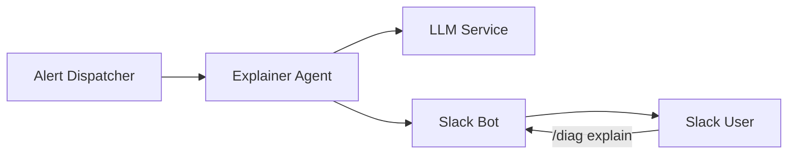

# Phase 8.2 – Alert Explanation Agent

## Overview

The Alert Explanation Agent is a service that provides human-readable explanations for alerts generated by the Alfred platform. It uses LangChain to analyze alert metadata and generate contextual explanations, potential causes, remediation steps, and runbook links.

## Architecture



## Features

- **Automatic Alert Explanation**: Generates explanations for alerts using AI
- **Slash Command Integration**: `/diag explain <alert-id>` for on-demand explanations
- **Flexible LLM Support**: Can use various LLM backends through LangChain
- **Stub Mode**: Works without LLM for testing and development

## Usage

### Via Slash Command

```
/diag explain ALERT-123
```

This will fetch the alert details and return an explanation in Slack.

### Programmatic Usage

```python
from alfred.alerts.explainer import ExplainerAgent

# Initialize with LLM
agent = ExplainerAgent(llm=your_llm_instance)

# Explain an alert
result = agent.explain_alert(alert_payload)
```

## Configuration

### Environment Variables

- `LOG_LEVEL`: Logging level (default: INFO)
- `LLM_ENDPOINT`: LLM service endpoint (optional)

### Helm Values

```yaml
explainer:
  enabled: true
  image:
    repository: ghcr.io/alfred-platform/explainer-bot
    tag: "v0.8.2"
  resources:
    requests:
      cpu: 100m
      memory: 128Mi
```

## Development

### Running Tests

```bash
pytest tests/unit/alfred/alerts/explainer/
```

### Local Development

1. Install dependencies:
   ```bash
   pip install -r docker/explainer-bot/requirements.txt
   ```

2. Run in stub mode:
   ```python
   from alfred.alerts.explainer import ExplainerAgent
   agent = ExplainerAgent()  # No LLM, uses stub
   ```

## Deployment

The explainer is deployed as part of the Alfred platform:

```bash
helm upgrade alfred ./charts/alfred \
  --set explainer.enabled=true \
  --set explainer.image.tag=v0.8.2
```

## Alert Format

The explainer expects alerts in the following format:

```json
{
  "alert_name": "ServiceDown",
  "description": "Service has been down for 5 minutes",
  "severity": "critical",
  "value": "0",
  "metric": "up",
  "labels": {
    "service": "alfred-core",
    "namespace": "alfred"
  },
  "annotations": {
    "runbook_url": "https://runbooks.alfred.ai/service-down"
  }
}
```

## Response Format

The agent returns explanations in this format:

```
Explanation: Brief explanation of what the alert means
Potential Causes: List of possible causes
Remediation: Steps to resolve the issue
Runbook: Link to detailed runbook
```
