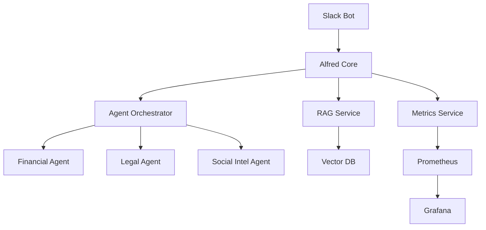

# Alfred Agent Platform v2 - Operations Run Book

## Table of Contents
1. [Overview](#overview)
2. [Architecture](#architecture)
3. [Deployment](#deployment)
4. [Monitoring](#monitoring)
5. [Secret Management](#secret-management)
6. [Troubleshooting](#troubleshooting)
7. [Emergency Procedures](#emergency-procedures)

## Overview

The Alfred Agent Platform v2 is a distributed AI agent orchestration system designed for enterprise use. This run book provides operational guidance for managing the platform in production.

### Key Components
- **Alfred Core**: Central orchestration service
- **Agent Services**: Domain-specific AI agents (financial, legal, social intelligence)
- **RAG Service**: Retrieval-augmented generation for knowledge management
- **Slack Integration**: Primary user interface via Slack bot
- **Monitoring Stack**: Prometheus, Grafana, and custom health checks

## Architecture


*Figure 1: High-level platform architecture showing service interactions*

### Service Dependencies


## Deployment

### Prerequisites
- Kubernetes 1.28+
- Helm 3.12+
- GitHub Container Registry access
- Configured secrets (see [Secret Management](#secret-management))

### Deployment Steps

1. **Clone the repository**
   ```bash
   git clone https://github.com/locotoki/alfred-agent-platform-v2.git
   cd alfred-agent-platform-v2
   ```

2. **Configure environment**
   ```bash
   cp values-staging.yaml values-local.yaml
   # Edit values-local.yaml with your configuration
   ```

3. **Deploy with Helm**
   ```bash
   helm upgrade --install alfred ./charts/alfred \
     -f values-local.yaml \
     --namespace alfred \
     --create-namespace
   ```

### Keycloak Authentication


*Figure 2: Keycloak login page with TLS enabled*

The platform uses Keycloak for authentication with the following security features:
- TLS encryption enabled on all endpoints
- Admin console disabled for production (`KC_SPI_CONSOLE_ENABLED=false`)
- Automated realm export for backup
- Health checks on `/health/ready`

## Monitoring

### Grafana Dashboards


*Figure 3: Cold-start performance monitoring dashboard*

Access Grafana at: `https://grafana.<namespace>.svc:3000`

Key dashboards:
- **Platform Overview**: Service health and SLIs
- **Cold Start Performance**: Startup time metrics (SLA: ≤75s)
- **Agent Performance**: Request latency and throughput per agent
- **Resource Usage**: CPU, memory, and network metrics

### Prometheus Alerts


*Figure 4: Configured Prometheus alert rules*

Critical alerts:
- `ContactIngestRateZero`: No contacts processed for 10 minutes
- `ColdStartSLABreach`: Startup time exceeds 75 seconds
- `ServiceDown`: Any core service unavailable for 5 minutes
- `HighErrorRate`: Error rate >5% for 10 minutes

### Health Checks

All services expose standardized health endpoints:
- `/health` - Liveness probe
- `/healthz` - Readiness probe
- `/metrics` - Prometheus metrics

## Secret Management

### Overview

Secrets are managed through GitHub Secrets and Kubernetes Secrets, with different configurations per environment.

### Secret Categories

1. **Authentication Secrets**
   - `SLACK_BOT_TOKEN`: Slack bot OAuth token
   - `SLACK_APP_TOKEN`: Slack app-level token
   - `KEYCLOAK_ADMIN_PASSWORD`: Keycloak admin credentials

2. **API Keys**
   - `OPENAI_API_KEY`: OpenAI API access
   - `ANTHROPIC_API_KEY`: Anthropic Claude API
   - `CREWAI_API_KEY`: CrewAI platform access

3. **Database Credentials**
   - `DB_HOST`, `DB_USER`, `DB_PASSWORD`: PostgreSQL connection
   - `REDIS_PASSWORD`: Redis authentication
   - `VECTOR_DB_KEY`: Vector database access

### Managing Secrets

#### GitHub Secrets (CI/CD)
```bash
# Set a secret via GitHub CLI
gh secret set SLACK_BOT_TOKEN --env production

# List secrets
gh secret list --env production
```

#### Kubernetes Secrets
```bash
# Create secret from literal
kubectl create secret generic alfred-secrets \
  --from-literal=SLACK_BOT_TOKEN=xoxb-... \
  --namespace alfred

# Create secret from file
kubectl create secret generic keycloak-realm-export \
  --from-file=realm.json \
  --namespace alfred

# Verify secret
kubectl get secret alfred-secrets -o yaml -n alfred
```

### Secret Rotation

Secrets should be rotated according to the following schedule:
- API tokens: Every 90 days
- Database passwords: Every 180 days
- TLS certificates: Before expiration (typically 365 days)

Use the provided rotation script:
```bash
./scripts/rotate-secrets.sh --env production --type api-tokens
```

## Troubleshooting

### Common Issues

#### 1. Service Won't Start
```bash
# Check pod status
kubectl get pods -n alfred

# View pod logs
kubectl logs -n alfred <pod-name> --tail=100

# Describe pod for events
kubectl describe pod -n alfred <pod-name>
```

#### 2. Slack Bot Not Responding
1. Verify Slack tokens in secrets
2. Check `slack-app` pod logs
3. Ensure OAuth scopes are configured correctly
4. Verify network connectivity to Slack API

#### 3. High Latency
1. Check Grafana latency dashboard
2. Review resource usage (CPU/memory)
3. Check database query performance
4. Verify no rate limiting from external APIs

#### 4. Authentication Failures
1. Check Keycloak pod status and logs
2. Verify realm configuration
3. Ensure TLS certificates are valid
4. Check client credentials

### Debug Commands

```bash
# Get all resources in namespace
kubectl get all -n alfred

# Check service endpoints
kubectl get endpoints -n alfred

# Test service connectivity
kubectl exec -it -n alfred <pod-name> -- curl http://alfred-core:8080/health

# View recent events
kubectl get events -n alfred --sort-by='.lastTimestamp'
```

## Emergency Procedures

### Service Outage Response

1. **Immediate Actions**
   - Check Grafana dashboards for service status
   - Review Prometheus alerts
   - Check pod status: `kubectl get pods -n alfred`

2. **Diagnosis**
   - Collect logs from affected services
   - Check resource constraints
   - Verify external dependencies

3. **Recovery**
   - Restart affected pods if necessary
   - Scale up if resource constrained
   - Rollback to previous version if recent deployment

### Rollback Procedure

```bash
# List helm releases
helm list -n alfred

# View release history
helm history alfred -n alfred

# Rollback to previous version
helm rollback alfred -n alfred

# Verify rollback
kubectl get pods -n alfred -w
```

### Data Recovery

1. **Database Backup**
   ```bash
   # Manual backup
   kubectl exec -n alfred postgres-0 -- pg_dump -U postgres alfred_db > backup-$(date +%Y%m%d).sql
   ```

2. **Keycloak Realm Export**
   ```bash
   # Trigger realm export job
   kubectl create job --from=cronjob/keycloak-realm-export manual-export -n alfred
   ```

### Contact Information

- **On-Call Engineer**: Check PagerDuty schedule
- **Platform Team**: #alfred-platform-team on Slack
- **Escalation**: platform-oncall@company.com

---

## Appendix

### Useful Links
- [GitHub Repository](https://github.com/locotoki/alfred-agent-platform-v2)
- [API Documentation](/docs/api)
- [Architecture Decision Records](/docs/adr)
- [Security Policy](/SECURITY.md)

### Version History
- v2.0.0 - Initial GA release
- v2.1.0 - Added Keycloak authentication
- v2.2.0 - Enhanced monitoring and alerting

Last Updated: 27 May 2025
