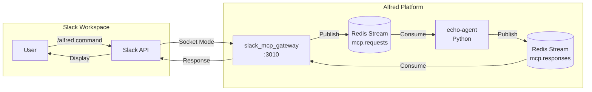

# Slack Integration Architecture

## Overview

The Alfred platform integrates with Slack through a multi-component architecture that processes slash commands (`/alfred`) via Redis Streams for asynchronous, scalable command processing.

## Architecture Diagram



## Components

### 1. Slack MCP Gateway (`slack_mcp_gateway`)
- **Purpose**: Bridge between Slack and internal Redis streams
- **Technology**: Node.js with @slack/bolt
- **Port**: 3010 (internal), 9127 (metrics)
- **Connection**: Socket Mode (no public webhook required)
- **Responsibilities**:
  - Receive slash commands from Slack
  - Publish commands to Redis stream `mcp.requests`
  - Consume responses from Redis stream `mcp.responses`
  - Send responses back to Slack

### 2. Redis Streams
- **Request Stream**: `mcp.requests`
  - Contains incoming Slack commands
  - Consumed by agent services (echo-agent, future agents)
- **Response Stream**: `mcp.responses`
  - Contains agent responses
  - Consumed by slack_mcp_gateway

### 3. Echo Agent (`echo-agent`)
- **Purpose**: Example agent that processes `/alfred` commands
- **Technology**: Python 3.11
- **Handles**:
  - `/alfred ping [message]` → Returns "🏓 [message]"
  - `/alfred health` → Returns health status
  - Other commands → Echo back

## Message Flow

### 1. Command Reception
```
User types: /alfred health
     ↓
Slack sends to alfred app via Socket Mode
     ↓
slack_mcp_gateway receives command
```

### 2. Request Publishing
```json
// Published to mcp.requests stream
{
  "id": "uuid-v4",
  "type": "slack_command",
  "command": "/alfred",
  "text": "health",
  "timestamp": "1234567890",
  "user_id": "U12345",
  "user_name": "john.doe",
  "channel_id": "C12345",
  "team_id": "T12345",
  "response_url": "https://hooks.slack.com/..."
}
```

### 3. Agent Processing
```python
# Echo agent consumes from mcp.requests
# Processes command
# Publishes to mcp.responses:
{
  "request_id": "uuid-v4",
  "text": "✅ Echo agent is healthy!"
}
```

### 4. Response Delivery
```
Gateway consumes from mcp.responses
     ↓
Matches request_id to original metadata
     ↓
Sends response to Slack channel
     ↓
User sees: "✅ Echo agent is healthy!"
```

## Configuration

### Environment Variables

#### slack_mcp_gateway
```bash
SLACK_APP_TOKEN=xapp-...      # App-level token for Socket Mode
SLACK_BOT_TOKEN=xoxb-...      # Bot user OAuth token
REDIS_URL=redis://:password@redis:6379
LOG_LEVEL=info
```

#### echo-agent
```bash
REDIS_URL=redis://:password@redis:6379
SLACK_BOT_TOKEN=xoxb-...      # For future direct Slack operations
LOG_LEVEL=INFO
```

### Docker Compose Configuration

```yaml
# docker-compose.override.yml
services:
  slack_mcp_gateway:
    environment:
      - REDIS_URL=redis://:${REDIS_PASSWORD}@redis:6379
      - SLACK_APP_TOKEN=${SLACK_APP_TOKEN}
      - SLACK_BOT_TOKEN=${SLACK_BOT_TOKEN}

  echo-agent:
    image: python:3.11-slim
    command: >
      bash -c "pip install redis slack-sdk &&
      python /app/services/slack_mcp_gateway/echo_agent.py"
    environment:
      - REDIS_URL=redis://:${REDIS_PASSWORD}@redis:6379
```

## Security Considerations

### Redis Security
- **Authentication**: Redis requires password (`requirepass`)
- **Disabled Commands**: `SLAVEOF`, `REPLICAOF`, `CONFIG`, `FLUSHDB`, `FLUSHALL`
- **Network**: Bound to Docker network only

### Slack Security
- **Socket Mode**: No public webhooks exposed
- **Token Storage**: Tokens stored in `.env` file, not committed
- **Channel Access**: Bot must be invited to channels

## Monitoring & Health Checks

### Health Endpoints
- **slack_mcp_gateway**: `http://localhost:3010/health`
- **Redis**: Built-in health via `redis-cli ping`

### Metrics
- Both services expose Prometheus metrics on port 9091
- Key metrics:
  - Command processing rate
  - Response delivery rate
  - Redis connection status
  - Error rates

## Troubleshooting

### Common Issues

#### 1. "No metadata found for request"
- **Cause**: Response received for unknown request ID
- **Solution**: Check if request metadata TTL (1 hour) expired

#### 2. Commands not processed
- **Check**:
  ```bash
  # Check if messages are in Redis
  docker exec redis redis-cli -a $REDIS_PASSWORD XLEN mcp.requests

  # Check echo agent logs
  docker logs echo-agent --tail 20

  # Check consumer group
  docker exec redis redis-cli -a $REDIS_PASSWORD XINFO GROUPS mcp.requests
  ```

#### 3. Slack connection issues
- **Check**:
  ```bash
  # Gateway health
  curl http://localhost:3010/health

  # Verify tokens
  echo $SLACK_APP_TOKEN | head -c 10  # Should start with xapp-
  echo $SLACK_BOT_TOKEN | head -c 10  # Should start with xoxb-
  ```

## Adding New Agents

To add a new agent that processes Slack commands:

1. **Create Agent Service**:
   ```python
   # services/my_agent/agent.py
   import redis
   import json

   # Connect to Redis
   r = redis.from_url(os.environ.get("REDIS_URL"))

   # Create consumer group
   r.xgroup_create("mcp.requests", "my-agent", id="0", mkstream=True)

   # Consume messages
   while True:
       messages = r.xreadgroup("my-agent", "consumer-1",
                               {"mcp.requests": ">"}, count=1, block=5000)
       # Process and respond...
   ```

2. **Add to docker-compose.override.yml**:
   ```yaml
   my-agent:
     image: python:3.11-slim
     environment:
       - REDIS_URL=redis://:${REDIS_PASSWORD}@redis:6379
     # ... rest of config
   ```

3. **Filter Commands**: Agent should only process relevant commands
   ```python
   if request_data.get("text", "").startswith("my-command"):
       # Process this command
   ```

## Testing

### Manual Testing
```bash
# Send test message directly to Redis
docker exec redis redis-cli -a $REDIS_PASSWORD \
  XADD mcp.requests '*' \
  id test-123 \
  type slack_command \
  command /alfred \
  text "ping test" \
  user_id U123 \
  channel_id C123

# Check for response
docker exec redis redis-cli -a $REDIS_PASSWORD \
  XRANGE mcp.responses - + COUNT 5
```

### Integration Testing
1. Invite bot to test channel: `/invite @alfred`
2. Test commands:
   - `/alfred health`
   - `/alfred ping hello world`

## Future Enhancements

1. **Multi-Agent Router**: Route commands to specialized agents based on intent
2. **Response Formatting**: Rich Slack blocks for better UX
3. **Conversation Context**: Maintain conversation state across commands
4. **Direct Messaging**: Support for DM interactions
5. **Interactive Components**: Buttons and select menus
6. **Audit Logging**: Command history and analytics

## References

- [Slack Bolt Framework](https://slack.dev/bolt-js/concepts)
- [Redis Streams](https://redis.io/docs/data-types/streams/)
- [Docker Compose Networking](https://docs.docker.com/compose/networking/)
- Internal: `services/slack_mcp_gateway/README.md`
