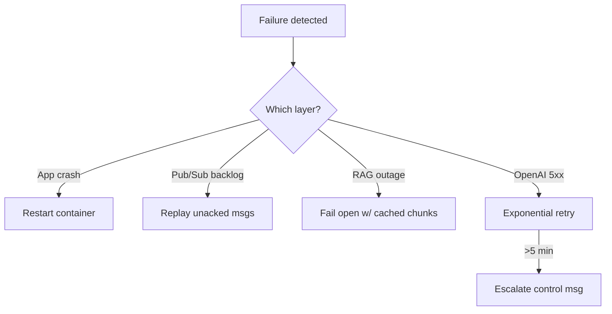

# Atlas (Infra‑Architect Agent) – Deployment Manual

> **Version 0.2 – May 2025**
> This major‑minor release folds in all post‑MVP fixes, adds full observability, security hardening, and clarifies the RAG interface.  It supersedes v0.1.

---

## Table of Contents

1. [Overview](#1-overview)
2. [Minimum Prerequisites](#2-minimum-prerequisites)
3. [Deployment](#3-deployment)
      3.1 [Single‑Node Quick Start](#31-single-node-quick-start)
      3.2 [Bare‑Metal Development Flow](#32-bare-metal-development-flow)
      3.3 [Scaling Atlas Workers](#33-scaling-atlas-workers)
4. [Building the Docker Image](#4-building-the-docker-image)
5. [Event‑Bus Contracts](#5-event-bus-contracts)
6. [RAG Service Wiring](#6-rag-service-wiring)
7. [Security & Secrets](#7-security--secrets)
8. [Observability & Monitoring](#8-observability--monitoring)
9. [Operational Tasks](#9-operational-tasks)
10. [Troubleshooting & Recovery](#10-troubleshooting--recovery)
11. [GitHub App Integration (Optional)](#11-github-app-integration-optional)
12. [Next Steps (Phase 2)](#12-next-steps-phase-2)
13. [Appendices](#13-appendices)

---

## 1 Overview

Atlas is a **stateless Python worker** that:

1. Listens for **`architect`**‑role messages on the event‑bus.
2. Retrieves relevant knowledge through the **RAG Service**.
3. Calls the configured OpenAI model (GPT‑4.1 → o3 → o1‑pro fallback chain).
4. Publishes architecture specs back to the bus for Claude‑Code and UI clients.

```text
Supabase ▶ architect_in  ─┐
                          │ (router) ➜ Pub/Sub topic ➜ atlas‑worker
atlas‑worker ▶ architect_out ─┘
```

### 1.1 Crew Composition (recommended minimum)

| Role                          | Purpose                              | Notes                                           |
| ----------------------------- | ------------------------------------ | ----------------------------------------------- |
| **Atlas** (Architect)         | Generates architecture specs / ADRs  | Day‑1 requirement                               |
| **Claude‑Code** (Implementer) | Turns specs into code / CI pipelines | Day‑1 requirement                               |
| Forge (Optional)              | Cloud builder / runner               | Promote when hands‑free infra needed            |
| Sentinel (Optional)           | Validator / gatekeeper               | Promote when automated SLO enforcement required |

---

## 2 Minimum Prerequisites

| Component         | Requirement                         |
| ----------------- | ----------------------------------- |
| **Docker Engine** | ≥ 24.x & Docker Compose ≥ 2.24      |
| **Python** (alt)  | 3.11.x (only if running bare‑metal) |
| **CPU / RAM**     | 2 vCPU, 4 GiB *(dev / PoC)*         |
| **Disk**          | 1 GiB free                          |
| **Outbound 443**  | OpenAI API, Supabase, Pub/Sub       |

### 2.1 Required Environment Variables

```dotenv
OPENAI_API_KEY=
OPENAI_MODEL=gpt-4.1         # default
SUPABASE_URL=
SUPABASE_SERVICE_ROLE_KEY=
PUBSUB_PROJECT_ID=
PUBSUB_TOPIC_OUT=architect_out
TOKEN_BUDGET_PER_RUN=12000   # optional
DAILY_TOKEN_BUDGET=250000    # optional
```

Store secrets using **Docker/K8s Secrets** or a vault; never commit `.env` to Git.

### 2.2 Network Ports

| Component     | Port | TLS                       |
| ------------- | ---- | ------------------------- |
| Atlas metrics | 8000 | optional (mTLS supported) |
| RAG Gateway   | 8501 | optional                  |

### 2.3 Secrets & Network Security

* **Secrets at rest** – mounted via Docker Secrets or K8s Secrets; encrypt volumes.
* **In‑transit** – enable TLS for Supabase & RAG; internal traffic can use WireGuard mesh.
* **RBAC** – restrict Supabase service‑role key to channel tables (`architect_in`, `architect_out`).
* **Egress policy** – allowlist `api.openai.com`, Supabase FQDN, and Pub/Sub endpoint.

---

## 3 Deployment

### 3.1 Single‑Node Quick Start

```bash
# 1 Clone repo and copy env
$ git clone https://github.com/locotoki/alfred-agent-platform-v2.git
$ cd alfred-agent-platform-v2
$ cp .env.example .env   # edit the variables listed above

# 2 Start the trimmed stack (Supabase, Qdrant, Pub/Sub emu, RAG, Atlas)
$ docker compose -f docker-compose.min.yml up -d

# 3 Index initial docs so RAG has content
$ ./scripts/index_repo.sh docs/

# 4 Send a test task (architect chat message)
$ ./scripts/publish_task.sh "Design a minimal CI pipeline"

# 5 Tail the reply
$ docker logs -f atlas-worker | grep architect_out
```

If you see a streamed spec in the logs, Atlas is alive.

### 3.2 Bare‑Metal Development Flow

```bash
# Python + Poetry setup
pyenv install 3.11.9 && pyenv local 3.11.9
poetry install --with dev
cp .env.example .env.dev      # redacted dev keys only
export $(grep -v '^#' .env.dev | xargs)
uvicorn atlas.main:app --reload
```

*Launch configuration* – VS Code snippet under `.vscode/launch.json` lets you attach a debugger to the reload server.

### 3.3 Scaling Atlas Workers

Atlas is **stateless**.  Scaling = add replicas behind the Pub/Sub subscription.

| Load (tasks/min) | vCPU/worker | RAM/worker | Workers | Notes      |
| ---------------- | ----------- | ---------- | ------- | ---------- |
| 10               | 1           | 2 GiB      | 1       | hobby      |
| 100              | 4           | 8 GiB      | 2       | small team |
| 500              | 16          | 32 GiB     | 6       | multi‑zone |

**Kubernetes example**:

```yaml
apiVersion: autoscaling/v2
kind: HorizontalPodAutoscaler
metadata:
  name: atlas-hpa
spec:
  scaleTargetRef:
    apiVersion: apps/v1
    kind: Deployment
    name: atlas
  minReplicas: 2
  maxReplicas: 10
  metrics:
  - type: Pods
    pods:
      metric:
        name: run_seconds_p95
      target:
        type: AverageValue
        averageValue: 5s
```

---

## 4 Building the Docker Image

`services/atlas-worker/Dockerfile`:

```dockerfile
FROM python:3.11-slim
ENV PIP_ROOT_USER_ACTION=ignore
RUN apt-get update && apt-get install -y gcc git && rm -rf /var/lib/apt/lists/*
COPY pyproject.toml poetry.lock /app/
WORKDIR /app
RUN pip install poetry==1.8.2 && poetry install --no-root --only main
COPY atlas /app/atlas
# Health‑probe endpoint => /healthz returns 200 when model is reachable
HEALTHCHECK --interval=30s --timeout=3s CMD curl -f http://localhost:8000/healthz || exit 1
CMD ["python", "-m", "atlas.main"]
```

#### Key dependencies

```toml
openai = "^1.20"
google-cloud-pubsub = "^2.20"
supabase = "^2.1"
prometheus-client = "^0.20"
tenacity = "^8.2"
```

---

## 5 Event‑Bus Contracts

```jsonc
{
  "task_id": "uuid4",
  "role": "architect",
  "msg_type": "chat|spec|control",
  "content": "…prompt or reply…",
  "metadata": {
    "tokens": 0,
    "model": "gpt-4.1",
    "parent_id": null,
    "status": "in_progress",
    "schema_ver": 1
  }
}
```

### 5.1 Message Types

| msg\_type | Purpose                               | Example                                  |
| --------- | ------------------------------------- | ---------------------------------------- |
| `chat`    | Human → Atlas prompt                  | "Design a Kubernetes ingress controller" |
| `spec`    | Atlas → Claude‑Code architecture spec | Markdown ADR                             |
| `control` | Ops signals                           | `{ "command": "flush_cache" }`           |

**Control Commands**

* `flush_cache` – drop RAG cache
* `heartbeat` – Atlas responds with `status: ok`
* `set_budget` – override `TOKEN_BUDGET_PER_RUN`
* `escalate` – emitted by router after 3 failed deliver attempts

Full examples live in `docs/event_examples/*.json`.

---

## 6 RAG Service Wiring

### 6.1 Service Endpoints

| Endpoint          | Method | Body                             | Notes                                              |
| ----------------- | ------ | -------------------------------- | -------------------------------------------------- |
| `/v1/query_chat`  | POST   | `{ "query": str, "top_k": int }` | Returns ranked chunks with `similarity` & `source` |
| `/v1/embed_batch` | POST   | `list[str]`                      | Async; returns `job_id`                            |

### 6.2 Tuning Parameters

| Param                 | Default | Description                  |
| --------------------- | ------- | ---------------------------- |
| `top_k`               | 15      | Retrieval fan‑out            |
| `relevancy_threshold` | 0.65    | Drop chunks below cosine‑sim |
| `collapse_by_file`    | true    | Deduplicate per file         |

### 6.3 Knowledge‑Base Maintenance

*Initial load*

```bash
./scripts/index_repo.sh docs/
```

*Nightly refresh* – K8s CronJob `atlas-index-refresh` runs `/v1/embed_batch` on changed files.  Logs are rotated daily.

*Ad‑hoc additions* – publish `docs.added` event with repo URL; embed‑worker pulls & indexes.

---

## 7 Security & Secrets

See [2.3](#23-secrets--network-security) for base practices.  Additional items:

| Area             | Best Practice                                                                            |
| ---------------- | ---------------------------------------------------------------------------------------- |
| **OpenAI keys**  | Rotate quarterly.  Store only in secret store (AWS SM, GCP SM, Vault).                   |
| **Supabase JWT** | Principle of least privilege; limit to RLS‑protected tables.                             |
| **Ingress**      | Terminate TLS at edge; internal traffic encrypted via service mesh or WireGuard overlay. |
| **Audit**        | Enable Supabase audit logs & GCP Pub/Sub IAM audit.                                      |

---

## 8 Observability & Monitoring

Atlas exposes **Prometheus metrics** at `/metrics`.

| Metric                      | Type      | Default Alert                                       |
| --------------------------- | --------- | --------------------------------------------------- |
| `atlas_tokens_total`        | counter   | Warn at 80 % of `DAILY_TOKEN_BUDGET`, page at 100 % |
| `atlas_run_seconds`         | histogram | Page if p95 > 10 s                                  |
| Pub/Sub `dead_letter_count` | gauge     | Warn if ≥ 1 msg / 5 min                             |

### 8.1 Grafana Dashboard

Import the JSON in [Appendix B](#appendix-b-grafana-dashboard-json) – screenshot:


### 8.2 Prometheus Alert Rules

Rules file in [Appendix C](#appendix-c-prometheus-alert-rules) – mount into Prometheus config.

---

## 9 Operational Tasks

| Frequency | Task                                                  | Command                                    |
| --------- | ----------------------------------------------------- | ------------------------------------------ |
| daily     | Rotate RAG index cronjob logs                         | `docker logs --since 24h rag-embed-worker` |
| weekly    | Review token budget chart                             | Grafana → Atlas panel                      |
| quarterly | Rotate `OPENAI_API_KEY`, GitHub App key, Supabase JWT | Update secrets + restart stack             |

---

## 10 Troubleshooting & Recovery

| Symptom                      | Checklist                                                                      |
| ---------------------------- | ------------------------------------------------------------------------------ |
| **Atlas container restarts** | `docker logs atlas-worker` – common: invalid OpenAI key, exceeded token limit. |
| **No reply in Slack**        | Check `architect_out` in Supabase Studio; review router logs and Pub/Sub DLQ.  |
| **High token spend**         | Lower `top_k`; switch `OPENAI_MODEL` to `gpt-4o-mini` for drafts.              |

### 10.1 Common Error Codes

| Source   | Code    | Meaning        | Fix                       |
| -------- | ------- | -------------- | ------------------------- |
| OpenAI   | 429     | Rate limit     | Back‑off; buy higher tier |
| OpenAI   | 500/502 | Upstream error | Retry with jitter         |
| Pub/Sub  | 9       | Ack deadline   | Increase ack time         |
| Supabase | 401     | Expired JWT    | Rotate secret             |

### 10.2 Recovery Flow‑Chart



---

## 11 GitHub App Integration (Optional)

Follow the **v0.1** steps with these clarifications:

*The Router* – Go micro‑service translating GitHub webhooks → Pub/Sub → Supabase.  Retries on 5xx, pushes to DLQ after 3 attempts, emits `control: escalate`.

Missing pieces are now in `services/router/README.md`.

---

## 12 Next Steps (Phase 2)

* Add hybrid reranker side‑car to RAG.
* Turn `index_repo.sh` into a long‑running embed‑worker subscribed to `docs.added` events.
* Extend event schema with streaming‑chunk fields for large replies.
* Create CI test (`pytest`) to fail PR if Atlas tokens > per‑run budget.

---

## 13 Appendices

### Appendix A – Supabase Channel DDL

```sql
create publication architect_bus;
create table public.architect_in  (data jsonb);
create table public.architect_out (data jsonb);
alter publication architect_bus add table public.architect_in, public.architect_out;
```

### Appendix B – Grafana Dashboard JSON

```json
{
  "id": null,
  "title": "Atlas Overview",
  "time": { "from": "now-6h", "to": "now" },
  "panels": [
    {
      "type": "graph",
      "title": "Token Spend (cumulative)",
      "targets": [
        { "expr": "sum(increase(atlas_tokens_total[1h]))" }
      ]
    },
    {
      "type": "graph",
      "title": "Run Time p95",
      "targets": [
        { "expr": "histogram_quantile(0.95, rate(atlas_run_seconds_bucket[5m]))" }
      ]
    }
  ]
}
```

### Appendix C – Prometheus Alert Rules

```yaml
# prometheus/atlas-rules.yaml
 groups:
 - name: atlas.rules
   rules:
   - alert: AtlasTokenBudget80
     expr: (atlas_tokens_total / DAILY_TOKEN_BUDGET) > 0.8
     for: 5m
     labels:
       severity: warning
     annotations:
       summary: "Atlas token usage > 80%"
   - alert: AtlasSlowP95
     expr: histogram_quantile(0.95, rate(atlas_run_seconds_bucket[5m])) > 10
     for: 10m
     labels:
       severity: critical
     annotations:
       summary: "Atlas p95 latency > 10 s"
```

### Appendix D – Example Implementation Task Issue (GitHub)

```markdown
## Context
Need Terraform module for Supabase S3.

## Technical Spec
…
```

---

© 2025 locotoki / Digital Native Ventures – MIT License
