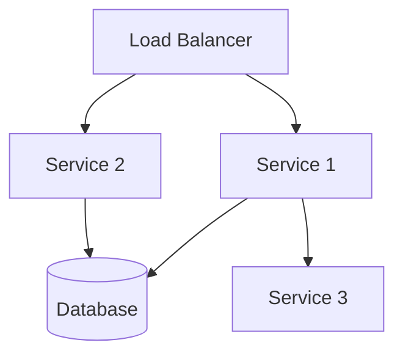

# Deployment Configuration: {Deployment Name}

*Last Updated: YYYY-MM-DD*  
*Owner: {Owner}*  
*Status: {Draft|Active|Deprecated|Replaced}*
*Environment: {Development|Staging|Production}*

## Overview

{Provide a concise overview of this deployment configuration, its purpose, and which components it deploys. Include information about the target environment and any specific considerations for this deployment.}

## Deployment Architecture

{Describe the architecture of this deployment configuration. Include a diagram showing the components being deployed and their relationships.}



## Prerequisites

### System Requirements

| Resource | Minimum | Recommended |
|----------|---------|-------------|
| CPU | X cores | Y cores |
| Memory | X GB | Y GB |
| Storage | X GB | Y GB |
| Network | X Mbps | Y Mbps |

### Required Tools

| Tool | Version | Installation Guide |
|------|---------|-------------------|
| Docker | 20.10+ | [Docker Installation](https://docs.docker.com/get-docker/) |
| Kubernetes | 1.25+ | [Kubernetes Installation](https://kubernetes.io/docs/setup/) |
| Helm | 3.8+ | [Helm Installation](https://helm.sh/docs/intro/install/) |
| Terraform | 1.5+ | [Terraform Installation](https://developer.hashicorp.com/terraform/downloads) |

### Required Credentials

| Credential | Purpose | How to Obtain |
|------------|---------|--------------|
| Cloud Provider API Key | Infrastructure provisioning | Contact platform administrator |
| Container Registry Credentials | Image pulling | Contact platform administrator |
| Database Credentials | Database access | Generated during deployment |

## Deployment Steps

### 1. Prepare Environment

```bash
# Set environment variables
export PROJECT_ID=alfred-platform
export ENVIRONMENT=development
export VERSION=1.2.3

# Clone repository (if needed)
git clone https://github.com/example/alfred-agent-platform.git
cd alfred-agent-platform

# Switch to the correct branch/tag
git checkout tags/v${VERSION}
```

### 2. Configure Deployment

```bash
# Copy example configuration
cp configs/example.env configs/${ENVIRONMENT}.env

# Edit configuration file
nano configs/${ENVIRONMENT}.env
```

Example configuration:
```dotenv
# Core Settings
PLATFORM_URL=https://alfred-platform.example.com
DEBUG=false

# Database Settings
DB_HOST=postgres.example.com
DB_PORT=5432
DB_NAME=alfred
DB_USER=alfred_user
# DB_PASSWORD should be set separately for security

# API Keys (replace with actual values)
OPENAI_API_KEY=your-openai-api-key
```

### 3. Start Infrastructure Services

```bash
# Initialize Terraform
cd terraform/environments/${ENVIRONMENT}
terraform init

# Apply Terraform configuration
terraform apply -var-file=terraform.tfvars

# Wait for infrastructure to be ready
./scripts/wait-for-infrastructure.sh
```

### 4. Deploy Platform Services

```bash
# Use Docker Compose for development
docker-compose -f docker-compose.yml -f docker-compose.${ENVIRONMENT}.yml up -d

# OR use Kubernetes for staging/production
kubectl apply -k k8s/overlays/${ENVIRONMENT}
```

### 5. Verify Deployment

```bash
# Check service status
docker-compose ps
# OR
kubectl get pods -n alfred-platform

# Run health check
./scripts/health-check.sh ${ENVIRONMENT}
```

## Configuration Reference

### Environment Variables

| Variable | Description | Default | Required |
|----------|-------------|---------|----------|
| PLATFORM_URL | Public URL for the platform | http://localhost:8080 | Yes |
| DEBUG | Enable debug mode | false | No |
| DB_HOST | Database hostname | postgres | Yes |
| DB_PORT | Database port | 5432 | Yes |
| DB_NAME | Database name | alfred | Yes |
| DB_USER | Database username | alfred_user | Yes |
| DB_PASSWORD | Database password | - | Yes |
| REDIS_URL | Redis connection URL | redis://redis:6379 | Yes |
| LOG_LEVEL | Logging level | info | No |
| OPENAI_API_KEY | OpenAI API key | - | Yes |

### Feature Flags

| Flag | Description | Default | Environment |
|------|-------------|---------|------------|
| ENABLE_RAG | Enable Retrieval-Augmented Generation | true | All |
| ENABLE_STREAMING | Enable streaming responses | true | All |
| ENABLE_ADVANCED_ANALYTICS | Enable advanced analytics | false | Production |
| ENABLE_EXPERIMENTAL_FEATURES | Enable experimental features | true | Development, false otherwise |

## Scaling

### Horizontal Scaling

{Describe how to scale the deployment horizontally.}

```bash
# Scale with Docker Compose
docker-compose -f docker-compose.yml -f docker-compose.${ENVIRONMENT}.yml up -d --scale service1=3 --scale service2=2

# Scale with Kubernetes
kubectl scale deployment service1 -n alfred-platform --replicas=3
kubectl scale deployment service2 -n alfred-platform --replicas=2
```

### Vertical Scaling

{Describe how to scale the deployment vertically.}

```yaml
# Example Kubernetes resource configuration
resources:
  requests:
    cpu: 2
    memory: 4Gi
  limits:
    cpu: 4
    memory: 8Gi
```

## Monitoring

### Health Endpoints

| Service | Endpoint | Expected Response |
|---------|----------|-------------------|
| API Gateway | /health | Status: 200, Body: {"status": "ok"} |
| Auth Service | /auth/health | Status: 200, Body: {"status": "ok"} |
| Agent Service | /agents/health | Status: 200, Body: {"status": "ok"} |

### Logs

```bash
# Collect logs from all services
docker-compose logs
# OR
kubectl logs -l app=alfred-platform -n alfred-platform

# Collect logs from a specific service
docker-compose logs service1
# OR
kubectl logs -l component=service1 -n alfred-platform
```

### Metrics

{Describe where to find metrics for this deployment.}

- Metrics Dashboard: [http://grafana.example.com/d/alfred-platform](http://grafana.example.com/d/alfred-platform)
- Prometheus: [http://prometheus.example.com](http://prometheus.example.com)

## Upgrading

### Pre-upgrade Checklist

- [ ] Backup all data
- [ ] Check available disk space
- [ ] Ensure no critical operations are in progress
- [ ] Notify users of upcoming maintenance

### Upgrade Steps

```bash
# Pull latest changes
git pull
git checkout tags/v${NEW_VERSION}

# Update infrastructure if needed
cd terraform/environments/${ENVIRONMENT}
terraform apply -var-file=terraform.tfvars

# Update services
docker-compose -f docker-compose.yml -f docker-compose.${ENVIRONMENT}.yml up -d
# OR
kubectl apply -k k8s/overlays/${ENVIRONMENT}
```

### Post-upgrade Verification

```bash
# Run health checks
./scripts/health-check.sh ${ENVIRONMENT}

# Run integration tests
./scripts/integration-tests.sh ${ENVIRONMENT}
```

## Rollback

### Rollback Steps

```bash
# Rollback to previous version
git checkout tags/v${PREVIOUS_VERSION}

# Redeploy services
docker-compose -f docker-compose.yml -f docker-compose.${ENVIRONMENT}.yml up -d
# OR
kubectl apply -k k8s/overlays/${ENVIRONMENT}
```

### Data Migration Rollback

{Describe any specific steps needed to roll back data migrations.}

```bash
# Example database rollback
psql -h ${DB_HOST} -U ${DB_USER} -d ${DB_NAME} -f scripts/rollback_migration.sql
```

## Troubleshooting

### Common Issues

| Issue | Symptoms | Resolution |
|-------|----------|------------|
| Database Connection Failure | Services failing to start, database connection errors in logs | Check DB_HOST and DB_PASSWORD, ensure database is running |
| API Gateway Unreachable | 502 Bad Gateway errors | Check if API Gateway pod is running, check logs for errors |
| Service Timeout | Requests taking too long, timeout errors | Check resource allocation, consider scaling services |

### Debug Mode

{Describe how to enable and use debug mode for troubleshooting.}

```bash
# Enable debug mode
export DEBUG=true
docker-compose -f docker-compose.yml -f docker-compose.${ENVIRONMENT}.yml up -d
```

## Related Documentation

- [Infrastructure Overview](path/to/infrastructure-overview.md)
- [Database Configuration](path/to/database-configuration.md)
- [Monitoring Setup](path/to/monitoring-setup.md)
- [Security Configuration](path/to/security-configuration.md)

## Version History

| Version | Date | Changes | Author |
|---------|------|---------|--------|
| 1.0.0 | YYYY-MM-DD | Initial version | {Author Name} |
| 1.1.0 | YYYY-MM-DD | Added scaling section | {Author Name} |

## References

- [Docker Compose Documentation](https://docs.docker.com/compose/)
- [Kubernetes Documentation](https://kubernetes.io/docs/)
- [Terraform Documentation](https://developer.hashicorp.com/terraform/docs)