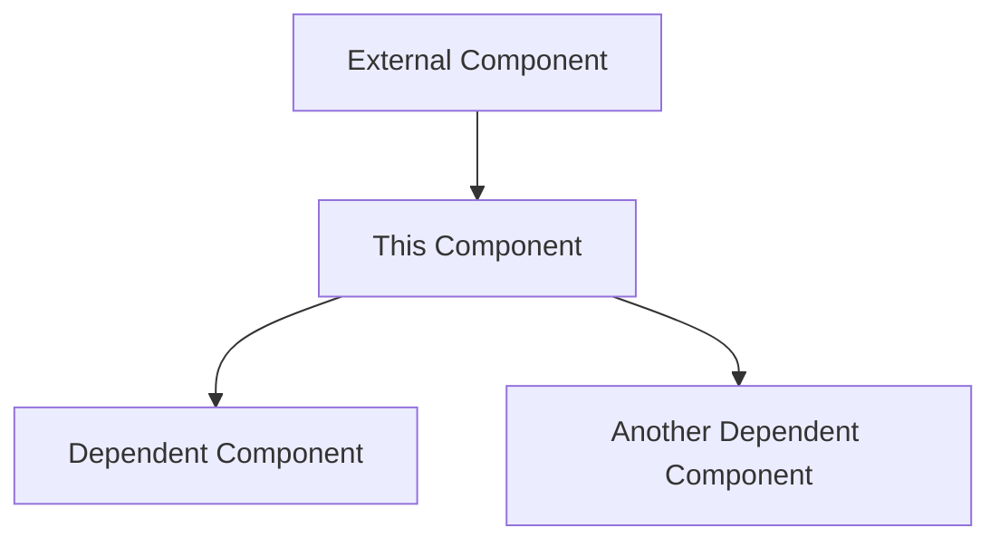

# Infrastructure Component: {Component Name}

*Last Updated: YYYY-MM-DD*  
*Owner: {Owner}*  
*Status: {Draft|Active|Deprecated|Replaced}*

## Overview

{Provide a concise overview of this infrastructure component, its purpose, and its role within the Alfred Agent Platform v2. Include any critical information that operators or developers should understand at a high level.}

## Architecture

{Describe the architecture of this infrastructure component. Include a diagram if possible.}



## Configuration

### Base Configuration

```yaml
# Example configuration with explanations
component:
  setting1: value1  # Description of setting1
  setting2: value2  # Description of setting2
  subsection:
    setting3: value3  # Description of setting3
```

### Environment-Specific Configurations

#### Development

```yaml
component:
  setting1: dev-value
  debug: true
```

#### Production

```yaml
component:
  setting1: prod-value
  replicas: 3
  resources:
    cpu: 2
    memory: 4Gi
```

## Deployment

### Prerequisites

- Prerequisite 1
- Prerequisite 2
- Prerequisite 3

### Deployment Steps

1. **Prepare Environment**
   ```bash
   # Commands to prepare the environment
   export VARIABLE=value
   ```

2. **Deploy Component**
   ```bash
   # Commands to deploy the component
   kubectl apply -f component.yaml
   ```

3. **Verify Deployment**
   ```bash
   # Commands to verify successful deployment
   kubectl get pods | grep component
   ```

## Scaling

{Describe how this component scales, including both horizontal and vertical scaling considerations.}

### Horizontal Scaling

```yaml
# Example configuration for horizontal scaling
component:
  replicas: 5
  autoscaling:
    min: 3
    max: 10
    targetCPUUtilizationPercentage: 80
```

### Vertical Scaling

```yaml
# Example configuration for vertical scaling
component:
  resources:
    requests:
      cpu: 2
      memory: 4Gi
    limits:
      cpu: 4
      memory: 8Gi
```

## Monitoring

### Health Checks

```yaml
# Example health check configuration
livenessProbe:
  httpGet:
    path: /health
    port: 8080
  initialDelaySeconds: 30
  periodSeconds: 10
readinessProbe:
  httpGet:
    path: /ready
    port: 8080
  initialDelaySeconds: 5
  periodSeconds: 5
```

### Metrics

| Metric | Description | Normal Range | Alert Threshold |
|--------|-------------|--------------|----------------|
| component_requests_total | Total number of requests | N/A | N/A |
| component_request_duration_seconds | Request duration in seconds | 0.1-0.5s | >1s |
| component_errors_total | Total number of errors | N/A | >10 in 5min |

### Dashboards

- [Component Overview Dashboard](link-to-dashboard)
- [Component Performance Dashboard](link-to-dashboard)
- [Component Alerts Dashboard](link-to-dashboard)

## Disaster Recovery

### Backup Procedures

```bash
# Commands to backup component data
kubectl exec component-pod -- backup.sh
```

### Restore Procedures

```bash
# Commands to restore component data
kubectl exec component-pod -- restore.sh /path/to/backup
```

## Security Considerations

### Network Policies

```yaml
# Example network policy
apiVersion: networking.k8s.io/v1
kind: NetworkPolicy
metadata:
  name: component-network-policy
spec:
  podSelector:
    matchLabels:
      app: component
  ingress:
  - from:
    - podSelector:
        matchLabels:
          app: allowed-service
    ports:
    - protocol: TCP
      port: 8080
```

### Secret Management

```yaml
# Example secret management
apiVersion: v1
kind: Secret
metadata:
  name: component-secrets
type: Opaque
data:
  api-key: YXBpLWtleS12YWx1ZQ==  # base64 encoded
```

## Troubleshooting

### Common Issues

| Issue | Symptoms | Resolution |
|-------|----------|------------|
| Issue 1 | Symptoms of issue 1 | Steps to resolve issue 1 |
| Issue 2 | Symptoms of issue 2 | Steps to resolve issue 2 |
| Issue 3 | Symptoms of issue 3 | Steps to resolve issue 3 |

### Logs

```bash
# Commands to access and analyze logs
kubectl logs -l app=component
```

### Debugging Procedures

```bash
# Commands for debugging
kubectl exec -it component-pod -- /bin/sh
curl localhost:8080/debug
```

## Related Components

- [Related Component 1](path/to/related-component-1.md): Describe relationship
- [Related Component 2](path/to/related-component-2.md): Describe relationship

## Version History

| Version | Date | Changes | Author |
|---------|------|---------|--------|
| 1.0.0 | YYYY-MM-DD | Initial version | {Author Name} |
| 1.1.0 | YYYY-MM-DD | Added scaling section | {Author Name} |

## References

- [Official Documentation](link-to-official-docs)
- [Internal Reference Document](path/to/internal/reference)
- [Design Document](path/to/design-doc)