# Alfred Agent Platform v2 - Service Dependency Graph

```mermaid
graph TD
    %% Core Infrastructure
    redis[Redis]
    qdrant[Qdrant Vector DB]
    pubsub[PubSub Emulator]
    ollama[Ollama LLM]
    
    %% Data Services
    supabase_db[Supabase DB]
    supabase_auth[Supabase Auth]
    supabase_rest[Supabase REST]
    supabase_studio[Supabase Studio]
    supabase_realtime[Supabase Realtime]
    supabase_storage[Supabase Storage]
    
    %% Agent Services
    alfred[Alfred / Alfred-Bot]
    atlas[Atlas]
    rag_gateway[RAG Gateway]
    social_intel[Social Intelligence]
    financial_tax[Financial Tax]
    legal_compliance[Legal Compliance]
    
    %% UI Services
    streamlit_chat[Streamlit Chat]
    mission_control[Mission Control]
    
    %% Monitoring Services
    prometheus[Prometheus]
    grafana[Grafana]
    node_exporter[Node Exporter]
    postgres_exporter[Postgres Exporter]
    
    %% Infrastructure dependencies
    
    %% Supabase dependencies
    supabase_db --> redis
    supabase_auth --> supabase_db
    supabase_rest --> supabase_db
    supabase_studio --> supabase_db
    supabase_studio --> supabase_rest
    supabase_realtime --> supabase_db
    supabase_storage --> supabase_db
    supabase_storage --> supabase_rest
    
    %% RAG dependencies
    rag_gateway --> qdrant
    rag_gateway --> redis
    
    %% Agent dependencies
    alfred --> redis
    alfred --> pubsub
    alfred --> supabase_db
    alfred --> rag_gateway
    
    atlas --> rag_gateway
    atlas --> pubsub
    atlas --> redis
    
    social_intel --> supabase_db
    social_intel --> pubsub
    social_intel --> redis
    social_intel --> rag_gateway
    
    financial_tax --> supabase_db
    financial_tax --> pubsub
    financial_tax --> redis
    financial_tax --> rag_gateway
    
    legal_compliance --> supabase_db
    legal_compliance --> pubsub
    legal_compliance --> redis
    legal_compliance --> rag_gateway
    
    %% UI dependencies
    streamlit_chat --> alfred
    mission_control --> alfred
    
    %% Monitoring dependencies
    grafana --> prometheus
    prometheus --> node_exporter
    prometheus --> postgres_exporter
    postgres_exporter --> supabase_db
```

## Service Grouping

### Core Infrastructure Layer
- **Redis**: In-memory data store used by almost all services
- **Qdrant**: Vector database for RAG functionality
- **PubSub Emulator**: Message queue for inter-service communication
- **Ollama**: Optional local LLM service

### Data Layer
- **Supabase DB**: Core PostgreSQL database
- **Supabase Auth**: Authentication and user management
- **Supabase REST**: API access to database
- **Supabase Studio**: Admin interface (often stubbed)
- **Supabase Realtime**: Real-time updates (often stubbed)
- **Supabase Storage**: File storage (often stubbed)

### Agent Layer
- **Alfred/Alfred-Bot**: Central orchestration service
- **Atlas**: Architecture-focused agent
- **RAG Gateway**: Knowledge retrieval service
- **Social Intelligence**: Social media focused agent
- **Financial Tax**: Financial domain agent
- **Legal Compliance**: Legal domain agent

### UI Layer
- **Streamlit Chat**: Chat interface for users
- **Mission Control**: Admin dashboard

### Monitoring Layer
- **Prometheus**: Metrics collection
- **Grafana**: Monitoring dashboards
- **Node Exporter**: System metrics
- **Postgres Exporter**: Database metrics

## Startup Dependencies

During startup, services should be launched in this order:

1. Core Infrastructure Layer (Redis, Qdrant, PubSub)
2. Data Layer (Supabase components)
3. Agent Layer (Alfred, RAG Gateway, Agents)
4. UI Layer (Streamlit, Mission Control)
5. Monitoring Layer (Prometheus, Grafana, etc.)

## Development Workflows

1. **Full Stack Development**: All services
2. **Agent Development**: Core + Data + specific Agent
3. **UI Development**: Core + Alfred + UI service
4. **Monitoring Development**: Core + Monitoring services

## Minimal Viable Stack

For most development work, these services are essential:
- Redis
- Supabase DB
- PubSub Emulator
- Alfred/Alfred-Bot